<div align="center">

# VcMoldCreator

### Automatic Composite Mold Design for Complex 3D Shapes

*A computational tool that automatically designs two-piece composite silicone molds for casting objects of unprecedented geometric complexity — implementing the algorithm from **"Volume-Aware Design of Composite Molds"** (Alderighi et al., SIGGRAPH 2019).*

<br>


*Left: Cut layout — parting surface (blue) and additional membranes (red). Center: Assembled composite mold. Right: Cast object.*

<br>

[](https://www.python.org/)
[](https://www.riverbankcomputing.com/software/pyqt/)
[](LICENSE)
[](https://doi.org/10.1145/3306346.3322981)

</div>

---

## What Is This?

**VcMoldCreator** is a desktop application that takes a 3D mesh (STL file) as input and automatically computes everything needed to fabricate a composite, two-piece silicone mold for casting that shape. The system handles objects that are impossible to cast with traditional rigid molds:

- **Thin protruding features** (tentacles, horns, fingers)
- **Deep undercuts** and concavities
- **Non-zero genus topology** (objects with holes, like a torus)
- **Knotted surfaces** and intertwined pieces
- **Multi-component entangled objects** (a cage around a knot)

<div align="center">


*Objects of extreme complexity — including entangled multi-piece assemblies — can be cast using automatically designed composite molds.*
</div>

---

## How It Works

The core idea is **volumetric analysis of escape paths**. Instead of analyzing just the surface of the object (like prior methods), VcMoldCreator tessellates the entire mold volume surrounding the object and analyzes the shortest paths that each volume element would take when removing the mold.

<div align="center">


*The escape path concept: for each point in the mold volume, the escape path is the shortest walk toward the exterior. The behavior of these paths determines where to place cuts in the mold.*
</div>

### The Composite Mold

Each mold piece consists of two parts:
- **A hard plastic shell** — 3D printed, keeps the mold rigid during casting
- **A flexible silicone part** — cast inside the shell, conforms to the object's complex geometry

The thin silicone part can flex to release undercuts, while the hard shell prevents deformation under casting pressure.

<div align="center">


*The mold volume O lies between the object surface M and the exterior hull ∂H. Two parting directions d₁, d₂ split the hull boundary, defining how the mold opens.*
</div>

---

## Algorithm Pipeline

The application implements a 12-step computational pipeline:

<div align="center">


*The full fabrication pipeline: from cut layout design (a,b) through 3D printing the hard shell (c), creating metamolds (d), casting silicone (e), to the final assembled composite mold with cast object (f).*
</div>

### Step-by-Step Breakdown

| Step | Operation | Description |
|:----:|-----------|-------------|
| 1 | **Import & Validation** | Load STL, validate manifold mesh, optionally repair |
| 2 | **Parting Direction** | Sample k directions on Gaussian sphere, GPU-accelerated visibility to find optimal d₁, d₂ |
| 3 | **Inflated Hull** | Create bounding volume (convex hull offset) around the object |
| 4 | **Tetrahedralization** | Tessellate the mold volume using fTetWild (robust tetrahedral meshing) |
| 5 | **Mold Half Classification** | Region-growing from seed faces to partition hull into ∂H₁ and ∂H₂ |
| 6 | **Edge Weights** | Compute weighted geodesics: `w = 1/(dist² + ε)` to push membranes perpendicular to surface |
| 7 | **Dijkstra Escape Paths** | Shortest paths from interior vertices to hull boundary — labels determine mold piece assignment |
| 8 | **Primary Surface Extraction** | Extended Marching Tetrahedra to extract the parting surface from cut edges |
| 9 | **Membrane Smoothing** | Laplacian smoothing with boundary re-projection to M and ∂H |
| 10 | **Secondary Membranes** | Detect features that prevent extraction; add additional cuts |
| 11 | **Pouring Direction** | Persistence homology to minimize trapped air bubbles |
| 12 | **Mold Fabrication** | Generate hard shell, metamold geometry, and export for 3D printing |

### Membrane Computation

The algorithm detects where to place cutting membranes by analyzing how escape paths diverge around object features:

<div align="center">


*Left: A **parting surface** cut separates vertices whose escape paths reach different hull halves. Center: An **additional membrane** is needed when the minimal surface between escape paths intersects the object. Right: No membrane needed when the surface doesn't intersect.*
</div>

### Weighted Geodesics & Membrane Quality

Plain geodesics produce poorly shaped membranes that travel tangentially to the surface. Weighted geodesics with exterior boundary reshaping produce clean, perpendicular membranes:

<div align="center">


*The effect of weighted geodesics and boundary reshaping: (a) plain geodesics produce tangent membranes; (b) boundary reshape alone; (c) distance weighting alone; (d) both combined produce optimal results.*
</div>

### Membrane Smoothing

The raw membranes extracted from the tetrahedral mesh are noisy. Laplacian smoothing with boundary re-projection produces clean, printable surfaces:

<div align="center">


*Left: Raw membranes from Marching Tetrahedra. Right: After Laplacian smoothing with boundary re-projection.*
</div>

### Pouring Direction Optimization

Air bubbles get trapped at local maxima during casting. The algorithm uses persistence homology to find pouring directions that minimize trapped air:

<div align="center">


*Maximum-saddle pairs identify air bubble trapping regions (red). Tilting the mold allows some air to escape (green), but trapped regions remain. The algorithm selects directions that minimize the total trapped area.*
</div>

---

## Deep Dive: Core Algorithms

This section details the key algorithms from the referenced papers and how they are implemented in VcMoldCreator.

### Extended Marching Tetrahedra — Surface Extraction

*Based on: Nielson & Franke, "Computing the Separating Surface for Segmented Data" (1997)*

The parting surface and additional membranes are extracted from the tetrahedral mesh using an **extended Marching Tetrahedra** algorithm. Unlike classic Marching Cubes (which works on voxel grids), this algorithm operates on tetrahedra and can produce **non-manifold separating surfaces** where three or more regions meet.

Each tetrahedron has four vertices, each labeled with an escape destination (∂H₁ or ∂H₂). The algorithm walks through tetrahedra and generates triangles at the interface between differently-labeled vertices. There are **five fundamental cases**:

<div align="center">


*Notation for vertices (V), mid-edge points (m_ij), mid-face points (m_ijk), and mid-tetrahedron point (m_t) used in the Marching Tetrahedra algorithm. (Nielson & Franke 1997, Figure 2)*
</div>

#### Case 1 — Three Edges Cut (1 triangle)

One vertex is isolated from the other three. A single triangle is formed by connecting the three mid-edge points on the cut edges.

<div align="center">
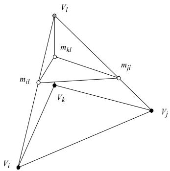

*Case 1: Three vertices of one class and one vertex of another — produces one triangle. (Nielson & Franke 1997, Figure 3)*
</div>

#### Case 2 — Four Edges Cut (2 triangles / quad)

Two vertices of each type. A quadrilateral is formed and split into two triangles along a consistent diagonal.

<div align="center">
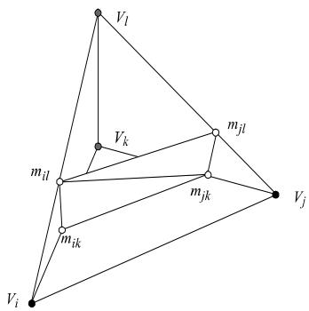

*Case 2: Two vertices of one class and two of another — produces a quad (2 triangles). (Nielson & Franke 1997, Figure 4)*
</div>

#### Case 3 — Five Edges Cut (5 triangles, face vertex)

Two vertices of one class, with the remaining two each of a different class. Requires a **face vertex** (a point interior to a tetrahedral face where three regions meet). This produces 5 triangles radiating from the face vertex.

<div align="center">
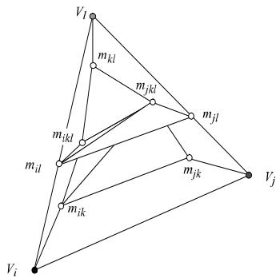

*Case 3: Two vertices of one class and two others each different — requires a face vertex, producing 5 triangles. (Nielson & Franke 1997, Figure 5)*
</div>

#### Case 4 — Six Edges Cut (12 triangles, inner vertex)

All four vertices are different. Requires both **face vertices** on each face and an **inner vertex** at the tetrahedron center. This produces 12 triangles that fully separate all four regions.

<div align="center">
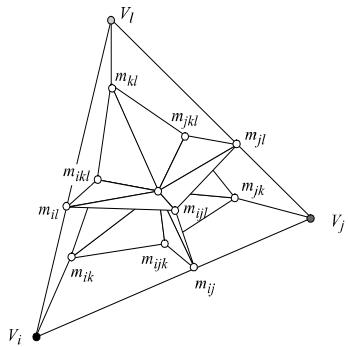

*Case 4: Each vertex is a different class — requires face vertices and an inner vertex, producing 12 triangles. (Nielson & Franke 1997, Figure 6)*
</div>

#### Mid-Point Computation

The position of cut points is computed using weighted interpolation:

$$m_{ij} = \frac{V_i + V_j}{2}, \quad m_{ijk} = \frac{m_{ij} + m_{ik} + m_{jk}}{3}, \quad m_t = \frac{1}{4}\sum_{\text{face centroids}}$$

In VcMoldCreator, **boundary-aware placement** adjusts these positions: edges touching the part surface $M$ place the cut point *on* $M$ (tracked as inner boundary, type -1), and edges touching the hull $\partial H$ place the cut point *on* $\partial H$ (tracked as outer boundary, type 1 or 2).

#### From Tetrahedral Grid to Surface

The algorithm processes tetrahedra sequentially, like the original Marching Cubes processes cubes. The key advantage is that tetrahedra have only 5 non-trivial cases (vs. 15 for cubes), making the algorithm simpler and the generated surfaces guaranteed to be consistent across shared faces.

<div align="center">


*Decomposing voxels into tetrahedra: 5 or 6 tetrahedra per cube. VcMoldCreator uses fTetWild for robust, boundary-conforming tetrahedralization. (Nielson & Franke 1997, Figure 1)*
</div>

The separating surface for multi-region data can produce non-manifold edges (shared by 3+ faces) which standard mesh data structures can't represent. This is where the Bloomenthal & Ferguson approach becomes essential.

---

### Non-Manifold Surface Handling

*Based on: Bloomenthal & Ferguson, "Polygonization of Non-Manifold Implicit Surfaces" (SIGGRAPH 1995)*

The cutting membranes in a composite mold are inherently **non-manifold**: the parting surface and additional membranes can intersect, creating edges shared by three or more surface patches. Bloomenthal & Ferguson's method extends tetrahedral polygonization to handle these cases.

#### The Problem: Multiple Regions

Conventional polygonizers assume a binary partitioning of space (inside/outside), producing manifold surfaces with all edges of degree 2. Mold design requires **multiple regions** — the parting surface separates O₁ and O₂, while additional membranes further subdivide each half. Where surfaces meet, edges have degree 3 or higher.

<div align="center">
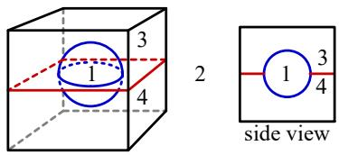

*Four regions of space define a non-manifold surface (sphere embedded in a square). The surface requires edges of degree 1 (boundaries), 2 (manifold), and 3+ (intersections). (Bloomenthal & Ferguson 1995, Figure 4)*
</div>

#### Face Vertices

When three regions meet at a tetrahedral face, a **face vertex** must be computed at the point where three surface patches converge. This is done by following the face contour: small triangles march along the face boundary until the "foreign" region is encountered.

<div align="center">
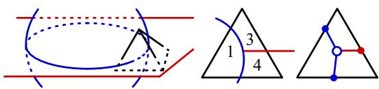

*When three regions meet at a face, three edge vertices and a face vertex are needed to properly separate all regions. (Bloomenthal & Ferguson 1995, Figure 7)*
</div>

Without face vertices, the polygonization either produces topological errors or geometric inaccuracies:

<div align="center">
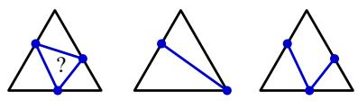

*Alternatives to face vertices either produce topological inconsistencies (left) or geometric artifacts (middle, right). (Bloomenthal & Ferguson 1995, Figure 8)*
</div>

#### Inner Vertices

When all four tetrahedron vertices belong to different regions (the 6-edge case), **face vertices** exist on every face and an **inner vertex** is placed inside the tetrahedron to connect them all:

<div align="center">
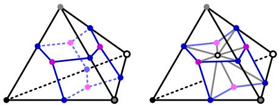

*When four regions meet inside a tetrahedron, four face vertices are connected through an inner vertex to properly separate all regions. (Bloomenthal & Ferguson 1995, Figure 11)*
</div>

#### Polygon Formation

Once edge, face, and inner vertices are computed, polygons are formed by traversing partner vertices across faces. Each polygon is consistently oriented so that, viewed from the lesser-valued region, vertices appear in clockwise order:

<div align="center">
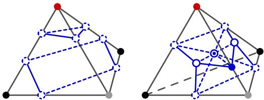

*Left: Disjoint surface lines form separate polygons. Right: Non-disjoint surfaces use face vertices and inner vertices to create triangles. (Bloomenthal & Ferguson 1995, Figure 18)*
</div>

#### Application in VcMoldCreator

VcMoldCreator's `parting_surface.py` implements these concepts through configuration-specific handlers:

| Configuration | Nielson & Franke Case | Bloomenthal Extension | Implementation |
|:---:|:---:|:---:|---|
| 3 cut edges | Case 1 | Standard | `_generate_triangles_config_3()` |
| 4 cut edges | Case 2 | Standard | `_generate_triangles_config_4()` |
| 5 cut edges | Case 3 | Face vertex | `_generate_triangles_config_5()` |
| 6 cut edges | Case 4 | Face + Inner vertex | `_generate_triangles_config_6()` |

---

### Constrained Surface Smoothing

*Informed by: Gibson, "Constrained Elastic Surface Nets" (MICCAI 1998)*

The raw surface extracted by Marching Tetrahedra is noisy due to the discrete tetrahedral grid. Gibson's Surface Nets concept — iteratively relaxing surface node positions while constraining each node to stay within its original cell — informs VcMoldCreator's smoothing approach.

<div align="center">
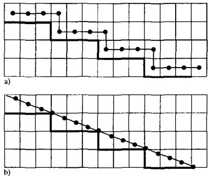

*The Surface Net concept: (a) A linked net of surface nodes is placed on the binary surface. (b) Constrained elastic relaxation smooths terraces while keeping each node within its original surface cube. (Gibson 1998, Figure 4)*
</div>

The key insight is **constrained relaxation**: smoothing should reduce surface noise but must not allow nodes to drift away from the surfaces they belong to. Surface nets demonstrate this on 2D binary objects:

<div align="center">


*Surface nets applied to 2D objects: circles become smooth, rectangles stay sharp, and thin structures (cracks, protrusions) are preserved through the constraint. (Gibson 1998, Figure 5)*
</div>

VcMoldCreator's smoothing (`surface_propagation.py`) uses a related but mold-specific approach:

1. **Smooth boundary vertices** — Laplacian smoothing on polyline boundary vertices only
2. **Re-project boundaries** — Snap boundary vertices back onto $M$ (type -1) or $\partial H$ (type 1/2)
3. **Smooth interior vertices** — Laplacian smoothing with boundary vertices held fixed
4. **Damping** — Factor of 0.5 per iteration for stable convergence

This preserves the critical property that the membrane **touches the part surface** (ensuring a clean parting line) while producing a smooth, printable geometry.

<div align="center">
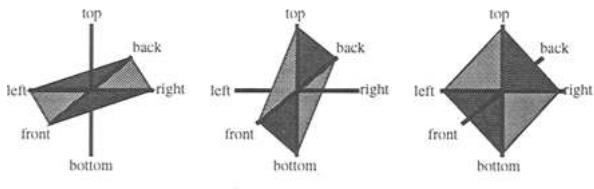

*Triangulation of surface nets: each node connects to neighbors with up to 12 possible triangles. Similar connectivity is used in VcMoldCreator's post-smoothing mesh triangulation. (Gibson 1998, Figure 7)*
</div>

---

### Weighted Geodesics — Escape Path Computation

*Based on: Alderighi et al. 2019, Section 4.5*

Standard geodesics produce membranes that travel **tangentially** to the object surface, creating long thin slivers of silicone that are fragile and hard to handle. The solution is **distance-weighted geodesics** that prefer paths far from the object:

$$\text{cost}(e) = l(e) \cdot \frac{1}{d_e^2 + \varepsilon}$$

where $l(e)$ is the Euclidean edge length, $d_e$ is the distance from the edge midpoint to $M$, and $\varepsilon = 0.25$.

This produces paths that **align with the distance field gradient**, creating membranes that are **perpendicular** to the object surface — exactly what is needed for clean mold extraction.

Additionally, the **exterior boundary reshape** biases path computation to account for the shape of the original object rather than just the convex hull:

$$\lambda_w = R - \text{dist}(w, M), \quad \text{biased\_dist}(v, w) = d(v, w) + \lambda_w$$

<div align="center">


*The distance from interior vertex v to boundary point w is biased by λ_w — the distance from w to the offset surface ∂F of M. This ensures membranes align with object features even when the convex hull discards them. (Alderighi et al. 2019, Figure 8)*
</div>

### Persistence Homology — Pouring Direction Selection

*Based on: Alderighi et al. 2019, Section 5.2; Edelsbrunner et al. 2000*

Choosing the wrong pouring direction causes **air bubbles** that create visible surface defects on the cast object. The algorithm uses **persistence pairing** from topological data analysis to quantify how much air gets trapped for each candidate direction.

For a given direction $\mathbf{f}$, the height function $h(v) = \mathbf{v} \cdot \mathbf{f}$ creates a sequence of **superlevel sets**. Maximum-saddle pairs $(m, n)$ identify regions where air would accumulate:

- $m$ = a local maximum (birth of a trapped air pocket)
- $n$ = a saddle point (death — the air pocket merges with another component)
- **Relevance score** = area of the trapped region $A_m^n$ minus the tiltable area $T$

The algorithm evaluates hundreds of candidate directions and selects:
- **Silicone pouring**: Two nearly-aligned, low-scoring directions $f_1, f_2$
- **Resin pouring**: Lowest-scoring direction in a 10° cone around the bisector of $f_1$ and $f_2$

---

## Fabrication Pipeline

Once the computational design is complete, the physical fabrication follows these steps:

<div align="center">


*The fabrication and assembly pipeline: 3D print the hard shell and metamolds → assemble casting containers → pour silicone → assemble composite mold → pour resin to cast the final object.*
</div>

1. **3D Print** the hard plastic shell (2 pieces) and metamolds (2 pieces)
2. **Assemble** each shell piece with its corresponding metamold
3. **Pour silicone** into the containers to cast the flexible mold parts
4. **Assemble** the composite mold (hard shell + silicone parts)
5. **Cast** the final object by pouring resin into the assembled mold

<div align="center">


*Air vents and pipes are incorporated into the hard shell and metamold geometry to allow casting liquid to flow in and air to escape.*
</div>

---

## Results

The algorithm successfully handles objects of extreme geometric and topological complexity:

### Complex Geometric Features

<div align="center">


*Successful casting of geometrically complex shapes: Medusa, Laocoonte, Dragon Head, and Dragon models.*
</div>

### Non-Zero Genus, Knots & Entangled Pieces

<div align="center">


*Left: Wheel of Life (non-zero genus) and trefoil knot. Right: Caged knot — two entangled pieces cast simultaneously.*
</div>

### Smart Membrane Design

<div align="center">


*Close-ups of additional membranes on the Medusa model (left, center) and full membrane layout on an ant model (right). Membranes intelligently follow object features and intersect freely.*
</div>

### Reusable Molds — Multiple Casts

<div align="center">


*The composite molds are reusable — multiple copies can be cast efficiently with no damage to the mold.*
</div>

---

## Installation

### Prerequisites

- **Python 3.10+**
- **pip** (Python package manager)

### Setup

```bash
# Clone the repository
git clone https://github.com/vjvarada/VcMoldCreator.git
cd VcMoldCreator

# Create a virtual environment
python -m venv .venv

# Activate the virtual environment
# Windows:
.venv\Scripts\activate
# Linux/macOS:
source .venv/bin/activate

# Install dependencies
cd desktop_app
pip install -r requirements.txt
```

### Run the Application

```bash
cd desktop_app
python main.py
```

---

## Dependencies

| Package | Purpose |
|---------|---------|
| **PyQt6** | Desktop GUI framework |
| **trimesh** | Mesh loading, manipulation, ray intersection |
| **numpy / scipy** | Numerical operations |
| **pyvista / pyvistaqt** | 3D visualization with PyQt integration |
| **pytetwild** | Tetrahedral meshing (fTetWild bindings) |
| **manifold3d** | CSG operations for mold cavity creation |
| **meshlib** | High-performance mesh repair |
| **potpourri3d** | Geodesic computation (Heat Method) |
| **torch** | Optional GPU acceleration for distance computation |
| **python-fcl** | Collision detection for secondary cuts |

---

## Project Structure

```
VcMoldCreator/
├── README.md                          # This file
├── desktop_app/                       # Main Python/PyQt6 desktop application
│   ├── main.py                        # Application entry point
│   ├── requirements.txt               # Python dependencies
│   ├── core/                          # Algorithm implementations
│   │   ├── stl_loader.py              # STL file loading & validation
│   │   ├── mesh_repair.py             # Non-manifold mesh repair
│   │   ├── mesh_decimation.py         # Mesh simplification for large models
│   │   ├── mesh_analysis.py           # Mesh diagnostics
│   │   ├── inflated_hull.py           # Convex hull inflation (bounding volume)
│   │   ├── parting_direction.py       # Visibility-based direction selection
│   │   ├── tetrahedral_mesh.py        # Tet meshing, Dijkstra, cut edges
│   │   ├── mold_half_classification.py # H₁/H₂ region-growing classification
│   │   ├── parting_surface.py         # Extended Marching Tetrahedra
│   │   ├── surface_propagation.py     # Laplacian smoothing with re-projection
│   │   ├── secondary_membrane.py      # Secondary cut detection
│   │   ├── pouring_direction.py       # Persistence-based pouring optimization
│   │   ├── mold_fabrication.py        # Hard shell & metamold generation
│   │   ├── export_artifacts.py        # STL/OBJ export
│   │   ├── alignment_notches.py       # Mold alignment features
│   │   ├── registration_marks.py      # Perlin noise registration on seams
│   │   └── resin_channels.py          # Resin pour channels & air vents
│   ├── ui/
│   │   └── main_window.py             # Main PyQt6 application window
│   └── viewer/
│       └── mesh_viewer.py             # PyVista 3D visualization widget
└── docs/                              # Research papers & implementation guides
    ├── README.md                      # Documentation index
    ├── PAPERS_TO_CODE_MAPPING.md      # Paper sections → code functions
    ├── alderighi-2019-composite-molds/ # Primary reference paper
    ├── nielson-franke-1997-marching-tetrahedra/  # Marching Tetrahedra
    ├── bloomenthal-1995-non-manifold/  # Non-manifold surface handling
    └── gibson-1998-surface-nets/       # Surface Nets algorithm
```

---

## Paper-to-Code Mapping

Every core algorithm step maps directly to a function in the codebase:

| Paper Section | Algorithm | Source File | Key Function |
|:---:|---|---|---|
| §4.1 | Direction Selection | `parting_direction.py` | `find_parting_directions()` |
| §4.1 | Hull Partitioning | `mold_half_classification.py` | `classify_mold_halves()` |
| §4.1 | Primary Cut Detection | `tetrahedral_mesh.py` | `find_primary_cutting_edges()` |
| §4.2 | Secondary Membranes | `tetrahedral_mesh.py` | `find_secondary_cutting_edges()` |
| §4.3 | Marching Tetrahedra | `parting_surface.py` | `extract_parting_surface()` |
| §4.4 | Membrane Smoothing | `surface_propagation.py` | `smooth_membrane_with_boundary_reprojection()` |
| §4.5 | Weighted Geodesics | `tetrahedral_mesh.py` | `compute_edge_weights()` |
| §4.5 | Escape Paths | `tetrahedral_mesh.py` | `compute_escape_paths()` |
| §5.2 | Pouring Direction | `pouring_direction.py` | `find_optimal_pouring_directions()` |
| N&F '97 | Case 1-4 Triangulation | `parting_surface.py` | `_generate_triangles_config_3/4/5/6()` |
| B&F '95 | Face/Inner Vertices | `parting_surface.py` | `_compute_face_vertex()`, `_compute_inner_vertex()` |

For the complete mapping, see [docs/PAPERS_TO_CODE_MAPPING.md](docs/PAPERS_TO_CODE_MAPPING.md).

---

## Comparison with Prior Work

VcMoldCreator's volumetric approach handles cases where surface-based methods (like Metamolds) fail:

<div align="center">


*Failure cases of surface-based Metamolds (left in each pair) vs. our volumetric approach (right). Complex knots, hindering membranes, and invalid segmentations are all handled correctly.*
</div>

---

## References

### Primary Paper

> Thomas Alderighi, Luigi Malomo, Daniela Giorgi, Bernd Bickel, Paolo Cignoni, and Nico Pietroni. 2019. **Volume-Aware Design of Composite Molds.** *ACM Trans. Graph.* 38, 4, Article 110 (SIGGRAPH 2019), 12 pages. [DOI: 10.1145/3306346.3322981](https://doi.org/10.1145/3306346.3322981)

### Surface Extraction Algorithms

> Gregory M. Nielson and Richard Franke. 1997. **Computing the Separating Surface for Segmented Data.** *Proc. Visualization '97.* — Marching Tetrahedra algorithm for extracting separating surfaces from multi-class segmented data. Defines the 5-case classification (0/3/4/5/6 cut edges) and mid-point computation formulas used in VcMoldCreator's parting surface extraction.

> Jules Bloomenthal and Keith Ferguson. 1995. **Polygonization of Non-Manifold Implicit Surfaces.** *Proc. SIGGRAPH '95*, pp. 309–316. [DOI: 10.1145/218380.218462](https://doi.org/10.1145/218380.218462) — Extends tetrahedral polygonization to handle non-manifold surfaces with edges of degree 1 (boundaries), 2 (manifold), and 3+ (intersections). Introduces face vertices and inner vertices for multi-region separation.

### Surface Smoothing

> Sarah F. F. Gibson. 1998. **Constrained Elastic Surface Nets: Generating Smooth Surfaces from Binary Segmented Data.** *Proc. MICCAI '98*, pp. 888–898. — Constrained relaxation method that smooths surfaces while preserving fine detail by constraining nodes within their original surface cubes. Informs VcMoldCreator's boundary-preserving Laplacian smoothing approach.

### Topological Analysis

> Herbert Edelsbrunner, David Letscher, and Afra Zomorodian. 2000. **Topological Persistence and Simplification.** *Proc. FOCS '00*, pp. 454–463. — Persistence pairing for identifying relevant topological features. Used in VcMoldCreator's pouring direction optimization to find maximum-saddle pairs that identify air bubble trapping regions.

### Predecessor Methods

> Thomas Alderighi, Luigi Malomo, Daniela Giorgi, Nico Pietroni, Bernd Bickel, and Paolo Cignoni. 2018. **Metamolds: Computational Design of Silicone Molds.** *ACM Trans. Graph.* 37, 4, Article 136. [DOI: 10.1145/3197517.3201381](https://doi.org/10.1145/3197517.3201381) — Surface-based approach to silicone mold design. VcMoldCreator's volumetric approach overcomes Metamolds' limitations with knotted surfaces, complex topologies, and thin features.

---

## License

This project is for academic and research purposes. See [LICENSE](LICENSE) for details.

---

<div align="center">

*VcMoldCreator — Turning impossible molds into reality, one tetrahedron at a time.*

</div>