# Metamolds: Computational Design of Silicone Molds

THOMAS ALDERIGHI, University of Pisa and ISTI - CNR
LUIGI MALOMO, ISTI - CNR
DANIELA GIORGI, ISTI - CNR
NICO PIETRONI, University of Technology Sidney and ISTI - CNR
BERND BICKEL, IST Austria
PAOLO CIGNONI, ISTI - CNR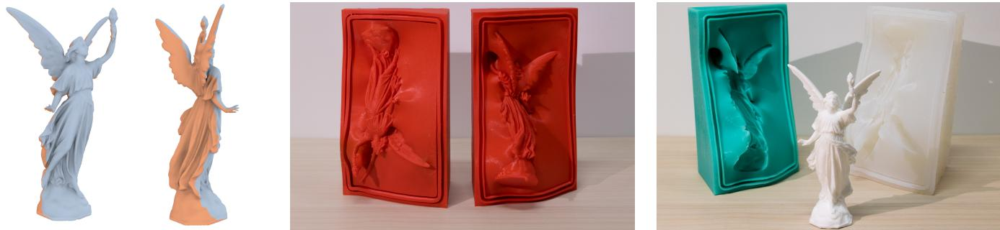
Fig. 1. Our approach automatically generates the shape of silicone molds for casting an input 3D mesh. After computing a segmentation of an input mesh into moldable pieces (left), we design and 3D print a set of metamolds (middle, in red). The actual mold pieces (right, in green and whitish) are produced by pouring liquid silicone onto the metamolds, then assembled and used to cast copies of the input model.

We propose a new method for fabricating digital objects through reusable silicone molds. Molds are generated by casting liquid silicone into custom 3D printed containers called metamolds. Metamolds automatically define the cuts that are needed to extract the cast object from the silicone mold. The shape of metamolds is designed through a novel segmentation technique, which takes into account both geometric and topological constraints involved in the process of mold casting. Our technique is simple, does not require changing the shape or topology of the input objects, and only requires offthe-shelf materials and technologies. We successfully tested our method on a set of challenging examples with complex shapes and rich geometric detail.

CCS Concepts: $\cdot$ Computing methodologies Shape modeling;

Additional Key Words and Phrases: fabrication, molding, casting

ACM Reference Format:
Thomas Alderighi, Luigi Malomo, Daniela Giorgi, Nico Pietroni, Bernd Bickel, and Paolo Cignoni. 2018. Metamolds: Computational Design of Silicone Molds. ACM Trans. Graph. 37, 4, Article 136 (August 2018), 13 pages. https://doi.org/10.1145/3197517.3201381

# 1 INTRODUCTION

While 3D printing technologies are becoming faster and more precise, classical manufacturing techniques remain the first choice for most industrial application scenarios. Industrial production is still largely dominated by casting techniques: casting scales well with the number of copies, supports a wide spectrum of materials, and ensures high geometric accuracy.

A popular casting technique for high-quality reproduction of art objects is silicone mold casting [Bruckner et al. 2010]. For simple scenarios, a physical prototype is submerged in liquid silicone; the cured silicone forms a mold around the object; then, the prototype is extracted by manually cutting and opening the silicone mold. Multiple copies can be cast by filling the silicone mold with a liquid casting material such as resin. Silicone molding has two main practical advantages over traditional rigid casting: the replicas can be safely extracted by deforming the flexible mold without damaging it, and overhanging geometric details do not constitute a severe limitation.

While conceptually simple, silicone mold casting may become extremely challenging when applied to non-trivial shapes, and often requires the intervention of skilled professionals. For example, objects with handles usually need a set of carefully placed extra cuts to make the extraction physically possible. Moreover, venting pipes have to be attached to the prototype object before submersion in liquid silicone, to let the air flow out and avoid artifacts in the replicas due to trapped air bubbles.

Recently, some methods tried to reinterpret the manufacturing process of mold casting using a computational approach [Babaei et al. 2017; Herholz et al. 2015; Malomo et al. 2016]. However, none of them was designed to exploit the practical advantages brought by silicone mold casting. We propose a novel and practical computational approach based on reusable silicone molds that is capable of reproducing objects with complex shapes and high geometric details.

The main idea is to first estimate the position and shape of optimal cuts in the silicone mold by facing a segmentation problem and devising appropriate parting surfaces. Then, to generate the molds, we fabricate via 3D printing a series of custom containers, which we call metamolds. Finally, metamolds are filled with liquid silicone to get the actual pieces of the flexible reusable mold. Metamolds are designed to incorporate all geometric features that will make the final casting successful. The process is simple and practical (Figure 1).

Our main contributions can be summarized as follows:

• we propose a new technique to automatically design and fabricate reusable silicone molds through 3D printed metamolds. Metamolds automatically define the cuts that are needed to extract the cast object from the silicone mold; we introduce a scalar field defined on the surface of an input object that measures moldability costs, which reflect how difficult it is to extract a flexible mold along a given direction. Moldability costs are computed from visible regions through a geodesic flow which aligns well with shape features; • we define a segmentation technique to partition the surface into moldable parts. Segmentation is formulated as a functional minimization problem, solved via Integer Linear Programming; • our pipeline includes a technique to design parting surfaces, and an optimization strategy to generate silicone molds by considering the placement of venting pipes.

visual distortion. The approach is limited to fairly simple shapes: when applied to complex geometries, the system might produce molds composed by multiple tiny pieces which are difficult to assemble. Additionally, significant deformations on the original model may result from fabrication constraints.

By exploiting the flexibility of silicone, our method overcomes these limitations, and generates valid cut layouts even for complex models, without imposing any change to the original geometry. The results in Section 6 and in the supplementary material show that our method works well for all the failure cases reported in [Herholz et al. 2015].

To overcome the limitations of rigid molding, Malomo et al. [2016] propose FlexMolds, single-piece, thin, flexible molds whose cut design is driven by a physically-based simulation of the extraction process. FlexMolds are made of a thin layer of flexible plastic material (TPU), and fabricated by 3D laser sintering. While FlexMolds can handle complex shapes, they still have some drawbacks. First, cuts are manually sealed with silicone, with risk of leakage of the cast material. Also, the authors of [Malomo et al. 2016] acknowledge that sealing can be difficult for small objects or involuted regions. In turn, large objects can be difficult to fabricate, as FlexMolds' thin layer of material is prone to deform under the action of casting material pressure. In addition, FlexMolds can be fabricated with laser sintering only, as the removal of an internal support structure may be problematic.

Again, our approach overcomes all the these limitations, by fabricating silicone molds that work for challenging shapes and sizes.

# 2 RELATED WORK

Digital fabrication makes extensive use of geometry processing and shape analysis to solve problems for digitally controlled manufacturing processes [Bermano et al. 2017; Liu et al. 2014; Umetani et al. 2015]. In this section, we place our contributions within the context of automatic mold design and shape segmentation techniques.

# 2.1 Mold design

Molding is commonly used in industry to build replicas of a given model in great quantity and with relatively contained costs. Nonetheless, designing and fabricating a proper mold is still a highly challenging engineering task [De Garmo et al. 2011]. Expendable, single-use molds are common practice, for example, for art reproduction and wax cast jewelry; reusable molds, in contrast, pose many engineering problems [Wannarumon 2011].

Reusable molds are generally made out of a rigid material such as metal (e.g., for injection molding). This severely reduces the class of shapes that can be manufactured, since the removal of mold pieces is strongly affected by the presence of undercuts and overhanging geometric details. Several methods have been proposed to identify parting surfaces and directions for either two-piece [Chakraborty and Reddy 2009; Zhang et al. 2010] or multi-piece [Lin and Quang 2014] rigid molds for CAD-like objects.

To deal with free-form objects, Herholz et al. [2015] identify parting and fabrication directions by segmenting a 3D surface into patches that satisfy the height field constraint; local constraint violations are removed by deforming the mesh, while trying to minimize

# 2.2 Shape segmentation

Segmenting 3D objects into parts is fundamental to a number of applications in Computer Graphics [Chen et al. 2009; Shamir 2008]. Segmentation may be either geometry-based [Zhang et al. 2005] or semantics-based [Litany et al. 2016]. Recently, 3D segmentation for efficient fabrication has drawn attention from the research community. We first cover the state-of-the-art on the decompose-to-print problem and then discuss segmentation as a functional minimization problem.

Shape segmentation for fabrication. Many attempts have been made to segment a 3D model into small parts which can fit into the working volume of 3D printers. Chopper [Luo et al. 2012] formulates a number of desirable criteria for the partition (assemblability, number of components, unobtrusiveness of seams, and structural soundness). Saving printing time and costs is the aim of Packmerger [Vanek et al. 2014], which converts an input 3D mesh into a shell composed of multiple segments. Packmerger also includes an optimization strategy to tightly pack the segments to minimize the amount of support material. Dapper [Chen et al. 2015] is a segmentation and packing strategy which builds on an initial decomposition of a 3D object into a small number of approximately pyramidal parts [Hu et al. 2014] to progressively pack a pile in the printing volume. The Shapes in a box solution [Attene 2015] defines a shape segmentation for 3D printing and an automatic arrangement of 3D printed parts in a small box, to ease the delivery of customized printed objects and the reassembling at destination.

Our approach is complementary to the above cited works, as segmentation is aimed at designing and fabricating multi-piece, reusable molds, rather than the simultaneous fabrication of object parts.

Segmentation via functional minimization. Segmentation via functi onal minimization has a long history in Computer Vision [Zhu and Yuille 1996]. Segmentation can be posed as a multi-labeling problem: given a set of data points and a finite set of labels, the goal is to label each point such that the joint labeling minimizes an objective function. The labeling induces a segmentation into parts, with boundaries lying between adjacent points with different labels. The objective function usually includes a data cost measuring the cost of assigning a specific label to a given point, and regularization factors, which usually enforce a preference for spatial smoothness (smoothing cost) and fewer unique labels in the solution (label cost) [Delong et al. 2012].

In the graphics community, Shapira et al. [2010] propose a 3D partitioning algorithm based on the minimization of an energy functional guided by the shape diameter function. Kalogerakis et al. [2010] learn the objective function from a collection of segmented and labeled training meshes: the data energy term measures consistency between local descriptors of the surface geometry and the labels through a JointBoost classifier. Sidi et al. [2011] address the unsupervised co-segmentation of a set of 3D shapes, with group information entering the optimization through the data term of the energy functional.

Whereas the above methods rely on the alpha expansion graphcut algorithm [Boykov et al. 2001] to solve the minimization problem, we preferred relying on an Integer Linear Programming formulation (ILP). Indeed, the ILP formulation comes with a global optimality guarantee also when large label costs, or label costs on large subsets, are taken into account. ILP does not require the smoothing coefficients to define a metric, and has the additional advantage that it can be solved by using available optimization solvers such as Gurobi [2016].

In terms of segmentation objective functions, the closest work to ours is [Herholz et al. 2015], where the segmentation problem is a discrete labeling process of mesh faces, with labels corresponding to potential fabrication directions; connected components of faces carrying the same labels form regions which can be manufactured individually. The only valid labelings are those that assign triangles to fabrication directions for which the triangles are height fields.

While finalized to a similar objective (partitioning into regions that are easily castable), our approach is completely different, as it takes into account a real-valued moldability cost, rather than a binary decision based on height field constraints, thanks to the elasticity of silicone. This avoids the need for shape deformations.

# 3 OVERVIEW

Given an input shape, our goal is to create flexible silicone molds for casting multiple replicas. Our method works in three steps (Figure 2):

• Shape segmentation into parts corresponding to different mold pieces. The segmentation is driven by a shape-aware moldability criterion which measures the difficulty of extracting the mold piece along a candidate parting direction. Moldability costs are computed through a shape-aware geodesic flow, which takes the properties of silicone into account (Figure 2.a, top). The segmentation is done by solving an Integer Linear Program, with regularizers improving the location of segment boundaries, and favoring fewer segments (Figure 2.a, bottom). For objects with complex topologies, an algorithm for topological simplification supports the automatic placements of the required cuts in the silicone mold volume.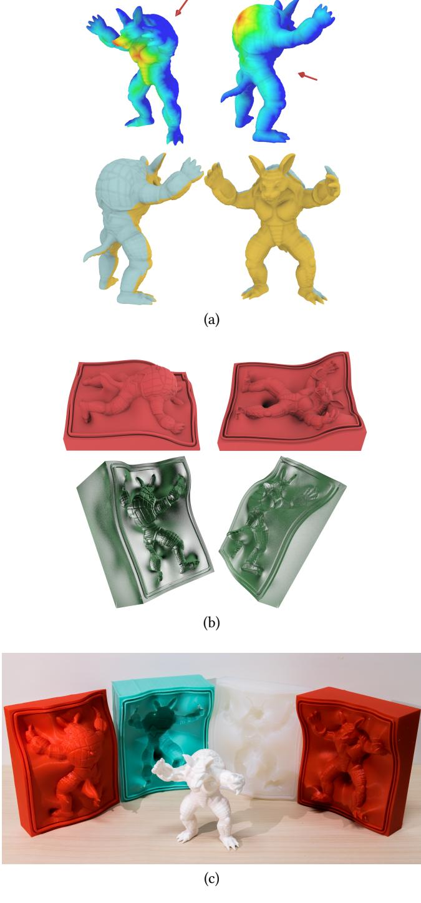
Fig. 2. Our fabrication pipeline: (a) evaluation of moldability costs for candidate parting directions (two samples shown, top) and optimal shape segmentation into castable parts (bottom); (b) design and fabrication of 3D printed metamolds (top) and silicone mold pieces (bottom); (c) assembly and object casting.

• Design and fabrication of 3D printed custom containers called metamolds (Figure 2.b, top), and fabrication of mold pieces by pouring liquid silicone into metamolds (Figure 2.b, bottom). We design metamolds by computing parting surfaces through a variant on Poisson surface reconstruction. Parting surfaces separate the space around the object following the segmentation boundaries, and create a proper container for liquid silicone. The final shape of metamolds is defined by searching for the optimal orientation which minimizes the formation of air bubbles in the silicone molds. Venting pipes are inserted to create escape holes for the air.

• Assembly of mold pieces and liquid casting of material inside the cavity, to get the final object (Figure 2.c). The molds can then be reused to produce multiple replicas.

The approach is entirely unsupervised. Section 4 details the segmentation process. Section 5 describes the fabrication of metamolds and silicone molds. Section 6 shows a number of objects cast using our technique.

# 4 SEGMENTATION

We consider the segmentation of the input mesh into a set of regions corresponding to different mold pieces as a discrete labeling problem where each label corresponds to a direction of extraction for a mold piece. Specifically, we formulate the labeling problem as an Integer Linear Program (Section 4.1), where the objective function is mainly expressed in terms of a moldability cost along a given parting direction.

With the usage of flexible silicone molds, we assume we can extract the mold of a surface portion along a given direction even in the presence of overhangs (e.g., when some faces are are not directly visible from that direction). Therefore, the main idea is to design the objective function by taking into account a real-valued score that reflects the difficulty of extracting a flexible mold from a given direction, rather than a binary decision based on visibility. In theory, the score could be computed by running a full volumetric FEM simulation of the extraction process, in analogy with the approach in [Malomo et al. 2016]. However, the cost of running such a simulation can be very high, especially when accounting for precise contact and frictional forces. Also, given the complex physical behavior of the solid molds during the extraction, the detaching forces governing the process would be very hard to define for a general case. Therefore, we adopted a purely geometric approach.

For a candidate parting direction, our score has the form of a realvalued function defined over the mesh. The function takes a zero value for directly visible portions of the surface, and is interpolated over the rest of the surface, with values propagating according to a shape-aware flow which accommodates for complex geometries (Section 4.2).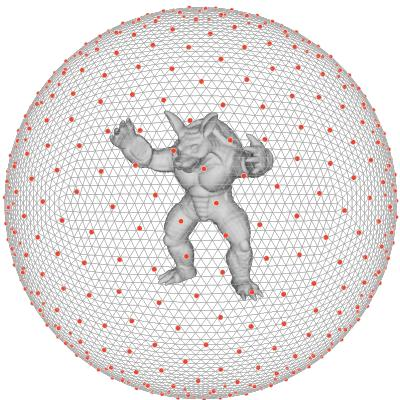
Fig. 3. The $k = 6 5 0$, uniformly sampled, candidate parting directions.

Regularization factors are introduced in the ILP formulation to improve the placement and smoothness of boundaries between segmented regions, and to enforce a preference for a small number of segments (Section 4.3). A two-stage strategy based on anisotropic clustering prior to segmenting helps to speed up the computation on huge meshes (Section 4.4).

Finally, an algorithm generates cuts in the silicone mold volume by adding special membranes over the input mesh, so as to guarantee that mold pieces can be extracted even in case of high-genus surfaces (Section 4.5).

The approach is entirely unsupervised. Our formulation can be easily extended to incorporate fabrication-related linear constraints (such as the maximum allowed overhanging area, or the maximum number of segments). The resulting program can be efficiently solved with any standard optimization package (Gurobi [2016] in our implementation), with the guarantee of finding the global optimum.

# 4.1 Integer programming formulation

Our aim is to label the n faces $f_{i}$ of an input manifold triangle mesh with k n ficandidate parting directions $d_{j}$. The candidate directions k djare uniformly sampled on the unit sphere (Figure 3) following the approach of Keinert et al. [2015].

To formulate the problem using Integer Linear Programming, we introduce binary indicator variables $b_{i j}$, defined as $b_{i j} = 1$ if face $f_{i}$ is labeled with view direction $d_{j}$ i j i j i, and 0 otherwise. Moreover, let us dconsider the auxiliary variables $g_{j}$ signaling the use of one of the k directions for at least one face: $g_{j} = 1$ kif and only if there is an index $i \in \{ 1, \ldots, n \}$ so that $b_{i j} = 1$.

The segmentation problem boils down to finding the values of binary indicator variables $b_{i j}$ which globally minimize:
$$
E = \sum_{j = 1}^{k} \sum_{i = 1}^{n} m_{i j} b_{i j} + \lambda \sum_{( u, v ) \in I} \sum_{j = 1}^{k} S_{u v} ( b_{u j} - b_{v j} )^{2} + \mu \sum_{j = 1}^{k} g_{j}
$$
The first unary term (data cost) assesses the consistency of faces with labels, according to the shape-aware moldability cost $m _ { i j }$ of face $f _ { i }$ for direction $d _ { j }$, defined in Section 4.2. Being I mi jthe set of fiindex pairs $( u, v )$ dj of all adjacent faces $f _ { u }$ and $f _ { v }$ Iin the mesh, the u, v fu fvsecond term (smoothing cost) is a pairwise cost penalizing adjacent faces being assigned different labels, with a weight $S _ { u v }$ preventing Suvfragmentation and helping the localization of optimal boundaries (Equation (2) in Section 4.3). The third term (label cost) exploits the auxiliary variables $g _ { j }$, which signal the use of a given direction $d _ { j }$ in дj djthe current solution, to enforce the choice of a minimum number of labels (and hence of mold pieces), with an object-dependent global label weight $\mu$ (Equation (3), Section 4.3).

Segmentation constraints. The segmentation is valid if each face is labeled exactly with a single parting direction, i.e. if for each $i \in \{ 1, \ldots, n \}$:
$$
\sum_{j = 1}^{k} b_{i j} = 1
$$
For each $j \in \{ 1, \ldots, k \}$, the auxiliary binary variables $g _ { j }$ are subject to the constraints:
$$
0 \leq n \cdot g_{j} - \sum_{i = 1}^{n} b_{i j} < n
$$
In this way $g _ { j }$ can be 0 only if no face is labeled with direction $d _ { j }$ and $g _ { j } = 1$ дj only if there is at least one face using direction $d _ { j }$ dj. Finally, дjto set an upper bound T djon the number of chosen directions we Tintroduce the constraint:
$$
2 \leq \sum_{j = 1}^{k} g_{j} \leq T
$$
Note that T is only a bound: the actual optimal number of segments is automatically computed by the ILP, thanks to the third term of Equation (1), encouraging the use of the smallest possible number of labels.

Linearization. The second term in Equation (1) is quadratic. To get a linear formulation, it is sufficient to replace the difference $( b _ { u j } - b _ { v j } ) ^ { 2 }$ with the equivalent formulation $( b _ { u j } X O R b _ { v j } )$ based buj bv jon exclusive disjunction.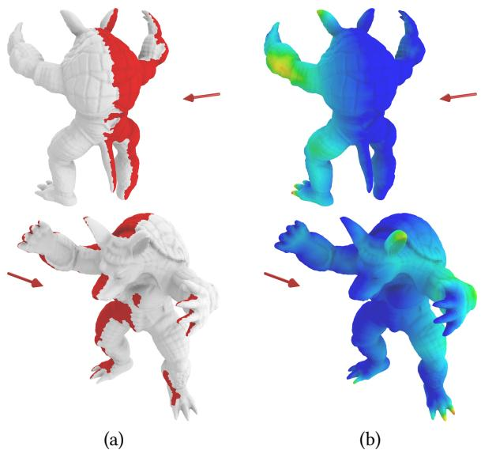
Fig. 4. (a) Visible regions from a given direction are depicted in red. (b) The corresponding moldability field takes a zero value over visible faces, and is interpolated over the rest of the surface through a shape-aware geodesic flow.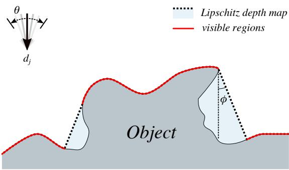
Fig. 5. Visibility computation scheme.

# 4.2 Moldability computation

The factor $m _ { i j }$ in Equation (1) measures how costly it is to extract mijthe mold at a given surface location $f _ { i }$ along a given direction $d _ { j }$. fi djUnder the assumption of having flexible silicone molds, the cost takes a zero value on visible faces, and is interpolated over the rest of the surface according to a shape- and topology-aware flow. The example in Figure 4.a shows the visible region from a given direction; Figure 4.b shows the moldability cost for the same direction.

4.2.1 Visible faces computation. Figure 5 sketches the visibility computation pipeline. Visible portions of the surface with respect to a direction $d _ { j }$ are computed by GPU-accelerated rendering. GPUjaccelerated visibility computation is used in [Jacobson 2017] also, to evaluate object nesting feasibility. We perform a per-fragment testing to check which faces are visible from a given direction. We enforce Lipschitz continuity on the depth map through Jump

Flooding [Rong and Tan 2006] with a threshold angle $\phi = 7 ^ { \circ }$. This prevents close locations in screen-space from having largely different depth values. Then, we use the Lipschitz continuous depth map as a threshold on the depth of visibile fragments. Finally, under the hypothesis of having flexible molds, we relax the notion of visibility from a direction $d _ { j }$, by considering a face as visible if it is visible djfrom at least one direction in a small neighborhood of $d _ { j }$ on the djGauss sphere. The neighborhood is defined as a spherical cap of polar angle $\theta = 5 ^ { \circ }$.

4.2.2 Flow-based moldability estimate. For a given parting direction, we assume that surface portions sufficiently close to visible areas can be extracted even if they are not directly visible, thanks to the elasticity of silicone. Therefore, we could assume that the moldability cost for a non-visible vertex depends on its geodesic distance from visible areas. However, using geodesic distance as a sole criterion could lead to undesirable decompositions in the presence of tubular features. Indeed, decompositions where tubular protrusions belong to a single segment would lead to mold pieces which could be difficult to extract. Therefore, we prevent small costs from wrapping around protrusions by defining a shape-aware geodesic flow which propagates from visible areas by taking into account tubular regions.

This is done by defining a new metric on the surface, by weighting the Euclidean arc-length by a scalar function which takes high values over tube-like regions and low values over flat regions (Figure 6.b). In other words, the metric makes traveling through tubular regions longer. This is similar in spirit to the geodesic active contours on images in [Caselles et al. 1997], where a new metric is derived which takes into account the image gradient. Then, for a vertex $v _ { i }$ on a non-visible region, the moldability cost $m _ { i j }$ for direction $d _ { j }$ is defined as
$$
m_{i j} = \exp ( d i s t_{i j} ) - 1
$$
with $d i s t _ { i j }$ the shortest distance from $v _ { i }$ to the boundary of directly disti jvisible regions for $d _ { j }$ vi, according to the shape-aware metric. We dj suse Djikstra's algorithm for geodesic path computation. In Figure 4.b, it can be noticed how small values do not propagate over the occluded parts of protrusions (legs, feet, arms, hands and ears), as they would do if a purely geodesic flow was used.

On the computational side, defining the metric amounts to multiplying the Euclidean length $l ( e ) = \| v _ { i } - v _ { j } \|$ sof an edge $e =$ $( v _ { i }, v _ { j } )$ by a value $( 1 + w ( e ) )$, with $w ( e )$ i jdefined as
$$
w ( e ) = { \frac { t ( v_{i} ) + t ( v_{j} )} { 2}}
$$
with the function t measuring tubeness, that is, the likelihood of a gitven vertex to lie on a tubular feature. The tubeness t is a region-wise tmeasure, computed following the intuition that tubes are identified by shape parts whose intersection with a sphere of proper radius is homeomorphic to a topological disk with holes, rather than a disk [Mortara et al. 2004]. For a given vertex $v _ { i }$, we consider the surface iregion defined by the points having geodesic distance from $v _ { i }$ less than a radius r vi, and keep track of the topology of the region as r increases. The tubeness at the given vertex is then defined as
$$
t ( v_{i} ) = { \frac { 1} { l n ( 1 + R_{i} )}}
$$
being $R _ { i }$ the smallest radius at which the region becomes a topolo-Rigical disk with holes (Figure 6.a). One of the main advantages is that the tubeness measure t can be computed and stored once per mesh, tas it does not depend on the candidate parting direction. Figure 6.b shows an example of tubeness computed on two different meshes.

We derive the per-face moldability cost $m _ { i j }$ in Equation (1) by mijconsidering the average moldability values of the triangle vertices.

# 4.3 Regularization factors

Optimizing with respect to moldability alone could lead to oversegmented meshes. Therefore, we introduce regularizers to improve the quality of boundaries and reduce the number of segments.

The second term (smoothing cost) in Equation (1) penalizes neighboring faces being assigned different extraction directions. We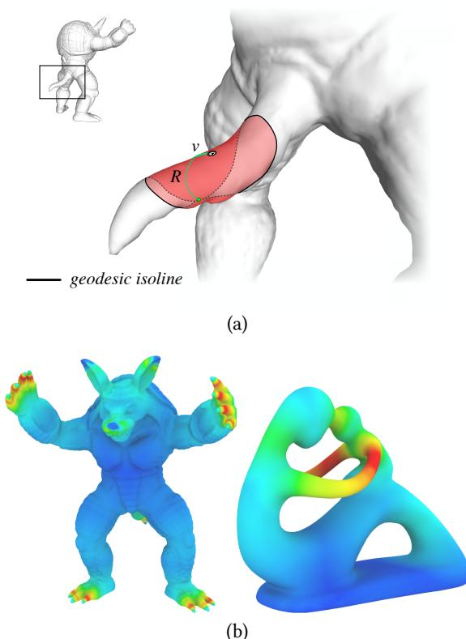
Fig. 6. (a) Tubeness computation at a vertex $^ { v }$, by tracking the topology of vthe surface region defined by the points having geodesic distance from $^ { v }$ vless than a varying radius. On tube-like features, the surface region changes topology for a small radius R; (b) Tubeness values on two example surfaces.

define the cost $S _ { u v }$ of assigning different labels to adjacent faces $f _ { u }$, $f _ { v }$ Suv fuas a product taking into account the areas of the two faces and fvthe normalized difference between their moldability values:
$$
S_{u v} = A_{u v} N_{u v}
$$
with
$$
A_{u v} = A r e a ( f_{u} ) + A r e a ( f_{v} )
$$
and
$$
N_{u v} = 1 - { \frac { ( m_{u j} - m_{v j} )^{2}} { \operatorname* { m a x}_{( u, v ) \in { I}} ( m_{u j} - m_{v j} )^{2}}}
$$
with $m _ { u j }$ the moldability of face $f _ { u }$ for direction $d _ { j }$. The smoothing muj fu djterm encourages short boundaries in the segmentation, and helps in preventing fragmentation. As the weight $N _ { u v }$ measures the cost Nuvof being a difference in labels as a function of pairwise moldability values, it helps to detect better boundaries than face areas alone, located where there is a significant change in the moldability value. In Equation (1), the smoothing regularization term is scaled by a factor $\lambda$ $\lambda = 0. 1$ in our setup).

The third term (label cost) in Equation (1) punishes the use of many different labels. We adopt a heuristic to define a label weight $\mu$ automatically for a given object. $\mu$ gives a lower bound for the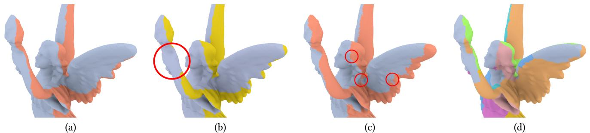
Fig. 7. The effect of energy terms in the segmentation results: (a) a detail of the final segmentation on a model, resulting in just two segments, and smooth boundaries; (b) the segmentation if plain geodesics were used in the data cost, instead of tubeness-weighted geodesics: the segment which wraps around the model arm (circled in red) would lead to a non-extractable mold piece; (c) the effect of neglecting the smoothing cost, namely poor boundary quality and isolated fragments near the boundary (circled in red); (d) the result if no label costs were imposed, with too many pieces to be useful in practice.

cost $\mu _ { j }$ of adding a label $d _ { j }$:
$$
\mu = \frac { 1} { 2} \cdot \operatorname* { m i n}_{j \in \{ 1,..., k \}} \mu_{j}
$$
where the cost $\mu _ { j }$ of a label $d _ { j }$, in a sense, measures the relative µjmoldability along $d _ { j }$ djwith respect to its opposite direction $d _ { \tilde { j } } \mathbf {: }$:
$$
\mu_{j} = \sum_{i = 1}^{n} \operatorname* { m a x} \{ ( m_{i j} - m_{i \tilde { j}} ), 0 \}
$$
The intuition is to relate the cost of introducing an additional label (hence a mold piece) to the reduction in the energy: the reduction should be at least half of the reduction brought by adding a trivial direction, namely, the opposite direction to an existing one. Therefore, the label weight $\mu$ helps to select a minimal number of segments, µwhich are needed to get a moldable object.

Both regularization terms (smoothing and label cost) depend linearly on face areas, hence they are expressed in the same base unit.

Figure 7 shows the influence of the design choices for the energy terms in Equation (1), namely tubeness-modified geodesics, smoothing, and per-object label costs. The images show how the results worsen whenever a single component is neglected in the energy definition.

# 4.4 Two-stage optimization approach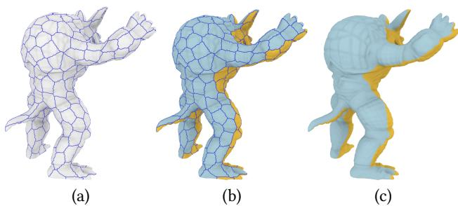
Fig. 8. Segmenting via a two-stage strategy: (a) anisotropic clustering of mesh faces; (b) segmenting the clustered mesh to get optimal parting directions; (c) segmenting the original mesh with respect to the optimal directions.

Solving the problem by optimizing Equation (1) could be too costly for meshes with a large number n of faces and for a dense sampling nof the parting directions space. To speed up the optimization, we split the problem into two sub-problems (Figure 8).

In the first step, we compute an anisotropic clustering of the mesh faces, to get q clusters, with $q \ll n$. The clusters are computed by first q q ndeforming the mesh according to the principal curvature directions, following [Panozzo et al. 2014], then clustering the mesh faces in the deformed space using Voronoi diagrams with Lloyd relaxation. Finally, we reverse the deformation. The result is an anisotropic clustering that aligns with geometric features (Figure 8.a). We define the moldability of a cluster as the sum of moldability values over the cluster faces. Then, we seek an optimal labeling of the clusters which minimizes an energy where only data and label costs are taken into account. The labeling on the clustered mesh gives as output a set of segments corresponding to a small set H of optimal parting directions (Figure 8.b).

In the second step, we run the optimization on the original mesh, with data and smoothing terms, by only admitting as candidate molding directions the optimal directions in the set H. This step Hreduces the possible fragmentation, and improves the localization and smoothness of boundaries (Figure 8.c).

To further speed up the computation in case of huge meshes, the whole segmentation process can be carried out on simplified meshes. The results can then be transferred to the corresponding high-resolution meshes.

# 4.5 Dealing with positive-genus surfaces

While the shape-aware flow defined in Section 4.2.2 helps with accommodating complex geometries, for objects with genus $g > 0$ the д >segmentation may result in mold pieces that pass through tunnel holes, and are therefore physically impossible to extract. This problem can be solved by introducing topological membranes, namely thin membranes inserted in the surface mesh in correspondence of tunnels. The membranes reduce the genus of the input model, and define a cut in the silicone mold volume. This makes it possible to extract the mold.

To define the presence and location of membranes on surfaces with genus $g > 0$ without requiring human intervention, we need to compute a basis of homology generators, which automatically locate and hug tunnel loops (Figure 9.a). We rely on the shortest basis proposed in [Dey et al. 2013], which first computes homology generators for the family of tunnel loops using Reeb graphs [Biasotti et al. 2008], then tightens them so that they have the desired geometry.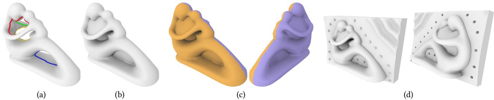
Fig. 9. Dealing with positive-genus models: (a) computation of a shortest basis of tunnel loops; (b) topological simplification by inserting membranes; (c) segmentation of the remeshed model; (d) keeping membranes in the metamold to define proper cuts in the mold volume.

Once we have identified the shortest tunnel loops, we remesh the input surface to add topological membranes. Given a loop, the surface of the corresponding membrane is defined through screened Poisson surface reconstruction [Kazhdan and Hoppe 2013]. The membranes are then made solid by duplicating and flipping their faces, and appended to the input mesh while preserving manifoldness (Figure 9.b). Running the optimization over the model equipped with membranes results in a segmentation with properly located boundaries (Figure 9.c).

After obtaining a valid segmentation, the membranes having the same label assigned on both their sides are kept in the model, as they introduce cuts in the molds (Figure 9.d). Conversely, the membranes which are either assigned two different labels on their sides or are traversed by a segment boundary can be removed from the object, as they do not correspond to a required cut in the silicone mold, but only served to identify proper boundaries in the segmentation.

# 5 FABRICATION AND ASSEMBLY

After the segmentation process is complete, the obtained regions identify the different mold pieces and the boundaries between different regions demarcate the parting lines. To get the final silicone multi-piece mold, we have to define the parting surfaces (Section 5.1) and design the actual shape of each printable metamold (Section 5.2), which will be filled with silicone to create the reusable mold piece (Section 5.3).

# 5.1 Parting surfaces

To generate the mold pieces we need to extend the boundaries between different segmented regions into the space surrounding the object, so that they correctly define the shape of the molds. Given a segment of the surface, we define an oriented point set $S _ { B } \cup S _ { C }$. We create $S _ { B }$ B Cby uniformly sampling points along the segment boun-SBdary. The orientation of each sample is defined as the cross product between the normal to the original surface and the direction along the boundary (Figure 10.a). $S _ { C }$ is created by uniformly distributing SCpoints on a circle lying on the best fitting plane to the boundary samples; these points are oriented according to the plane normal and they are useful to obtain a fairly planar surface far from the object. Since $S _ { B }$ and $S _ { C }$ have coherent orientations, we can construct the SB SCparting surface by using Poisson Surface Reconstruction [Kazhdan and Hoppe 2013] on $S _ { B } \cup S _ { C }$ (Figure 10.b). We use an analogous SB SCapproach to generate the membranes, using Poisson surface reconstruction on a set of points sampled on tunnel loops (Figure 10.c), oriented using the same procedure as for $S _ { B }$.

SBFor molds composed of more than two pieces, consistent parting surfaces are generated incrementally. We start from a single piece and build its parting surface as described above. Then, for the next piece, we build the parting surface using only the portion of the boundary that has not been used yet (i.e., that is not shared with the previous pieces). Finally, we clip the result with all previously obtained surfaces (Figure 10.d).

# 5.2 Metamold design and fabrication

The final design of printable metamolds should take into account material costs (i.e., the amount of silicone required to fill each metamold), as well as practical aspects, such as preventing air trapping and excessive pressure while casting.

Although there are no strict requirements on the final shape of the silicone multi-piece mold, for the sake of practicality, we decided to generate mold pieces that, once assembled, form a box that is easy to use for casting and for which the metamolds are easy to be cast too. In other words, for the resulting mold (and metamold), the direction for which pouring the casting liquid does not induce trapped air should be orthogonal to one of the sides of the box.

Preventing air trapping during the casting operations is important to avoid artifacts on the cast model. Ideally, one should create an escape hole for each local maximum on the object surface with respect to the gravity direction. However, the presence of high frequencies on the surface may result in a high number of escape holes. We follow the approach proposed in [Malomo et al. 2016] that defines a practical solution to prune unnecessary maxima, based on the intuition that the cast can be slightly tilted during the casting.

Our production pipeline involves two casting operations: we first cast silicone into the metamolds, then resin into the assembled final mold. Therefore, we need to address air trapping for both these steps (Figure 11). The casting directions for silicone implicitly restrict the possible resin casting directions, as we place the silicone mold box on one of its flat faces while pouring the resin. Then, the idea is to explore contemporarily the space of possible good directions for both silicone and resin casting.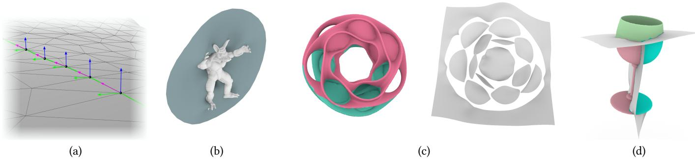
Fig. 10. Modeling parting surfaces: (a) the oriented sampling on the boundary of a segment: the normal to each sample (green) is the cross product between the normal to the original surface (blue) and the direction along the segment boundary (purple); (b) the parting surfaces for the armadillo model; (c) internal membranes and parting surfaces for an object with high genus; (d) parting surfaces for a model segmented into three pieces.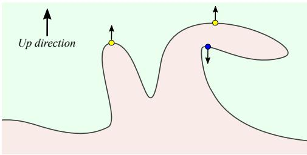
Fig. 11. A visualization of the trapped air problem for both silicone and resin casting. During silicone casting, the mold volume (green area) could trap air bubbles around downward maxima (blue dot). During resin casting, the model cavity (pink area) could trap air bubbles in correspondence of upward maxima (yellow dots).

Let $\boldsymbol { P } = \{ P _ { 1 }, \ldots, P _ { q } \}$ denote a mold composed of q pieces $P _ { i }$ $\dot { \boldsymbol { q } } \le 3$ P P,..., Pqin all our examples). Let $P _ { i }$ q Pibe obtained by pouring silicone qin the metamold $M _ { i }$ Pi. For each mold piece $P _ { i }$, we compute the best i ifitting plane to the corresponding parting line, then define a first set of candidate directions by sampling directions in a cone around the plane normal vector. These directions are assumed to be good candidates for pouring silicone in the corresponding metamold $M _ { i }$ MiAmong these, we pick a subset of directions which would reduce the presence of air-trapped bubbles in the silicone, following the strategy in [Malomo et al. 2016].

Let $C _ { i }$ denote the subset of good candidate directions for each mold piece $P _ { i }$, $i \in \{ 1, \ldots, q \}$. We now search a set of box-compatible q Pi i,.-tuples of directions $( c _ { 1 }, \ldots, c _ { q } )$, $c _ { i } \in C _ { i }$, for which there could q c,..., cq ci Ciexist a box that contains all the mold pieces and with faces approximately orthogonal to $( c _ { 1 }, \ldots, c _ { q } )$; that is, we search for q -tuples c,..., cq qof directions which are approximately either mutually orthogonal or mutually parallel. Finally, among these box-compatible tuples of directions, we choose the one for which we can define a box with minimal height (to minimize the amount of silicone and the pressure of casting material) and minimum risk of generating air bubbles while casting inside the box cavity. Note that in many cases box-compatible tuples can leave a degree of freedom, for example when they are composed of parallel, opposite directions. In this case, we simply choose the remaining box axis by minimizing the box volume.

Given the final pouring directions, we automatically add the final details over the metamolds geometry. Small pegs are placed in correspondence of each local maximum, defining the anchor points for 3D printed pipes that will be attached to form the air vents in the mold volume. We take the global maximum as the anchor point for a larger vent, from which resin will be poured. Sealing dams are added as a plug and slot structure surrounding the object in a closed loop over the parting surface to secure the sealing between different mold pieces (Figures 12.a and.b). Also, to ensure a perfect interlock of the mold pieces, registration pegs and holes are added on the parting surface in correspondence of topological membranes shared among different mold pieces.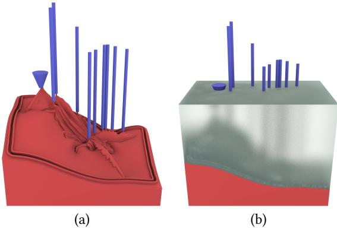
Fig. 12. (a) Details on the metamold geometry: 3D printed pipes (in blue) anchored to pegs, and sealing dams closing a loop around the object on the parting surface; (b) the 3D printed pipes create air vents in the mold volume, to let air escape while casting.

Robust CSG Boolean operations [Zhou et al. 2016] are used to generate the final metamold geometry.

# 5.3 Silicone mold fabrication and assembly

The final silicone mold pieces are obtained by filling each metamold with liquid silicone. For the sake of simpler removal of the mold and faster fabrication, we 3D print just the bottom of the metamold and we attach to them generic vertical sides of the container (see Figure 13). We used in most cases four L-shaped plastic pieces that can be easily assembled to build the sides of any rectangular container, but cheaper solutions, like hand cut, taped, disposable cardboard sides, were equally successful. Finally, once the silicone mold pieces have been created and assembled, resin can be poured in the cavity to cast the sought object. Then, silicone molds can be removed and re-used to cast multiple copies.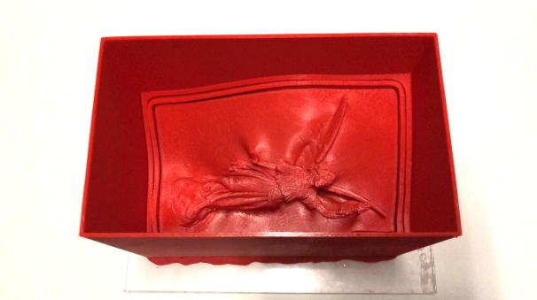
Fig. 13.3D printed walls used for the silicone pouring procedure.

<table><tr><td>Model</td><td>Time (min)</td><td>Model</td><td>Time (min)</td></tr><tr><td>Armadillo</td><td>8</td><td>Gargoyle</td><td>11</td></tr><tr><td>Lucy</td><td>15</td><td>Fertility</td><td>8</td></tr><tr><td>Heptoroid</td><td>8</td><td>Magali&#x27;s hand</td><td>17</td></tr><tr><td>Bunny</td><td>12</td><td>Hammer</td><td>6</td></tr><tr><td>Horse</td><td>8</td><td>Goblet</td><td>48</td></tr></table>

Table 1. Timings for deriving the optimal segmentation.

# 6 RESULTS

We evaluated our approach by fabricating metamolds and molds for many different objects, ranging from fairly simple shapes to shapes with highly challenging geometries and topologies.

To segment objects, we uniformly remeshed surfaces to $6 0 K$ fa-Kces. The space of possible parting directions was uniformly sampled with $k \: = \: 6 5 0$ candidate parting directions. Then, the segmentaktion pipeline included: evaluating tubeness (once per mesh), which took between 2 and 4 minutes on an Intel I7-6700K 4GHz machine; computing moldability costs for the whole set of candidate parting direction, which took between 5 and 10 minutes;clustering meshes with $q = 1 0 0 0$ clusters, which took around 30 seconds; solving the qILP problem on both clustered and original meshes, with timings for different objects reported in Table 1. The final parting lines were then transferred from simplified meshes to high-resolution meshes (up to $1. 5 M$ faces).. MGenerating metamolds required computing parting surfaces on high-resolution meshes, inserting air pipe pegs, and defining the optimal final geometry. The whole process took up to 20 minutes.

Metamolds were printed using different 3D printers, namely a Ultimaker $2 +$, a Stratasys J750, and a Stratasys Fortus 450 MC. Molds were fabricated using common silicone, available at hobby stores.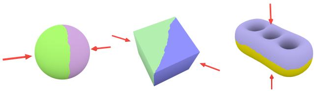
Fig. 14. Resulting segmentation for basic shapes. Red arrows represent the extraction direction chosen for each segment.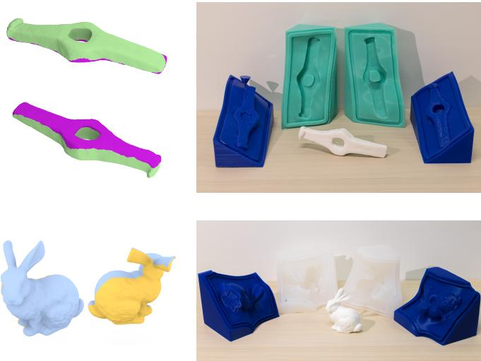
Fig. 15. Some simple models cast with our technique. Left: the optimized segmentation; right: the fabricated metamolds and the cast object.

Finally, once we obtained the metamolds and their corresponding silicone molds, we could easily produce multiple copies of the same geometry in a cost- and time-effective manner. We used simple bi-component resin for casting.

Figure 14 shows the resulting segmentation for basic shapes, with the chosen extraction directions highlighted. Figure 15 shows two fabricated models with relatively simple geometries. Figure 16 shows successful examples of fabricated objects with complex geometric detail. Our method handles well both models with protrusions (Figure 16.a) and models that have high-frequency surface details (Figure 1 and 16.c). Figure 17 shows a model which required a three-piece mold.

All objects were reproduced without appreciable difference with respect to the digital mesh. We measured the error introduced in the casting process on the fertility model, based on the Hausdorff distance between a 3D scan of the cast model and the digital version. The physical model is $1 2 0 m m$ long. For the digitization process mmwe used a GOM Atos scanner that yields a precision of $0. 2 m m$. As shown in Figure 18, approximatively $8 8 \%$ of the surface has an error less than $0. 5 m m$.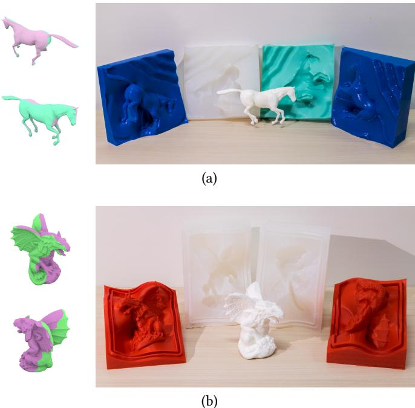
Fig. 16. Some more complex models cast with our technique. Left: optimized segmentation; right: fabricated metamolds, molds and cast object.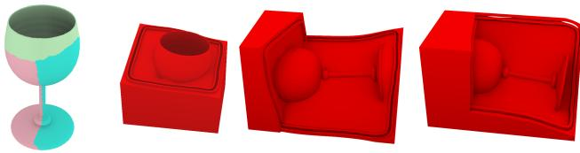
Fig. 17. A goblet model that required three mold pieces.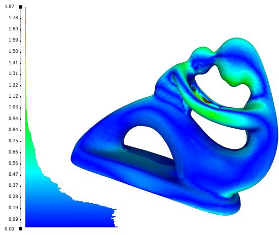
Fig. 18. The error (in mm) induced by the casting process over 1M samples (0 is deep blue, 1 87 is red). The statuette is $1 2 0 m m$ long. The histogram.shows that the resulting error is $\leq 0. 5 m m$ for $8 8. 1 1 \%$ of the samples.

# 6.1 Comparison with other techniques

Figure 19 demonstrates how we can successfully cast objects which could not be fabricated with previous techniques. In particular, the hand, fertility and heptoroid models are the failure cases reported in [Herholz et al. 2015], as models for which mold pieces could not be assembled and disassembled due to interlocking. Our approach is successful as it enables one to relax the height field constraints, by exploiting the flexibility of silicone. Therefore, we are able to reproduce the models without inducing any deformation on the original geometry.

The fertility and heptoroid models also show how we can cope with positive-genus surfaces, thanks to the insertion of membranes which simplify the object topology and define properly located cuts in the silicone volume. Notice how we are able to cast the high-genus heptoroid with just a two-piece mold.

The heptoroid model was a failure example also in [Malomo et al. 2016]. Though FlexMolds can theoretically handle high-genus surfaces, on the heptoroid it produced a mold with a very long and complex cut, making the manual sealing process unfeasible. Moreover, FlexMolds would have required printing techniques which allowed for the easy removal of the support material, while our metamolds can be fabricated with a common 3D printer.

# 6.2 Limitations

While our approach has proven successful on objects for which no previous technique was able to provide a practical molding, we found that at least two classes of complex shapes still remain beyond the capabilities of metamolds. First, shapes with long, thin involuted structures (like the floating strips of the model in Figure 20) cannot be safely molded mostly because the cast material is not able to sustain the forces applied by the mold during the extraction. Secondly, models where a large part of the surface is not easily accessible from the outside, or even a simple bottle, cannot be molded. Such shapes would require decomposing the object itself into multiple pieces to be molded separately; this is an interesting research direction.

# 7 CONCLUSIONS

We presented a novel technique for the computational design of flexible, reusable molds for resin casting. The framework is based on metamolds: automatically generated, 3D printed custom containers, which can be filled with silicone to produce silicone molds for casting multiple replicas of objects. A novel segmentation technique allows one to find optimal parting directions for mold pieces. The surface decomposition drives the design of the shape of the mold pieces, including the choice of appropriate parting surfaces and casting directions. The placement of sound air vents and sealing and registration features supports the practical usage of the molds.

We generated the metamolds, fabricated the corresponding molds and finally used them to cast various 3D models, demonstrating that our approach works for challenging examples, up to shapes extremely complex in topology or rich in fine geometric details which could not be fabricated with previous techniques. Thanks to the great capacity of silicone to seal external slits, our method can also be applied to produce ice models (see Figure 21).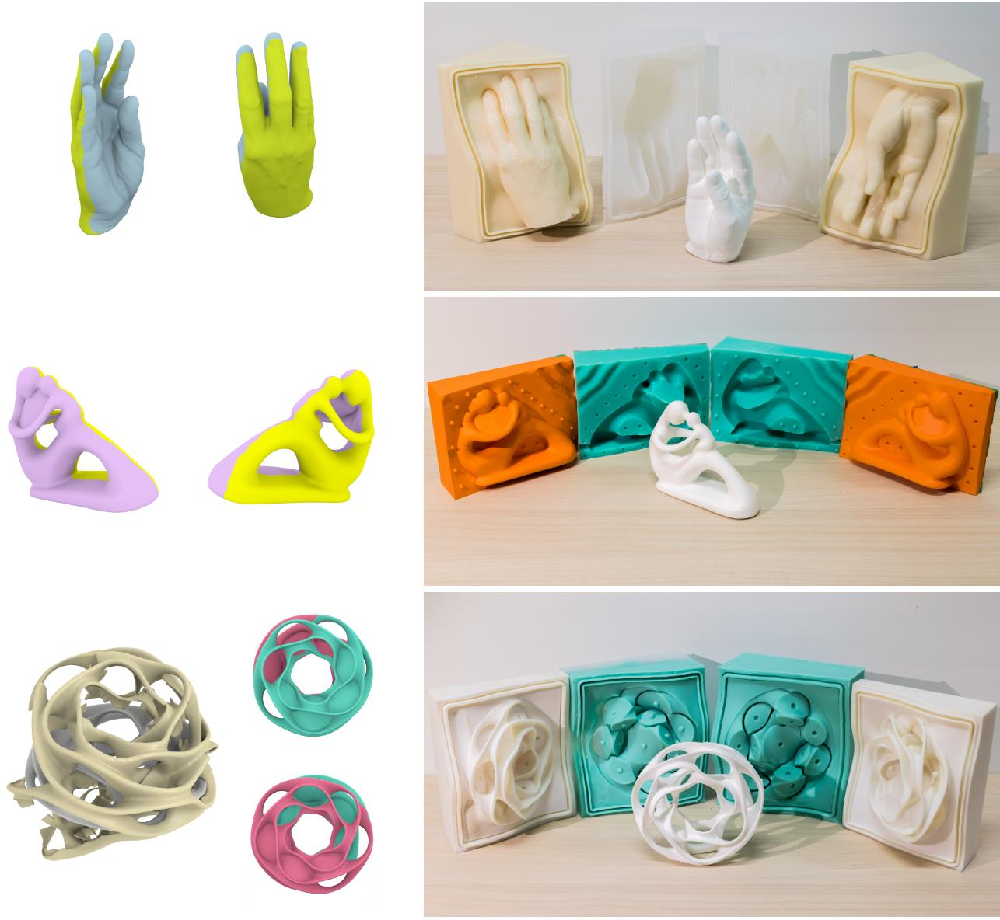
Fig. 19. Successful casting of objects which could not be fabricated with the approach in [Herholz et al. 2015]. The heptoroid (third row) is a failure case als for FlexMolds [Malomo et al. 2016], which derives an extremely complex cut layout (left), whereas our approach requires just a two-piece mold (right).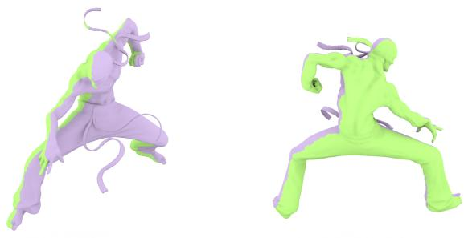
Fig. 20. A failure case: a model with extremely long thin features may require additional cuts that cannot be detected by our technique.

While some limitations in the class of shapes that can be handled still exist, we significantly expanded the range of objects that it is possible to cast in a simple and practical way, thus bringing silicone mold casting into the realm of personal fabrication.

# ACKNOWLEDGMENTS

The authors thank Marco Callieri for helping with the resin casts and 3D scanning, Jon O'Neill and Tarrant Saphin for helping with 3D printing, and Angela Fabiano and Ylenia Zambito for their help with silicone molding. The armadillo, Lucy, and bunny models are courtesy of the Stanford 3D Scanning Repository. The hand and fertility models are courtesy of the AIM@SHAPE Shape Repository. The goblet is courtesy of the Shape COSEG Dataset. The heptoroid is courtesy of the UC Berkeley Rapid Prototyping Project. The horse model is available in the dataset from [Sumner and Popović 2004]. For the hammer model we thank The Hunterian, University of Glasgow, UK for access to the original hammer from their Antonine Wall collection, and Historic Environment Scotland for the 3D model. The research was partially funded by the EU H2020 Programme EMOTIVE: EMO-TIve Virtual cultural Experiences through personalized storytelling H2020-SC6-CULT-COOP-08-2016 (grant no. 727188), the European Research Council (ERC) MATERIALIZABLE: Intelligent fabricationoriented Computational Design and Modeling (grant no. 715767), and by the Italian PRIN project DSURF (grant no. 2015B8TRFM).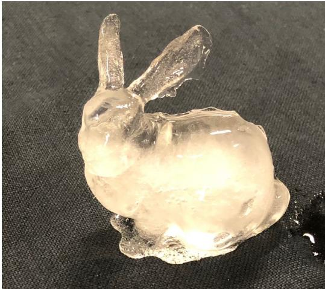
Fig. 21. An Ice-Age bunny.

# REFERENCES

Marco Attene. 2015. Shapes In a Box: Disassembling 3D Objects for Efficient Packing and Fabrication. Comput. Graph. Forum 34, 8 (Dec. 2015), 64-76.
V. Babaei, J. Ramos, Y. Lu, G. Webster, and W. Matusik. 2017. FabSquare: Fabricating Photopolymer Objects by Mold 3D Printing and UV Curing. IEEE Computer Graphics and Applications 37, 3 (May 2017), 34-42.
Amit H. Bermano, Thomas Funkhouser, and Szymon Rusinkiewicz. 2017. State of the Art in Methods and Representations for Fabrication-Aware Design. Comput. Graph. Forum 36, 2 (May 2017), 509-535.
S. Biasotti, D. Giorgi, M. Spagnuolo, and B. Falcidieno. 2008. Reeb Graphs for Shape Analysis and Applications. Theor. Comput. Sci. 392, 1-3 (Feb. 2008), 5-22.
Yuri Boykov, Olga Veksler, and Ramin Zabih. 2001. Fast Approximate Energy Minimization via Graph Cuts. IEEE Trans. Pattern Anal. Mach. Intell. 23, 11 (Nov. 2001), 1222-1239.
Tim Bruckner, Zach Oat, and Ruben Procopio. 2010. Pop sculpture. Watson-Guptill Publications. Vicent Caselles, Ron Kimmel, and Guillermo Sapiro. 1997. Geodesic Active Contours. Int. J. Comput. Vision 22, 1 (Feb. 1997), 61-79.
Pritam Chakraborty and N. Venkata Reddy. 2009. Automatic determination of parting directions, parting lines and surfaces for two-piece permanent molds. Journal of Materials Processing Technology 209, 5 (2009), 2464 - 2476.
Xiaobai Chen, Aleksey Golovinskiy, and Thomas Funkhouser. 2009. A Benchmark for 3D Mesh Segmentation. ACM Trans. Graph. 28, 3, Article 73 (July 2009), 12 pages.
Xuelin Chen, Hao Zhang, Jinjie Lin, Ruizhen Hu, Lin Lu, Qixing Huang, Bedrich Benes, Daniel Cohen-Or, and Baoquan Chen. 2015. Dapper: Decompose-and-pack for 3D Printing. ACM Trans. Graph. 34, 6, Article 213 (Oct. 2015), 12 pages.
Ernest P De Garmo, J Temple Black, and Ronald A Kohser. 2011. DeGarmo's materials and processes in manufacturing. John Wiley & Sons. Andrew Delong, Anton Osokin, Hossam N. Isack, and Yuri Boykov. 2012. Fast Approximate Energy Minimization with Label Costs. Int. J. Comput. Vision 96, 1 (Jan. 2012), 1-27.
Tamal K. Dey, Fengtao Fan, and Yusu Wang. 2013. An Efficient Computation of Handle and Tunnel Loops via Reeb Graphs. ACM Trans. Graph. 32, 4, Article 32 (July 2013), 10 pages.
Gurobi Optimization, Inc. 2016. Gurobi Optimizer Reference Manual. (2016). http://www.gurobi.com
Philipp Herholz, Wojciech Matusik, and Marc Alexa. 2015. Approximating Free-form Geometry with Height Fields for Manufacturing. Comput. Graph. Forum 34, 2 (May 2015), 239-251.
Ruizhen Hu, Honghua Li, Hao Zhang, and Daniel Cohen-Or. 2014. Approximate Pyramidal Shape Decomposition. ACM Trans. Graph. 33, 6, Article 213 (Nov. 2014), 12 pages.
Alec Jacobson. 2017. Generalized Matryoshka: Computational Design of Nesting Objects. Comput. Graph. Forum 36, 5 (Aug. 2017), 27-35.
Evangelos Kalogerakis, Aaron Hertzmann, and Karan Singh. 2010. Learning 3D Mesh Segmentation and Labeling. ACM Trans. Graph. 29, 4, Article 102 (July 2010), 12 pages.
Michael Kazhdan and Hugues Hoppe. 2013. Screened Poisson Surface Reconstruction. ACM Trans. Graph. 32, 3, Article 29 (July 2013), 13 pages.
Benjamin Keinert, Matthias Innmann, Michael Sänger, and Marc Stamminger. 2015. Spherical Fibonacci Mapping. ACM Trans. Graph. 34, 6, Article 193 (Oct. 2015), 7 pages.
Alan C. Lin and Nguyen Huu Quang. 2014. Automatic generation of mold-piece regions and parting curves for complex CAD models in multi-piece mold design. Computer-Aided Design 57 (2014), 15 - 28.
O. Litany, E. Rodolà, A. M. Bronstein, M. M. Bronstein, and D. Cremers. 2016. Non-Rigid Puzzles. Comput. Graph. Forum 35, 5 (Aug. 2016), 135-143.
Ligang Liu, Ariel Shamir, Charlie Wang, and Emily Whitening. 2014.3D Printing Oriented Design: Geometry and Optimization. In SIGGRAPH Asia 2014 Courses (SA '14). ACM, New York, NY, USA, Article 1.
Linjie Luo, Ilya Baran, Szymon Rusinkiewicz, and Wojciech Matusik. 2012. Chopper: Partitioning Models into 3D-printable Parts. ACM Trans. Graph. 31, 6, Article 129 (Nov. 2012), 9 pages.
Luigi Malomo, Nico Pietroni, Bernd Bickel, and Paolo Cignoni. 2016. FlexMolds: Automatic Design of Flexible Shells for Molding. ACM Trans. Graph. 35, 6, Article 223 (Nov. 2016), 12 pages.
M. Mortara, G. Patanè, M. Spagnuolo, B. Falcidieno, and J. Rossignac. 2004. Plumber: A Method for a Multi-scale Decomposition of 3D Shapes into Tubular Primitives and Bodies. In Proc. of the 9th ACM Symposium on Solid Modeling and Applications (SM $\overrightarrow { O 4 },$. Eurographics Association, Aire-la-Ville, Switzerland, Switzerland, 339-344.
Daniele Panozzo, Enrico Puppo, Marco Tarini, and Olga Sorkine-Hornung. 2014. Frame Fields: Anisotropic and Non-orthogonal Cross Fields. ACM Trans. Graph. 33, 4, Article 134 (July 2014), 11 pages.
Guodong Rong and Tiow-Seng Tan. 2006. Jump Flooding in GPU with Applications to Voronoi Diagram and Distance Transform. In Proceedings of the 2006 Symposium on Interactive 3D Graphics and Games (I3D '06). ACM, New York, NY, USA, 109-116.
Ariel Shamir. 2008. A survey on Mesh Segmentation Techniques. Computer Graphics Forum (2008).
L. Shapira, S. Shalom, A. Shamir, D. Cohen-Or, and H. Zhang. 2010. Contextual Part Analogies in 3D Objects. Int. J. Comput. Vision 89, 2-3 (Sept. 2010), 309-326.
Oana Sidi, Oliver van Kaick, Yanir Kleiman, Hao Zhang, and Daniel Cohen-Or. 2011. Unsupervised Co-segmentation of a Set of Shapes via Descriptor-space Spectral Clustering. ACM Trans. Graph. 30, 6, Article 126 (Dec. 2011), 10 pages.
Robert W. Sumner and Jovan Popović. 2004. Deformation Transfer for Triangle Meshes. ACM Trans. Graph. 23, 3 (Aug. 2004), 399-405.
Nobuyuki Umetani, Bernd Bickel, and Wojciech Matusik. 2015. Computational Tools for 3D Printing. In ACM SIGGRAPH 2015 Courses (SIGGRAPH '15). ACM, New York, NY, USA, Article 9.
J. Vanek, J. A. Garcia Galicia, B. Benes, R. Mźch, N. Carr, O. Stava, and G. S. Miller. 2014. PackMerger: A 3D Print Volume Optimizer. Comput. Graph. Forum 33, 6 (Sept. 2014), 322-332.
Somlak Wannarumon. 2011. Reviews of Computer-Aided Technologies for Jewelry Design and Casting. Naresuan University Engineering Journal 6, 1 (2011), 45-56.
Chunjie Zhang, Xionghui Zhou, and Congxin Li. 2010. Feature extraction from freeform molded parts for moldability analysis. The International Journal of Advanced Manufacturing Technology 48, 1 (01 Apr 2010), 273-282.
Eugene Zhang, Konstantin Mischaikow, and Greg Turk. 2005. Feature-based Surface Parameterization and Texture Mapping. ACM Trans. Graph. 24, 1 (Jan. 2005), 1-27.
Qingnan Zhou, Eitan Grinspun, Denis Zorin, and Alec Jacobson. 2016. Mesh Arrangements for Solid Geometry. ACM Trans. Graph. 35, 4, Article 39 (July 2016), 15 pages.
Song Chun Zhu and Alan Yuille. 1996. Region Competition: Unifying Snakes, Region Growing, and Bayes/MDL for Multiband Image Segmentation. IEEE Trans. Pattern Anal. Mach. Intell. 18, 9 (Sept. 1996), 884-900.