# Polygonization of Non-Manifold Implicit Surfaces

Jules Bloomenthal and Keith Ferguson Department of Computer Science The University of Calgary

# Abstract

A method is presented to broaden implicit surface modeling. The implicit surfaces usually employed in computer graphics are two dimensional manifolds because they are defined by real-valued functions that impose a binary regionalization of space (i.e., an inside and an outside). When tiled, these surfaces yield edges of degree two. The new method allows the definition of implicit surfaces with boundaries (i.e., edges of degree one) and intersections (i.e., edges of degree three or more). These non-manifold implicit surfaces are defined by a multiple regionalization of space. The definition includes a list of those pairs of regions whose separating surface is of interest.

Also presented is an implementation that converts a nonmanifold implicit surface definition into a collection of polygons. Although following conventional implicit surface polygonization, there are significant differences that are described in detail. Several example surfaces are defined and polygonized.

CR Categories and Subject Descriptors: I.3.5 [Computer Graphics]: Computational Geometry and Object Modeling - Curve, Surface, Solid, and Object Representations. Additional Keywords and Phrases: Implicit Surface, Non-Manifold, Polygonization.

# 1 Introduction

In this paper we wish to broaden the scope of implicit surface modeling to include combinations of volumes and surfaces. Traditionally, implicit surfaces are two-dimensional manifolds. A manifold surface is, everywhere, locally homomorphic (that is, of comparable structure) to a twodimensional disk.

Permission to make digital/hard copy of part or all of this work for personal or classroom use is granted without fee provided that copies are not made or distributed for profit or commercial advantage, the copyright notice, the title of the publication and its date appear, and notice is given that copying is by permission of ACM, Inc. To copy otherwise, to republish, to post on servers, or to redistribute to lists, requires prior specific permission and/or a fee. ©1995 ACM-0-89791-701-4/95/008..$3.50

Any tessellation of a manifold surface, such as the polygonization of a finite (i.e., bounded) implicit surface, produces edges that are of degree two; that is, all edges are shared by exactly two faces. Uncommon to implicitly defined surfaces are manifolds with boundaries, which yield tessellations with edges of degree one, and non-manifold surfaces consisting of trimmed pieces whose tessellation yields edges of degree three or more.

The combination of finite three-dimensional volumes and two-dimensional surfaces is sometimes called mixed dimensional modeling and its surface is characteristically nonmanifold. Such models are unusual in computer graphics. Although considerable study has been devoted to the smooth join of parametric surfaces [Farin 1988] and to blends of implicit volumes [Rockwood 1989], the representation of a combined surface and volume has received relatively little attention.

# 2 Related Work

There have been several efforts to extend conventional solid modeling [Mäntylä 1988] to non-manifold surfaces and manifolds with boundary. Solid modeling is often specified by a binary construction tree; if the leaf nodes are solid primitives, the process is known as constructive solid geometry and may be represented internally by three-dimensional half spaces. If the leaf nodes include two-dimensional surfaces, the half-space is unsatisfactory as an internal representation [Miller 1986]. In these cases, the boundary representation, or a variation [Weiler 1986], is often employed.

In [Muuss and Butler 1990] a non-manifold boundary representation is constructed in pairwise order from simpler solid and surface primitives. It appears the topology of the resulting surface must, however, be pre-established. In [Rossignac and Requicha 1991] and [Rossignac and O'Connor 1989] a simplicial complex is used to specify and internally represent a mixed dimensional model. A calculus is developed that permits the application of standard Boolean set operations upon the mixed dimensional primitives. This approach is examined further in [Paoluzzi et al. 1993].

As observed in [Mäntylä 1988], the construction of intermediate structures during constructive solid modeling requires both considerable attention to numerical accuracy and significant case analysis of edge/edge and edge/surface intersections. These issues also receive considerable attention in the studies of mixed dimensional modeling.

Concrete examples are not presented in [Rossignac and O'Connor 1989] and [Muuss and Butler 1990] and are limited in scope in [Paoluzzi et al. 1993]. In this paper we provide several definitions for and renderings of mixed dimensional models. This paper describes the conversion of a nonmanifold definition to a concrete representation. As in [Muuss and Butler 1990], we produce a polygonal tessellation to approximate a model. Unlike constructive geometry, however, we utilize an implicit representation for nonmanifold surfaces, extending conventional implicit surface polygonization to accommodate these surfaces.

# 3 Implicit Representations

Let us consider a closed cylinder embedded in a sheet. Such an object poses a dilemma as to its implicit representation. As shown below, left to right, the object (truncated for illustration) can be represented as surface only, surface and volume, thin volume, and volume and trimmed surface. We regard the first representation as insufficiently faithful. The second representation is incorrect insofar as its physical usefulness (in terms of manufacturing) or its imaging (if, for example, the surfaces are semi-transparent).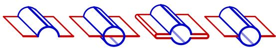
Figure 1. Possible Combinations of Cylinder and Sheet

The third representation offers difficulty for the sampling process commonly employed with implicit surfaces. The sampling rates for a ray-tracer and for a polygonizer must both be high (below left), when compared with those for the 'surface only' (below, right).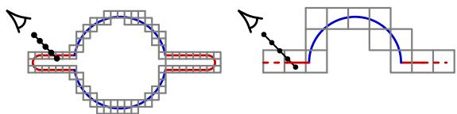
Figure 2. Sampling Rates for Polygonization and Ray-Tracing

Therefore, we conclude that the 'volume and trimmed surface' representation, which contains edges of degree one, two, and three, is the only accurate, compact, and unified representation of a volume embedded in a sheet. Unfortunately, this representation is not readily expressed as an implicit surface, i.e., as a set of points $\{p : f(p) = 0\}$. An implicit surface separates regions for which $f(\mathbf{p}) < 0$ from regions for which $f(\mathbf{p}) > 0$. This binary partitioning of space provides a definition for the 'volume only' shape, below left. It can also, below middle and right, define the 'surface only' and 'surface and volume' shapes, if the surface bounds are ignored. But it cannot define the 'volume and trimmed surface.' Conventional polygonizers assume that f is continuous and that points on opposite sides of the surface have oppositely signed values; therefore, they require a binary partitioning of space. For finite objects, they produce manifold tessellations but cannot produce a boundary, i.e., an edge with only one face. Nor can they produce an intersection, i.e., an edge with three or more faces. In contrast, any tessellation of a volume embedded in a surface requires edges of degree one, two and three.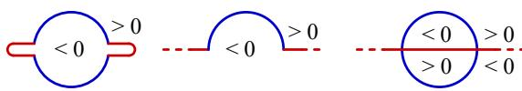
Figure 3. Possible Implicit Definitions (cross-sections)

In this paper we describe a new method to define and polygonize implicit surfaces that are non-manifold or manifold with boundary. The method differs from conventional polygonization in that it permits multiple, rather than binary, regions of space. This multiple regionalization is noted in [Rossignac and Requicha 1991]. As an example, we employ four regions, shown below, to define a sphere embedded within a square.
Figure 4. Multiple Regions define the Sphere-Square

Here, a cube bounds a plane, creating the square; the surface of the cube, however, is not of interest. Accordingly, our surface definition consists of two parts: an integer-valued region function, $f _ { r e g },$ that returns the region value of a point, and a set of region-pairs of interest. For the example above, the region pairs are $\{(1, 3), (1, 4), (3, 4)\}$, and $f_{reg}(\mathbf{p})$ is: 1 for $|p| < r$, 2 for max$(|p_x|, |p_y|, |p_z|) > s$, 3 for $p_z > 0$, and 4 otherwise, with $r$ the sphere radius and $s$ the half-length of the square. An approximation to this object, produced by our non-manifold polygonizer, is shown below. The use of multiple regions is conceptually simple, and may be implemented along the lines of conventional polygonization. There are, however, significant differences.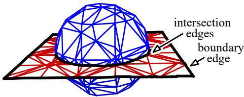
Figure 5. Tessellation of a Non-Manifold

# 4 Comparison to Conventional Polygonization

Conventional polygonizers of continuous functions partition space into adjoining cells that enclose the implicit surface [Ning and Bloomenthal 1993]. In a process known as continuation [Allgower and Georg], cells propagate across faces that contain both positively and negatively valued corners. With the non-manifold polygonizer, however, a face must contain a region pair of interest. This prevents unwanted propagation along uninteresting surfaces (such as the cube above).

As with many conventional polygonizers, we utilize the cube as the propagating cell and decompose it into tetrahedra. The tetrahedra serve as polygonizing cells, producing one or more polygons to approximate that portion of the surface contained in the cell. The fundamental steps of polygonization are diagrammed below As described in section 5, surface vertices, which control the direction of propagation, are produced during polygonization. Therefore, tetrahedra are polygonized concurrently with cube propagation.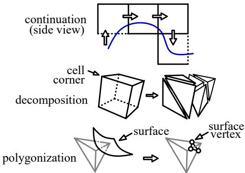
Figure 6. Overview of a Polygonizer

Conventional polygonizers assume that a surface passes through a polygonizing cell at most once. Thus, only a single surface vertex, or edge vertex, is produced along a cell edge that connects differently signed cell corners. This results in zero, three, or four edge vertices within a tetrahedron, and, at most, a single polygon edge, or face line, across a tetrahedral face. Traversing from one face line to the next, around the faces of the tetrahedron, produces a single three or four-sided polygon. The non-manifold polygonizer performs these steps of edge vertex computation and polygon creation, but, as we will now show, must also accommodate face vertices, multiple edge vertices along a single tetrahedral edge, and multiple face lines within a single tetrahedral face.

As a consequence of multiple regions, more than two regions can occur within a tetrahedral face. This yields more than two edge intersections on the face as well as an intersection internal to the face. For example, consider the three regions that meet along the circular intersection of sphere and square. In the illustration below (left), all three regions are spanned by a single tetrahedron; indeed, three regions are spanned by a single tetrahedral face (middle). This suggests the computation of three edge vertices, a face vertex, and their connection by three face lines (right).
Figure 7. The Face Vertex

Face vertices complicate implementation, but alternatives either produce a topological inconsistency (below, left) or are geometrically inaccurate (below, middle and right). These inaccuracies cause undesirable visual artifacts along intersections and boundaries of an object, unless the tetrahedra are very small. Unfortunately, uniformly small tetrahedra yield an excessive number of polygons, and adaptively sized tetrahedra appear difficult to implement for this application.
Figure 8. Alternatives to the Face Vertex

Regions can divide a face other than as shown in figure 7. Two common cases, below, left, suggest a need for multiple edge vertices, shown below, right. In one case, multiple edge vertices occur along an edge connecting equi-valued corners. Thus, unlike conventional polygonizers, the non-manifold polygonizer inspects all edges, not simply those that connect differently valued corners.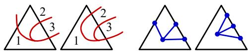
Figure 9. Multiple Vertices along an Edge

Let us consider the left face, above, its containing tetrahedron, and an adjoining tetrahedron. The face is repeated below, left, and the two tetrahedra are shown, right, separated for clarity. The front face of the right tetrahedron is shown, middle. The polygonal set produced by these tetrahedra are more complex than produced by conventional polygonizers. In particular, the left tetrahedron contains a 3, a 4, and a 5-sided polygon, each sharing the edge connecting the two face vertices. The right tetrahedron contains disjoint surfaces. Thus, in addition to a face vertex, a tetrahedral face must accommodate disjoint face lines, each connecting edge vertices that separate the same region pair.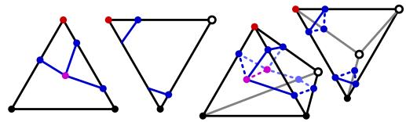
Figure 10. Disjoint Face Lines and Polygonal Surfaces

Because the tetrahedral corners may all differ in value, one tetrahedron may contain four face vertices, as shown below, left. To facilitate the connection of face vertices so that the four regions are properly separated, our polygonizer supports an inner vertex within the tetrahedron that connects face and edge vertices, as shown below, right (for clarity, the far bottom edge vertex is not shown). Complex arrangements of face, edge, and inner vertices can occur regardless of cell size. These complexities are more readily accommodated by evaluating tetrahedra independently; adaptive subdivision would likely complicate this process.
Figure 11. Disjoint Face Lines and Polygonal Surfaces

A sufficiently complex object can require an arbitrary number of face and edge vertices within a tetrahedron. For example, a face might contain any of the arrangements below, regardless of cell size. A robust polygonizer should handle these cases. We have, however, restricted our implementation to one face vertex per face or a collection of disjoint face lines per edge, and one inner vertex per tetrahedron. Nonetheless, our implementation produces reasonable results for the examples we present later.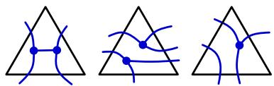
Figure 12. Complex Face Topologies

# 5 Implementation

In this section we provide details for cell propagation, cell polygonization, and post-process vertex modification. Throughout, the polygonizer attempts to produce surface vertices whose location is independent of the region-pairs of interest. Pseudo-code detailing these algorithms is given in [Bloomenthal and Ferguson 1994].

We use the cube as the propagating cell, centering the first cube at a start point, usually given, whose distance to a surface of interest is less than half the size of the cube. To prevent cyclic propagation, each visited cube location is stored in a hash table, as described in [Wyvill et al.]. To simplify the polygonization step, each cube is decomposed into six tetrahedra [Koide et al. 1986]. For each tetrahedron intersected by a surface of interest, a) each tetrahedral edge is examined for edge vertices, b) each face is examined for a face vertex, c) any necessary inner vertex is calculated, and d) polygon(s) are produced.

As described in section 4, an edge vertex is placed at all edge intersections along a cell edge. A hash table associates the vertex with its tetrahedral edge and stored with each vertex is the region-pair it separates. The binary subdivision often used in conventional polygonizers is unsatisfactory because in the first subdivision step half of the edge is ignored and intervening intersections may be missed, as shown below.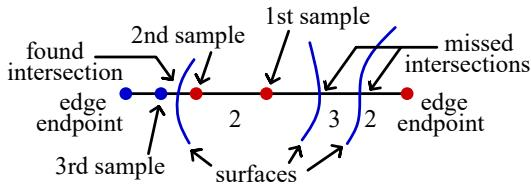
Figure 13. Sampling by Binary Subdivision

Therefore, each tetrahedral edge is divided into equally sized sections, as shown below, left. Binary subdivision is applied to those sections whose endpoints have different region values, below, right. If, during this binary subdivision, a 'foreign' region (i.e., a region not equal to either of the endpoint regions) is encountered, the subdivision continues recursively in both halves, detecting two (or more) intersections in the given section. Edge vertices are placed at the midpoint of the final interval(s) yielded by subdivision. To guard against a narrow region crossing a final interval, we test that the region value at the interval midpoint is one of the two endpoint region values of the interval; if not, the subdivision is continued. We choose n, the number of initial sections, and m, the minimum number of subdivision steps, such that each vertex will be within $\varepsilon$ of an actual intersection, i.e., edgeLength$/( 2^{(m+1)} n ) \leq \varepsilon$. We have employed $\varepsilon = 1/256$ of the propagating cell size.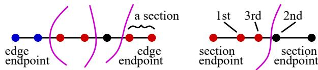
Figure 14. Two-Stage Edge Division

As explained shortly, it is important to order edge vertices during their storage; we use the location of the edge endpoints to compute an edge direction, and order the vertices accordingly. The region-pair for each vertex also is ordered according to this direction. We store all edge vertices, whether or not they belong to a surface of interest. This allows the polygonizer to produce geometry that is insensitive to changes in the region-pair interest set. Storing all edge vertices also permits computation of the region-set for a face vertex, as described below. Edge vertices are shared between adjoining tetrahedra; the presence of a previously computed edge vertex can be determined from the edge and the hash table.

As with edge vertices, face vertices are shared between adjoining tetrahedra. Therefore, we first test if a face has been previously processed; if not, we test if it contains an intersection. A face contains no face intersection if it contains only disjoint lines. To determine this, we traverse the edge vertices of a face, in order, adding and removing vertex region-value pairs from a stack, as shown below. If there are only disjoint lines in the face, then, beginning with a vertex startV, the stack will empty when the partner of startV is reached, fill again, and will empty a second time upon the return to startV.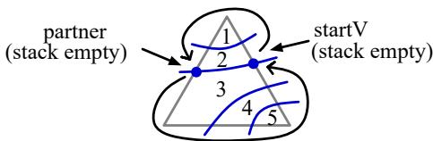
Figure 15. Determining if a Face Contains only Disjoint Lines

Our implementation accommodates any number of disjoint lines within a face, provided there is no face intersection. If an intersection exists, a face vertex is allocated and stored. Because it is computationally expensive to locate the intersection, we compute the location only if the face vertex is an intersection of surfaces of interest. We follow the face contour from an edge vertex v, continuing until a foreign region is found. This is similar to other local methods [Mortensen 1985], [Bajaj et al. 1988]. As shown below, left, the face contour is surrounded by small triangles until region 3 (in this example) is encountered.

The small triangles enclosing the contour are each specified by a directed edge, below, middle, that crosses the contour. A directed edge implies a new triangle apex, whose region value determines which of the new triangle sides becomes the next directed edge. The initial directed edge spans the start vertex. The contour follower terminates with a final triangle, below, right, whose apex belongs to a foreign region; the face vertex is located at the center of this triangle. So that this be within $\varepsilon$ of the actual intersection, the length of a small triangle side (exaggerated below for illustration) should not exceed $(2\sqrt{3})\varepsilon$, assuming the final triangle contains the actual intersection. A recursive contour follower, in which triangles become increasingly smaller, may prove more accurate.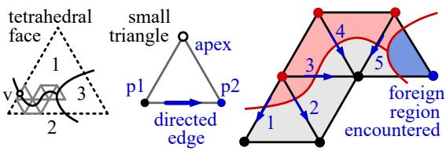
Figure 16. Following a Face Contour

For simple face topologies, as above, the choice of start vertex is immaterial. For complex topologies, as below, some vertices (e.g., $v_1$ and $v_2$) do not yield a face intersection. The contour follower must recognize when it fails, and begin again at a different edge vertex. Also, some vertices ($v_3$ and $v_4$, for example) will yield different intersections; therefore searches begin first from edge vertices that separate regions of interest. This compromises our goal of a geometry independent of the region-pair set, but, because we are limited to a single face vertex, we prefer it be on a surface of interest.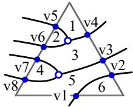
Figure 17. A Complex Face Topology

If the tetrahedron contains only disjoint face lines, as shown below, left, the lines are connected to form one or more disjoint polygons. As established in [Bloomenthal and Ferguson 1994], each polygon is of three or four sides. So that a polygon is properly associated with two regions (to provide, for example, polygon color), the polygons must be consistently oriented. We order each polygon so that, when viewed from the lesser of the two regions it separates, its vertices appear in clockwise order. The ordering begins with an edge vertex that separates a region of interest and a tetrahedral face that contains the edge vertex such that, if traversed in a clockwise direction, the edge traverses from lesser to greater region. We now proceed to the partner of this vertex, with respect to the given face (see figure 15). The partner becomes the 'current' vertex, and the face on the other side of the edge containing the new current vertex becomes the 'current' face. This step, similar to one described in [Bloomenthal 1988], is iterated until the current vertex becomes the start vertex. The process is repeated for those edge vertices not yet assigned to polygons. An optimized procedure could process those common cases typical of conventional tetrahedral polygonization.
Figure 18. Polygon Formation

In the case of non-disjoint surfaces, there must be at least two face vertices that separate regions of interest. We create an inner vertex whose location is the average location of those face vertices that separate regions of interest. Each face line, together with this inner vertex, creates one triangle, as shown above, right. Each triangle is ordered clockwise when viewed from the lesser-valued of the two regions it separates.

A problem concerning face contours, which also affects propagation, is the 'loop.' A face contour is looped if it enters and exits the face along the same edge, as shown below, left. As shown below, middle and right, looped intersections may occur on edges of equal or differently valued corners, and may be nested.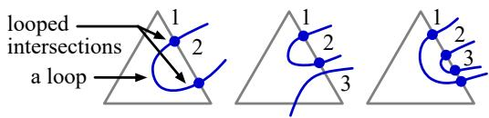
Figure 19. Looped Intersections

Looped intersections are problematic because there is no face vertex with which they can connect. They could be joined together, yielding a line coincident with the cell edge; this can duplicate polygons or align polygons with tetrahedral edges or faces, resulting in a staircased tessellation. They could be connected to a point on the face contour, preferably one that is maximally distant from the cell edge; this is an implementation complication we chose to avoid. Therefore, we ignore looped intersections, effectively truncating the surface, as illustrated below. Conventional polygonizers also truncate loops if they occur between equi-valued corners. Truncation can be arbitrarily large; when significant, truncation is best mitigated by a smaller cell size.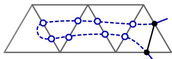
Figure 20. Truncation of Large Loop

There are two problems whose remedy we postpone until all cells are polygonized. The first concerns thin or small triangles. Thin triangles are produced when a polygonizing cell face is nearly tangential to the implicit surface; small triangles are produced if a polygonizing cell corner is close to the surface. Either triangle can occur when an inner vertex is close to a face vertex or a face vertex is close to an edge vertex. These triangles also occur in conventional polygonization and can cause visualization artifacts. They can yield orientation errors (i.e., the normal of the triangle can vary significantly from the actual surface normal) if the triangle width is comparable to E, the accuracy of edge and face vertices. In a post-polygonization step, each pair of connected vertices whose distance is less than E is replaced by the average of the two vertices. Resulting degenerate triangles are removed. Perturbation of cell corners, as suggested in [Moore and Warren 1991], is another method to eliminate problematic triangles.

The second problem concerns vertices on intersection edges. Consider triangles $t_1$, $t_2$, and $t_3$, which share an edge along the intersection circle of the sphere-square, as shown below. For smooth shading, each vertex requires a surface normal, but, in this example, it is not possible to compute a single normal for $v$ because $t_1$ and $t_2$ require a right-facing normal, whereas $t_3$ requires an upward-facing normal. To accommodate these competing requirements, we produce coincident vertices located at $v$, one for each different region-pair of the triangles sharing $v$.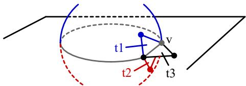
Figure 21. Duplicated Vertices

# 6 Results

We first compare the performance of the non-manifold polygonizer with a conventional polygonizer. For non-trivial objects, both polygonizers devote the vast majority of their time in evaluating the implicit surface function. Thus, we compare the two polygonizers according to the number of function evaluations. The non-manifold polygonizer performs many more evaluations along a surface border, where it must locate a face intersection. Because a conventional polygonizer does not attempt to locate such intersections, we compare the frequency of evaluations for solid models only. This limits our consideration to the typical cases of three and four edge intersections per tetrahedron.

We assume the non-manifold polygonizer uses $n$ (the number of edge sections, as described in section 5) $= 16$ and $m$ (the number of binary subdivisions) $= 4$, and that the conventional polygonizer uses $m = 8$, so that their vertex accuracies are equal. We ignore function evaluations for corners of the tetrahedra. which should be the same for both polygonizers. For three edge vertices per tetrahedron, the conventional polygonizer requires $(3 \times 8) = 24$ evaluations of $f$, whereas the non-manifold polygonizer requires $3 \times 16 + 3(16 + 4) = 108$ evaluations of $f_{reg}$. For four edge vertices, the conventional polygonizer requires $(4 \times 8) = 32$ evaluations, and the non-manifold polygonizer requires $4 \times 16 + 4(16 + 4) = 112$ evaluations. Thus, the non-manifold polygonizer requires about four times as many function evaluations as does the conventional polygonizer.

Our first example blends a sphere and a square. Pseudo-code for the region value and the surface interest are given below.

Sigmoid(d) { if abs$(d) > 1$ then return 0 else return $1 - (4d^6 - 17d^4 + 22d^2)/9$ } (a blend function from [Wyvill et al. 1986])
Saucer(p) { return Sigmoid$(\sqrt{p_x^2 + p_y^2}/7)/3$ }
Region(p) { if not InsideCube(p) then return 0; if Saucer(p) > abs($p_z$) then return 1; if $p_z > 0$ then return 2 else return 3 }
Interest(region-pair) { if regionPair = (1, 2) then return (true, red); if regionPair = (1, 3) then return (true, blue); if regionPair = (2, 3) then return (true, green); return (false) }

Conventional polygonizers calculate surface normals by approximating the gradient, $\nabla f$, of the implicit surface function. Our region function is integer valued, however, and cannot yield a gradient. Hence, we allow the software client to provide a real-valued function $g$ from which the gradient can be calculated. For non-manifold polygonization, the normal depends not only on vertex location but also on the region-pair being separated. For a fixed region-pair, $g$ should be a continuous function in the neighborhood of the surface separating that region-pair. Usually $g$ can be defined in terms of those functions that underlie $f_{reg}$, as shown below:

g(p, regionPair) { if regionPair = (1, 2) then return $-p_z$ - Saucer(p); if regionPair = (1, 3) then return $p_z$ - Saucer(p); if regionPair = (2, 3) then return $-p_z$ }

The surfaces are rendered transparently to demonstrate that surfaces internal to the volume have been trimmed.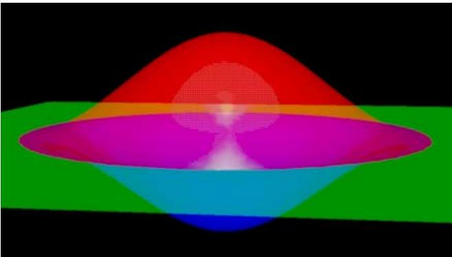
Figure 22. Saucer

The second example is a sphere embedded in a square, as in figure 4, with a smaller sphere removed. We observe that, whereas two adjacent regions of space define a surface, three adjacent regions define a curve. For example, in figure 4 the equator of the sphere is the intersection of regions 1, 3, and 4, and the boundary of the square is the intersection of regions 2, 3, and 4. These curves intersect polygonizing cells at cell faces, and are readily approximated simply by connecting face vertices. The boundary and intersection curves below are shown as thin (blue, yellow, cyan, and magenta) lines.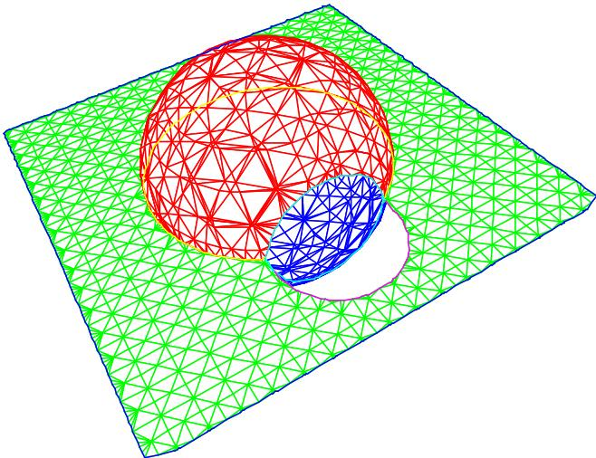
Figure 23. Object with Boundary and Intersection Curves

Our last example blends a sphere to a bicubic patch according to the following definition.

Region(p) {
  if Beyond(p, patch) then return 0
  if Sigmoid(p) > abs(DistanceToPatch(p, patch)) return 1
  if DistanceToPatch(p, patch) > 0 return 2 else return 3
}

The distance between $\mathbf{p}$ and the closest point on the patch, $P(s, t)$, is computed numerically. $s$ and $t$ are initialized from an approximating triangle mesh and are refined by projecting the vector from $P(s, t)$ to $\mathbf{p}$ onto the tangent plane at $P(s, t)$, as shown below. If the closest point belongs to the patch border, $\mathbf{p}$ is regarded as 'beyond' the patch. Otherwise, the signed distance indicates whether $\mathbf{p}$ is above or below the patch.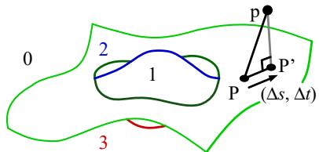
Figure 24. Region Definition for Blend to Patch

The shaded images are produced with transparency.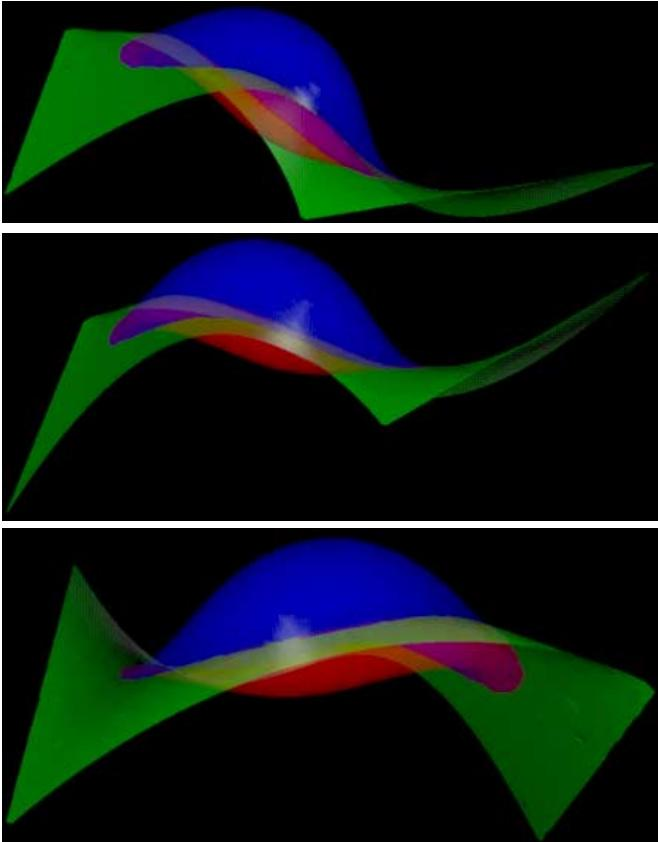
Figure 25. Blend to Patch

# 7 Conclusions

We have presented a new method to express and polygonize non-manifold implicit surfaces. This method permits a simple expression and evaluation for parametric surfaces combined with and trimmed against implicit volumes. These nonmanifold implicit surfaces are defined by multiple regions of space, unlike the binary regions that typically define implicit surfaces. Included with the object definition is a list of region pairs whose separating surfaces are of interest. When polygonized, non-manifold surfaces may have borders and intersections.

The use of multiple regions significantly complicates the polygonizer. In particular, the accurate polygonization of surface borders requires vertices internal to faces of the polygonizing cell, which in turn require multiple intersections per cell edge. This leads to the need for multiple, disjoint surfaces. The accurate polygonization of surface intersections requires vertices fully internal to the polygonizing cell. This additional complexity, however, is exercised only in the relatively few cells that contain borders or intersections.

The formula used to define non-manifold implicit surfaces do not require extraordinary numerical stability because, unlike constructive geometric methods, the non-manifold implicit surface is not computed as a series of intermediate surfaces, nor are primitive intersections explicitly calculated.

The present polygonizer cannot accommodate arbitrary complexity per tetrahedron, although it does accommodate an arbitrary number of disjoint surfaces. Non-disjoint surfaces are limited to a single intersection per face and a single internal vertex per polygonizing cell. Future work might include the accommodation, within a single polygonizing cell, of disjoint surfaces and multiple face and multiple internal intersections. Other future work might include improved boundary accuracy and reduced truncation, as well as additional consideration of adaptive methods.

Ray-tracing can render non-manifold, implicitly defined shapes; indeed, many ray-tracers return an integer identifier for a particular object or region of space, usually to accelerate performance or invoke anti-aliasing. We prefer, however, a concrete representation of the object. We have yet to determine the power of the present method with respect to shape specification and editing. Considering the flexibility of non-manifold surfaces, continued work on the present method seems warranted.

# Acknowledgements

We thank Przemek Prusinkiewicz for his insight and guidance. We also thank Dennis Arnon, Debbie Brooks, Tony DeRose, Adam Finkelstein, Pat Hanrahan, Paul Heckbert, Ken Shoemake, and Joe Warren for their comments. We are indebted to the University of Calgary and to Xerox Corporation for their support of this research.

# References

E. Allgower and K. Georg, Numerical Continuation Methods, an Introduction, Springer-Verlag, 1990.
C. Bajaj, Surface Fitting with Implicit Algebraic Surface Patches, in Topics in Surface Modeling, H. Hagen. ed., SIAM Publications, 1992.
J. Bloomenthal, Polygonization of Implicit Surfaces, Computer Aided Geometric Design, Nov. 1988.
J. Bloomenthal and K. Ferguson, Polygonization of Non-Manifold Surfaces, Research Rep. 94-541-10, Dept. of Computer Science, The University of Calgary, June 1994.
G. Farin, Curves and Surfaces for Computer Aided Geometric Design, a Practical Guide, Academic Press, New York 1988. A. Koide, A. Doi, and K. Kajioka, Polyhedral Approximation Approach to Molecular Orbital Graphics, Journal of Molecular M. Mäntylä, An Introduction to Solid Modeling, Computer Science Press, Md., 1988.
J. Miller, Sculptured Surfaces in Solid Models: Issues and Alternative Approaches, IEEE Computer Graphics and Applications, Dec. 1986.
D. Moore and J. Warren, Mesh Displacement: An Improved Contouring Method for Trivariate Data, Rice University Technical Rep. TR91-166, Sept. 1991.
M.E. Mortensen, Geometric Modeling. Wiley and Sons, New York, 1985.
M. Muuss and L. Butler, Combinatorial Solid Geometry, B-Reps, and n -Manifold Geometry, in Computer Graphics Techniques: Theory and Practice, D. Rogers and R. Earnshaw, eds., Springer Verlag, New York, 1990.
P. Ning and J. Bloomenthal, An Evaluation of Implicit Surface Tilers, IEEE Computer Graphics and Applications, Nov. 1993.
A. Paoluzzi, F. Bernardini, C. Cattani, and V. Ferrucci, Dimension-Independent Modeling with Simplicial Complexes, ACM Trans. on Graphics 12, Jan. 1993.
A. Rockwood and J.C. Owen, Blending Surfaces in Solid Modeling, Proc. of SIAM Conf. on Geometric Modeling and Robotics, G. Farin, ed., Albany New York, 1985.
J. Rossignac and M. O'Connor, SGC: a Dimension-Independent Model for Pointsets with Internal Structures and Incomplete Boundaries, Geometric Modeling for Product Engineering, Elsevier Science, 1990.
J. Rossignac and A. Requicha, Constructive Non-Regularized Geometry, in Beyond Solid Modeling, special ed. of Computer Aided Design, 1991.
K. Weiler, Topological Structures for Geometric Modeling, Ph.D. dissertation, Dept. of Computer and Systems Engineering, Rensselaer Polytechnic Institute, Aug. 1986.
G. Wyvill, C. McPheeters, and B. Wyvill, Data Structure for Soft Objects. Visual Computer 2, 4, Aug. 1986.