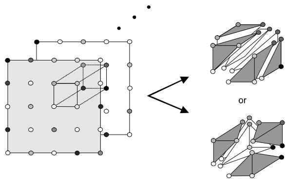
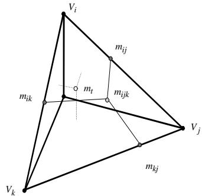
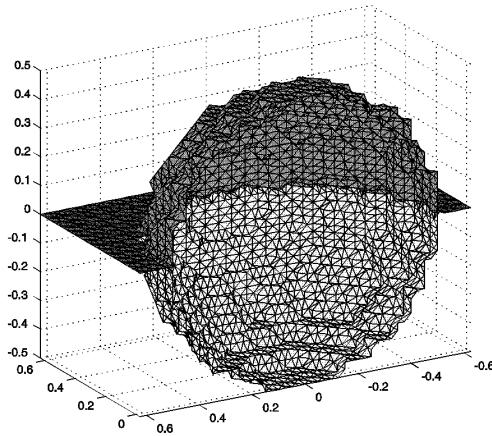
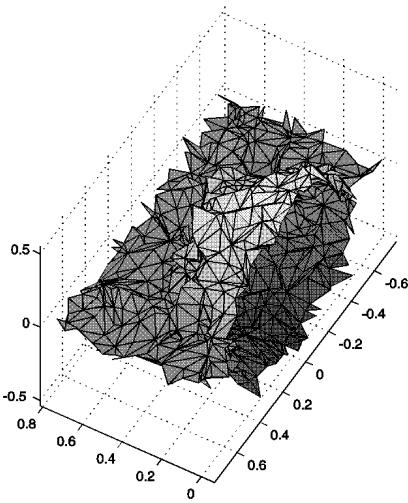
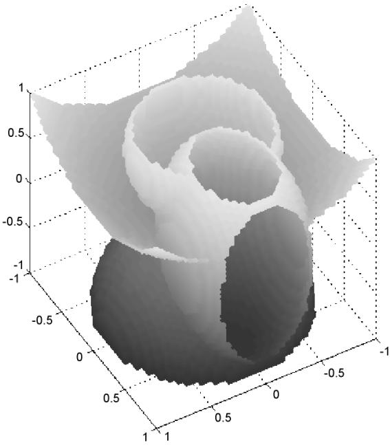

# Computing the Separating Surface for Segmented Data

Gregory M. Nielson
Computer Science and Engineering
Arizona State University
Tempe, AZ 85287-5406
nielson@asu.edu
Richard Franke
Mathematics
Naval Postgraduate School
Monterey, CA 93943-5216
rfranke@nps.navy.mil

# Abstract

An algorithm for computing a triangulated surface which separates a collection of data points that have been segmented into a number of different classes is presented. The problem generalizes the concept of an isosurface which separates data points that have been segmented into only two classes: those for which data function values are above the threshold and those which are below the threshold value. The algorithm is very simple, easy to implement and applies without limit to the number of classes.

# 1. Introduction and Algorithm

In this paper we describe an algorithm for computing a triangulated surface which separates regions of different types. We assume that we have a collection of data points $V_{_{i}}, i = 1,..., n$ and that each of these data points has been classified into one of several possible classes $c_{i}, i = 1,..., M$. This includes, for example, medical scanning device data that has been postprocessed by some segmentation procedure into different tissues or organ classes or physical simulation data that has been classified by material properties such solid, liquid or gas. For our algorithm, we assume that the data points $V_{i}$ are the vertices of a tetrahedrization of the domain of interest. Two important application areas are where the data points lie on a 3D rectilinear grid or 3D curvilinear grid. In either case we preprocess the data by subdividing each voxel or hexahedron (curvilinear grid cell) into tetrahedra and proceed with our algorithm. See Figure 1 and Nielson [4]. Note that in the 6 tetrahedra split, each cube is split exactly as shown. In the 5 tetrahedra split, a rotated version of what is shown is used on alternating voxels so that adjoining diagonals line up properly.
Figure 1. Decomposing voxel data into tetrahedra data

Our goal is to produce a triangulated surface which separates the components (connected subsets) of the regions, $R_{i}, i = 1,..., M$, each containing the data of type $c_{i}, i = 1,..., M$. This surface can be viewed as a generalization of the isosurface often associated with the marching cube algorithm (see [2] and [5]). In the context of the mc algorithm the discrete vertices lying on a 3D rectilinear grid are classified into only two possible classes: either the value of the data function, $\delta$, is above the threshold of the isosurface or below this threshold. The isosurface then separates these two classes of data points into two regions. In the more general situation where there are several possible classes for data points, the separating surface is defined as $S = \bigcup_{i,j=1,...,M; i \neq j} (\overline{R_i} \cap \overline{R_j})$. This, more general, separating surface

is fundamentally different from an isosurface in that it may contain regions where three or more surface segments join (see [1]). This means that the data structures used for the representation of the triangular approximation must allow for three or more triangles to share a common edge. This is not necessary for the results of a valid mc type algorithm which can be represented with a triangular grid structure.

In the spirit of the mc algorithm, our algorithm sequentially "marches" through all the cells processing one at a time. In our case, a cell is a tetrahedron. Let $V_{i}$, $V_{j}$, $V_{k}$, $V_{\iota}$ be the vertices of an arbitrary tetrahedron. If two vertices, say $V_{i}$ and $V_{j}$ are classified differently, we make reference to a point $m_{i j}$ along the edge joining $V_{i}$ and $V_{j}$. This point is where this edge intersects the surface separating the vertices $V_{i}$ and $V_{j}$. This separating point can be anywhere on this edge and in some default situations a reasonable choice would be the midpoint. We mention some other considerations for selecting this point later. If three points of a face, $V_{i}, V_{j}$ and $V_{k}$, are classified differently, we must make reference to a point $m_{i j k}$ lying somewhere interior to this face. Again, for the topological aspects of our algorithm, it is not important where exactly this point lies on the face, but some practical considerations which we discuss later lead to reasonable choices for this point. And finally if all four points are classified differently, we need to reference a point $m_{t}$ lying interior to the tetrahedron. This notation is further illustrated in Figure 2.
Figure 2. Notation used for vertices, mid-edge, mid-face and mid-tetrahedron points.

The strength of our tetrahedral-based algorithm is its simplicity and subsequent ease of implementation. There are only five cases to be considered: (0) all vertices are classified as one type (trivial case; no separating surface intersects the tetrahedron), (1) three vertices are of one class and one other vertex is of another class, (2) two vertices are of one class and two vertices are of another class, (3) two vertices of one class and the other two vertices are of second and third classes, and (4) each vertex is of a different class. Because any configuration in one of these five cases can be rotated into a standard configuration, standardized algorithms can be used assuming that (local) vertices are labeled $V_{i}, V_{j}, V_{k}$ and $V_{\iota}$.

The face of a tetrahedron having vertices of more than one type must be split. This can be seen in Figures 3, 4, 5 and 6 for the four nontrivial cases. When the vertices on a particular face of the tetrahedron are of only two types, the face is split along the line segment joining the mid-edge points on that face, say the points $m_{i l}$ and $m_{j l}$. This occurs in cases (1)-(3). When the vertices on a face are all three of a different type, the face must be split not only at the mid-edge points, but also at the mid-face point $m_{i j k}$ interior to this face. The face is then divided by the line segments joining the mid-face point to the mid-edge points. When four different types are present then we must involve the mid-tetrahedron point $m_{t}$. The separating surface is to be represented as a union of triangles, so quadrilaterals that naturally occur in our algorithm must be triangulated by including one diagonal or the other. We adopt the convention that we will impose those diagonals that are consistent with a certain tetrahedrization of the four hexahedra that occur in case (4). See Figure 6. Since each hexahedron has a vertex of the cube as one vertex, we adopt the triangulation of the faces by diagonals from the tetrahedron vertices to the mid-face points, and the mid-edge points to the mid-tetrahedron point. We should point out that unless certain restrictions are put on the mid-edge, mid-face and mid-tetrahedron points, those quadrilaterals may not be planar. This causes no particular problem, although we note that the separating surface will be slightly different if different choices were made when triangulating those quadrilaterals.

In case (3), there is a dilemma as to whether the exterior quadrilateral faces $( V_{i}, V_{j}, m_{j l}, m_{i l}$ and $V_{i}, V_{j}, m_{j k}, m_{i k}$ in Figure 5) would be divided from $V_{i}$ to $m_{j l}$ and $V_{i}$ to $m_{j k}$, or from $V_{j}$ to $m_{i l}$ and $V_{j}$ to $m_{i k}$ when tetrahedrizing the subvolumes. We have adopted the strategy that the order of the vertices in the description of the tetrahedrized volume will determine that; we choose $V_{i}$ or $V_{j}$ according to which has priority in the input list. Because we maintain order when sorting the unique classes of vertices for a particular tetrahedron, symbolically the first vertex is $V_{i}$. Hence we diagonalize the interior separating quadrilaterals using the line segments through $m_{j k l}$ and $m_{i l}$, and $m_{j k l}$ and $m_{i k}$.

In case (2), we again wish to be consistent with some tetrahedrization of the volumes, two triangular prisms in this case. Thus, we follow the rule of connecting the priority vertex to the opposite mid-edges for each prism, i.e., $V_{i}$ to $m_{j k}$ and $m_{j l}$, and $V_{k}$ to $m_{i l}$ and $m_{j l}$. After this is done for each prism, it is seen that the diagonal on the separating quadrilateral is arbitrary, and we choose the $m_{j k}$ to $m_{i l}$ segment.

For completeness we list the triangles comprising the separating surface in each case.

Case (1): Triangle: $m_{i l}, m_{j l}, m_{k l}$
Figure 3. Case (1): Three vertices of one class and one vertex of another class.

# Case (2):

Triangles: $m_{i k}, m_{j k}, m_{i l}; m_{i l}, m_{j k}, m_{j l}$
Figure 4. Case (2): Two vertices of one class and two vertices of another class.

# Case (3):

Triangles: $m_{kl}, m_{ikl}, m_{jkl}$; $m_{jk}, m_{ik}, m_{jkl}$; $m_{ik}, m_{jkl}, m_{ikl}$; $m_{jl}, m_{il}, m_{jkl}$; $m_{il}, m_{ikl}, m_{jkl}$

allows for maximum flexibility. In some applications where there is no additional information on which to base any bias or adjustment, one just as well select these point to be the actual geometric midpoints. That is,
$$
\begin{array} { l} { { m_{i j} = \displaystyle \frac { V_{i} + V_{j}} { 2}}} \\ { { m_{i j k} = \displaystyle \frac { m_{i j} + m_{i k} + m_{j k}} { 3}}} \\ { { m_{t} = \displaystyle \frac { m_{i j k} + m_{j k l} + m_{i k l} + m_{i l}} { 4}}} \end{array}
$$
In some other applications where there is additional information some weights may be used to compute these values. For example, if data points are classified (or segmented) on an interval of values of some data function, then it might be useful to weight accordingly the computation of the mid-edge value. Assume that an arbitrary point $V = ( x, y, z )$ is classified by the rules:
Figure 5. Case (3): Two vertices of one class and two other vertices each of another class.

V is of class $c _ { \alpha }$ provided $\alpha \leq \delta ( V ) \leq m$

# Case (4):

Triangles: $m_{ij}, m_{ijk}, m_t$; $m_{ij}, m_{ijl}, m_t$; $m_{jk}, m_{ijk}, m_t$; $m_{jk}, m_{jkl}, m_t$; $m_{ik}, m_{ijk}, m_t$; $m_{ik}, m_{ikl}, m_t$; $m_{jl}, m_{jkl}, m_t$; $m_{jl}, m_{ijl}, m_t$; $m_{il}, m_{ijl}, m_t$; $m_{il}, m_{ikl}, m_t$; $m_{kl}, m_{ikl}, m_t$; $m_{kl}, m_{jkl}, m_t$

and

Further assume that $V _ { a }$ and $V _ { b }$ are vertices that are classified as $c _ { \alpha }$ and $c _ { \beta }$, respectively. If we now consider the values of $\delta$ varying linearly along the edge joining $V _ { a }$ and $V _ { b }$ we could choose the mid-edge point to be the point where $\delta$ becomes equal to m which is the point where the classification changes from $c _ { \alpha }$ to $c _ { \beta }$. That would be
Figure 6. Case (4): Each vertex is a different class.

For the general description of our algorithm, we have kept the location of the mid-edge, mid-face and mid-tetrahedron points arbitrary. It is easy to present this way and also this
$$
m_{a b} = \left( \frac { m - \delta ( V_{a} )} { \delta ( V_{b} ) - \delta ( V_{a} )} \right) V_{b} + \left( \frac { \delta ( V_{b} ) - m} { \delta ( V_{b} ) - \delta ( V_{a} )} \right) V_{a}.
$$
We have also used the following approach which is based upon the idea of a preference or probability matrix. The user specifies the off-diagonal values of a $M \times M$ matrix $P = \left( { p _ { i j } } \right)$. These values serve as the weights for computing the mid-edge points. Let vertex $V _ { a }$ be of class $c _ { \alpha }$ and $V _ { b }$ be of class $c _ { \beta }$ be vertices of the same tetrahedron. Then the edge joining $V _ { a }$ and $V _ { b }$ will intersect the separating surface at $p _ { \alpha \beta } V _ { b } + p _ { \beta \alpha } V _ { a }$. Since the separating point must be a convex combination of the vertices we require that $0 \leq p _ { i j } \leq 1$ and $p _ { i j } + p _ { j i } = 1, i \neq j$. The interpretation of the matrix $\mathrm { P }$ can be in terms of the "strength" of various classes relative to other classes, or it can be used to cause the separating surface to come close to (or stay further away from) certain classes of points. For example, it may be desirable to not overestimate the volume associated with a particular class, and in that case the values in the row of the matrix P associated with that class should be close to zero, forcing the separating surface close to the vertices of that class.

# 2. Examples

The first example has three regions. Points above the plane $z = 0$, and outside the sphere $x^2 + y^2 + z^2 = 0.25$, are of one type. Points below the plane and outside the sphere are in a second class and the points inside the sphere form the third class. Over the domain $\{(x, y, z): -0.025 \leq x \leq 0.625, -0.625 \leq y \leq 0.625, -0.625 \leq z \leq 0.625\}$ we formed a grid of size $14 \times 26 \times 26$ and classified the points on this grid according to the ideal. We then applied our algorithm, using the 5 tetrahedra per cube split. In this case we used the formulas of equation (1) for determining the mid-edge, mid-face and mid-tetrahedron points. The separating surface which is shown in Figure 7 consists of 5,987 triangles.
Figure 7. An example with three regions.

One of the features of our algorithm is that it is designed for scattered data. Our next example illustrates its use in that context. Because the algorithm we used tetrahedrized the convex hull, points near the boundary may be in tetrahedra with large aspect ratios. This causes distortion around the boundaries, so in Figure 8 the separating triangles near the boundary have been deleted. We note, however, that if the proper tetrahedrization is performed, the separating triangles could be processed using subsets of the entire data set because our algorithm guarantees a proper match across tetrahedron boundaries. For Figure 8, we generated 2000 random points in the region $\{(x, y, z): -0.2 \leq x \leq 1, -1 \leq y \leq 1, -1 \leq z \leq 1\}$. These points were then classified according to the same scheme as for the previous example. The point set was tetrahedrized (yielding 12,936 tetrahedra) and our algorithm applied with separating points being taken according to equation (1). To avoid the distraction of poor edge behavior, we then eliminated each triangle in the separating surface whose median point fell outside the region $\{(x, y, z): 0 \leq x \leq 0.75, -0.75 \leq y \leq 0.75, -0.75 \leq z \leq 0.75\}$.

The final separating surface consists of 2,661 triangles. A graph of it is shown in Figure 8. The separating surface is necessarily jagged, but the proper character is shown.
Figure 8. An example with three regions, random points.

The final example has five different regions. These regions are defined relative to several conic surfaces, and the volumes are described sequentially, with a given class overriding a lower numbered one. Above the paraboloid $z = 0.5(x^2 + y^2)$ the class is 1, while below (or on) the paraboloid the class is 3; inside the sphere $x^2 + y^2 + (z - 0.75)^2 = 0.4$, the class is 2; inside the sphere $x^2 + y^2 + (z + 1)^2 = 0.8$, the class is 4; and finally, inside the ellipsoid $2x^2 + (y - 0.5)^2 + (z - 0.1)^2 = 0.6$, the class is 5. We formed a $41 \times 41 \times 41$ grid over the domain $\{(x, y, z): -1 \leq x \leq 1, -1 \leq y \leq 1, -1 \leq z \leq 1\}$ and classified the points according to the definitions of the various regions. Using the 6 tetrahedra per cube split, we ran our algorithm on this data using the $\mathrm { P }$ matrix $P_{ij} = 1 - 0.2(j - i)$ for $i < j$. Because of the dense set of separating triangles, the results are shown as a shaded object in Figure 9. The surface is comprised of 58,956 triangles.
Figure 9. A surface separating five regions.

# 3. Summary and Remarks

The algorithm presented here applies to scattered data which has been tetrahedrized. This type of data is often also called unstructured data. We apply our algorithm to rectilinear data by forming a very simple tetrahedrization based upon decomposing each cell into 5 or 6 tetrahedra. One can deal directly with rectilinear grids using a very simple approach mention to us by J. van Wijk. It is based upon the cells with vertices at the centers (more generally the interior) of the original cells. These cells each contain a single original data point. The faces of adjacent cells which differ in classification form a separating surface.

Another approach which applies to rectilinear data is based upon the idea of generalizing the original mc algorithm to nonbinary classified data. As with the mc algorithm, case tables for the various configurations of classified vertices must be created. The number of equivalence classes of configurations (under rotations and possibly also reflections) for two and three classes of vertices on a cube is manageable, but for more than three classes a table lookup approach is probably not viable due to the large number of different configurations.

After much of this paper was completed reference [3] came to our attention. This paper treats essentially the same problem from the point of view of constructing barriers for robot paths. While the scheme treats only rectilinear data, it does tetrahedrize the data so it would probably work essentially as described for scattered data. The way the separating surface is constructed is different from the present algorithm in all but case 4. For the other cases, the algorithm of [3] simply removes the part of the surface in case 4 that does not separate different classes.

The algorithm presented here assumes that the data has been segmented into various classes and cannot be applied until this is accomplished. The problem of segmenting data is a highly nontrivial and currently unsolved problem. In no way does this present simple algorithm add to the solution of this problem, but possibly a more general algorithm which produces a tetrahedrized volume representation of the regions for different classes could be a useful tool in this regard. In a future paper, we will present such an algorithm.

# Acknowledgments

We wish to acknowledge the support of the National Aeronautical and Space Administration under NASA-Ames Grant, NAG 2-990 and the support of the Office of Naval Research under grant N00014-97-1-0243. The second author was on sabbatical leave from NPS.

# References

[1] J. Bloomenthal and K. Ferguson, Polygonization of Non-Manifold Implicit Surfaces, Computer Graphics, Vol. 29, No. 4, pp. 309-316, 1995.
[2] W. E. Lorensen and H. E. Cline, Marching cubes: A high resolution 3D surface construction algorithm, Computer Graphics, Vol. 21, No. 4, pp. 163-169, 1987.
[3] Heinrich Mueller, Boundary extraction for rasterized motion planning, in: Modeling and planning for Sensor Based Intelligent Robot Systems, Horst Bunke, Tankeo Kanade, and Hartmut Noltemeier, eds, World Scientific, pp. 41-50, 1995.
[4] G. M. Nielson, Tools for triangulations and tetrahedrizations, in: Scientific Visualization: Overviews, Methodologies, and Techniques, G. M. Nielson, H. Mueller, and H. Hagen, eds., IEEE Computer Society Press, pp. 422-526, 1997.
[5] G. M. Nielson and B. Hamann, The Asymptotic Decider: Resolving The Ambiguity in Marching Cubes, in Proceedings of Visualization '91, pp. 83-90, 1991.