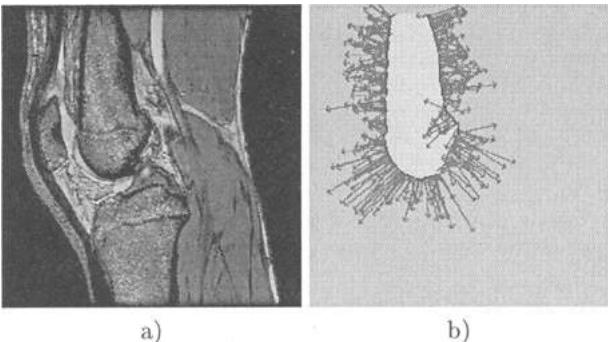
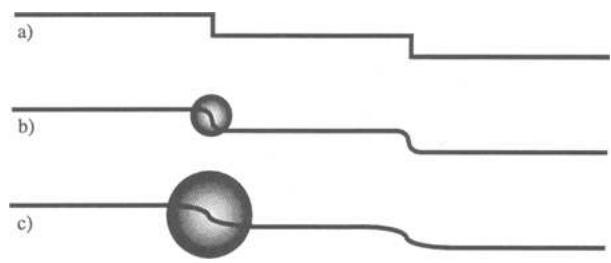
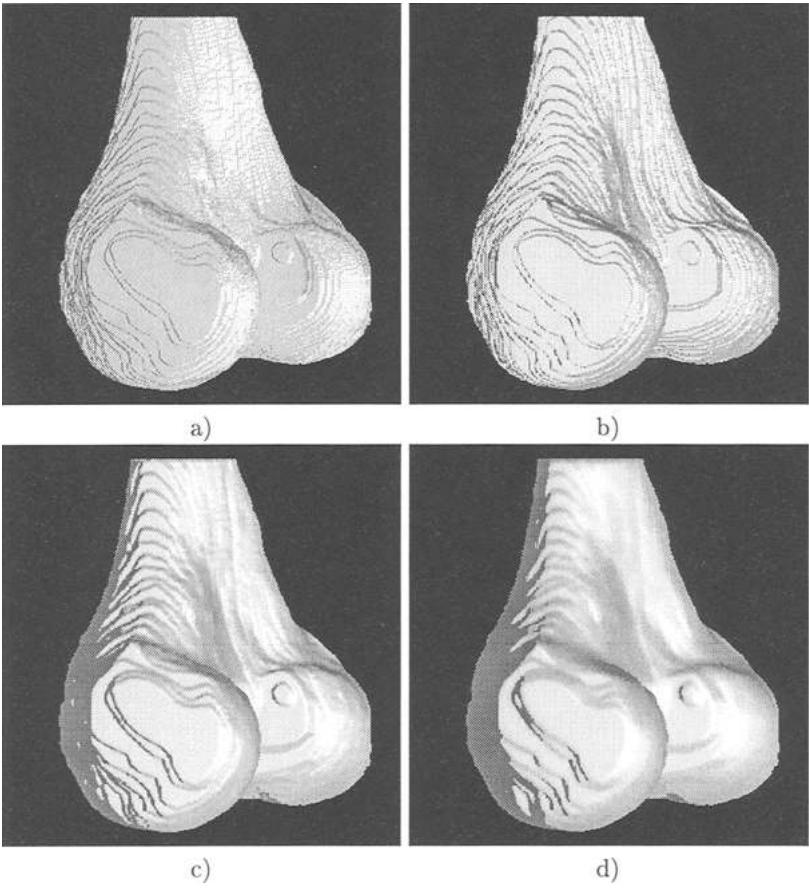
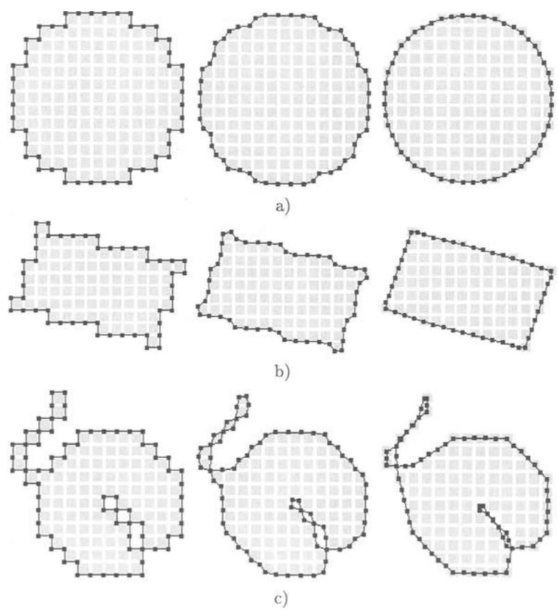
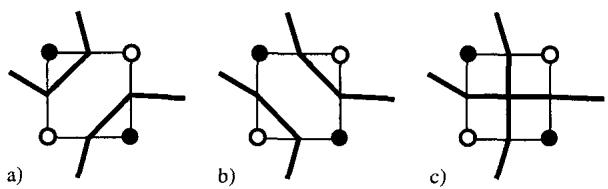
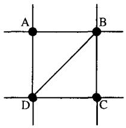
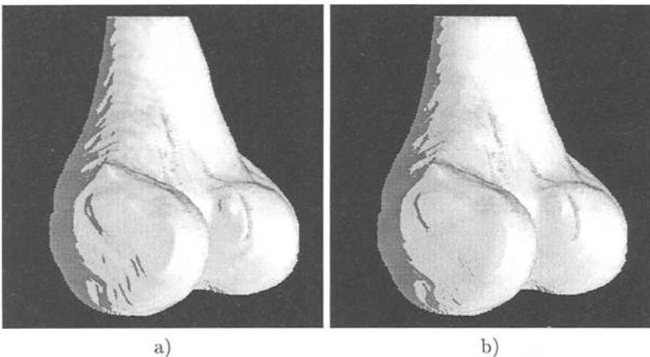

# Constrained Elastic Surface Nets: Generating Smooth Surfaces from Binary Segmented Data

Sarah F. F. Gibson

MERL - A Mitsubishi Electric Research Lab 201 Broadway, Cambridge, MA 02139 Email: gibson@merl.com

Abstract. This paper describes a method for creating object surfaces from binary-segmented data that are free from aliasing and terracing artifacts. In this method, a net of linked surface nodes is created over the surface of the binary object. The positions of the nodes are adjusted iteratively to reduce energy in the surface net while satisfying the constraint that each element in the surface net must remain within its original surface cube. This constraint ensures that fine detail such as cracks and thin protrusions that are present in the binary data are maintained.

# 1 Background

Image data from 3D Magnetic Resonance Imaging (MRI) or Computed Tomography (CT) scanners can be used to create computer models of human anatomy for visualization and surgical simulation. Volumetric models, which are composed of 3D arrays of sampled values, are more suitable for visualization and physically-based modeling of complex objects than surface-based models because they incorporate internal structure[10]. In particular, volumetric models are necessary for modeling object deformation using mass-spring (e.g. [21, 15, 14]), finite element (e.g. [11,3, 2]), or other methods (e.g. [4,6]) and they have significant advantages over surface-based models for modeling the cutting, tearing and joining of objects and soft tissues [8].

Until recently, one of the disadvantages of volumetric models was that they could not represent surfaces well. High quality rendering with lighting and shading effects is important for anatomical structures because it provides shape cues and a sense of realism in visualization and simulation. However, in medical data, image intensities tend to change abruptly at object surfaces, indicating the presence of high spatial frequencies. These high spatial frequencies cause aliasing artifacts in volume rendered images, which are manifested as jagged or irregular surfaces. Such artifacts are particularly noticeable when a highly reflective surface is rendered with a lighting model, such as the Phong lighting model [5].

In [9], a new method for encoding surfaces into volume-sampled data is proposed. In this method, two values are stored for each volume element: an intensity value which is used to calculate color and opacity at each sample point; and a signed distance to the closest surface point, which is used to estimate positions and normal vectors of the object surface. Because the distance function varies slowly across object surfaces, it can be sampled at relatively low rates and still provide alias-free estimates of object surfaces for high quality rendering.

In order to generate the sampled distance map for this representation, a model of the underlying surface is required. In [9] it was shown that when the object originates as an analytic or polygonal model, high quality shading can be accomplished. However, when objects originate in binary-segmented volumes, as often occurs for medical data, the underlying surface and its distance map must be estimated from the binary data. Several methods for estimating distance maps from binary data were analyzed in [7]. However, all of these methods are prone to artifacts. In particular, when the volume is sampled less frequently in one dimension (e.g. in MRI, the distance between image planes is often greater than the in-plane pixel spacing), existing methods for calculating distance maps are subject to terracing artifacts, where sloped surfaces appear as flat terraces separated by sharp elevation changes.

This paper presents a method for generating a smooth surface model from binary segmented data that is constrained to follow the original object segmentation but that reduces aliasing and terracing artifacts. The resultant surface model can be used to generate distance maps for distance-based shading in volume rendering. In addition, it provides an alternative to methods such as Marching Cubes [16] for creating triangulated surface models from binary data.

# 2 Previous Work

# 2.1 Binary Segmented Data

Image segmentation, where elements of the volume are labeled according to what structure they belong to, is the first step in creating a computer model from 3D data. Once elements in the volume have been labeled, elements with the same tissue classification are grouped into objects that represent anatomical structures. With CT data, segmentation can be performed relatively automatically using intensity thresholding or other low-level image processing. However, with MRI, image segmentation is challenging and generally requires more sophisticated algorithms and significant human input. The knee data used to illustrate examples in this paper were segmented manually from an MRI data volume of size $512 \times 512 \times 87$ acquired at a resolution of $0.25 \times 0.25$ mm in-plane and $1.4$ mm between planes.

Although surface normals can be estimated from the original grey-scale data [12], in volume rendering, grey-scale shading can fail for the same reasons that automatic segmentation fails. This is illustrated in the MRI image in Figure 1b) where the grey-scale image gradient has been calculated along the manuallysegmented surface of the femur, a bone in the knee. Because the real bone surface is smooth and of uniform texture, surface normals along the edge of the femur should have similar magnitudes and slowly varying directions. However, the greyscale image gradient depends on tissues adjacent to the bone surface, whose intensities and thicknesses can vary significantly. Hence, both the direction and magnitude of the calculated gradient can vary dramatically around the edge of the femur. For this reason, it can be more accurate to estimate surface normals from a binary segmentation of the data than from the grey-scale image.
Fig. 1. a) MRI cross section through a human knee. b) Image gradient vectors calculated along the surface of the segmented femur using central differences on the grey-scale data. Image gradients vary much more than bone surface normals would be expected to vary, in some cases pointing inward when an outward facing normal is expected. Hence, applying a gradient operator to the grey-scale data does not provide a good estimate of surface normals. (Data and segmentation courtesy of Surgical Planning Lab, Brigham and Women's Hospital, Boston MA.)

Unfortunately, in Volume Rendering, estimating surface normals from binary data poses significant challenges. Because of the high spatial frequencies in binary data, rendered images tend to have significant aliasing artifacts that are particularly apparent in shaded images. In addition, when surfaces lie at a shallow angle to the sampling grid, the rendered image exhibits terracing, in which sloped surfaces appear as a sequence of fat planes separated by sudden elevation changes. These elevation changes can be dramatic when the spacing between image planes is significantly larger than the in-plane spacing, as often occurs in clinical imaging.

# 2.2 Existing Methods for Rendering Surfaces from Binary Data

There are a number of existing methods for achieving smooth surfaces from binary segmented data. In volume rendering, several approaches have been used to approximate surfaces during rendering (see reviews in [13, 25]) including various methods using look-up tables [17], smoothing filters, and surface estimation filters [22] which approximate surface normals from the state of local neighbors. Alternatively, instead of filtering during rendering the data can be pre-processed by appling a low-pass filter to the binary data [23, 24, 1, 19]. Surface normals are then estimated from gradients of the resulting band-limited grey-scale image. All of these methods reduce aliasing artifacts but, because they are applied to local neighborhoods, they do not eliminate terracing artifacts. As illustrated in Figure
Fig. 2. The effect of filtering on terraces in binary segmented data. a) Original binary terraces. b) and c) Gaussian low-pass filters reduce the slope of the terraces but do not eliminate terraces. In order to eliminate terraces, the filter extent must be comparable to the width of the terraces.

2, local filtering reduces the slopes of terraces. However, unless the filter extent is significantly wider than the terraces, terracing artifacts are not removed. When terraces are wide (i.e. when the slope of the object is small) and deep (i.e. when the distance between planes is significantly larger than the in-plane sampling), a local filter sufficient to eliminate terracing would remove significant detail from the object model. Figure 3 illustrates the effect of a local smoothing filter on the femur data. As filter size is increased, aliasing artifacts are eliminated and the slope of the terrace is reduced. However, even after convolution with a large Gaussian filter of size $19 \times 19 \times 19$, unacceptable terracing artifacts remain.

In surface rendering, two basic methods have been used to fit surfaces to binary data. In the first, the binary data is low-pass filtered, and an algorithm such as Marching Cubes is applied, where the surface is built through each surface cube at an iso-surface of the grey-scale data. Unfortunately, the resultant surface is subject to the same terracing artifacts and loss of fine detail as lowpass filtered volumetric representations. In order to remove terracing artifacts and reduce the number of triangles in the triangulated surface, surface smoothing and decimation algorithms can be applied. However, because these procedures are applied to the surface without reference to the original segmentation, they can result in further loss of fine detail.

In the second general method for fitting a surface to binary data, the binary object is enclosed by a parametric or spline surface. Control points on the surface are moved towards the binary data in order to minimize an energy function based on surface curvature and distance between the binary surface and the parametric surface. McInerney and Terzopoulos used such a technique to detect and track the surface of the left ventricle in sequences of MRI data [18] and Takanahi et al. used a similar technique to generate a surface model of muscle from segmented data [20]. This approach has two main drawbacks for general applications. First, it is difficult to determine how many control points will be needed to ensure sufficient detail in the final model. Second, this method does not handle complex topologies easily.
Fig. 3. Shaded, volume rendered images of low-pass filtered binary data of a human femur. a) was rendered from the binary data. In b), c) and d), the data was filtered with a Gaussian filter of size $7^3$, $13^3$, and $19^3$ respectively. Even with a large filter size, significant terracing artifacts are present.

# 3 Surface Nets

The goal of the surface net approach is to create a globally smooth surface model from binary segmented data that retains fine detail present in the original segmentation. Methods that apply local low-pass filters to the binary data can reduce aliasing but they are not effective at removing terracing artifacts. In addition, low-pass filters can eliminate fine structures that can be especially important in medical applications. In contrast, surface nets produce a smooth surface that is constrained to maintain all of the surface structure present in the original data. Surface nets are constructed by linking nodes on the surface of the binary-segmented volume and relaxing node positions to reduce energy in the surface net while constraining the nodes to lie within a surface cube defined by the original segmentation. Figure 4 illustrates how a linked net of surface points can smooth out terracing artifacts.
Fig. 4. Terracing artifacts in binary segmented data cause smooth surfaces to appear jagged. a) A linked net of surface nodes is constructed, placing one node at the center of each surface cube. b) Constrained elastic relaxation of the surface net smooths out terraces but keeps each surface node within its original surface cube.

# 3.1 Generating Surface Nets

The first step in generating a surface net is to locate cubes that contain surface nodes. A cube is defined by 8 neighboring voxels in the binary segmented data, 4 voxels each from 2 adjacent planes. If all 8 voxels have the same binary value, then the cube is either entirely inside or entirely outside of the object. If at least one of the voxels has a binary value that is different from its neighbors, then the cube is a surface cube. The net is initialized by placing a node at the center of each surface cube and linking nodes that lie in adjacent surface cubes. Each node can have up to 6 links, one each to its right, left, top, bottom, front, and back neighbors.

Once the surface net has been defined, the position of each node is relaxed to reduce an energy measure in the links. In the examples presented here, surface nets were relaxed iteratively by considering each node in sequence and moving that node towards a position equi-distant between its linked neighbors. The energy was computed as the sum of the squared lengths of all of the links in the surface net1. Defining the energy and relaxation in this manner without constraints will cause the surface net to shrink into a sphere and eventually onto a single point. Hence, to remain faithful to the original segmentation, a constraint is applied that keeps each node inside its original surface cube. This constraint favors the original segmentation over smoothness and forces the surface to retain thin structures and cracks.
Fig. 5. Examples of surface nets applied to 2D binary objects. Each row contains the surface net superimposed on its 2D binary object for various numbers of relaxations of the surface net. In a) a surface net was fit over a circle and relaxed, from left to right, 0, 1, and 10 times. In b) the surface net was fit over a tilted rectangle and relaxed 0, 1, and 30 times. In c) the surface net was fit over an object with a thin crack and a thin protrusion and relaxed 0, 1, and 20 times. After relaxation, curved surfaces are relatively smooth, corners are sharp, and thin structures are preserved.

Several examples of surface nets applied to binary segmented 2D objects are illustrated in Figure 5. Observe that the surface nets generate relatively smooth surfaces for curves objects, produce sharp corners for rectangular objects, and preserve thin structures and cracks. Figure 5 shows the surface nets after initialization, after 1 relaxation iteration, and after several iterations. The number of iterations is chosen according to the desired result: it can either be chosen interactively or set according to the behavior of the computed energy in the net. In our work, we have observed that the net energy decreases quickly to a minimum and then increases slowly and asymptotically to a slightly higher level. At the minimum energy level, the surface appears to be smoothest, but corners become sharper as the energy increases to the final level.
Fig. 6. Possible surface constructions for a 2D surface cube containing matched diagonal elements. a) The two black voxels are separated by the surfaces. b) The surface bridges the space between the two black voxels. In Marching Cubes, one of these two topologies is chosen arbitrarily. c) In surface nets, neither topology is assumed but the surface is pinched together at the ambiguous node.

The thin protrusion in Figure 5c) demonstrates that the surface net approach can produce surfaces that are topologically different from surfaces that would be produced by Marching Cubes. When a surface cube contains like elements on opposite corners, there may be more than one topological surface that can be constructed. This is illustrated in 2D in Figures 6a) and b). The separating surfaces in Figure 6a) and the bridging surface in Figure 6b) both keep black voxels inside the constructed surface and white voxels out of the constructed surface but they result in topologically different structures. In Marching Cubes, one of these surfaces would be chosen arbitrarily. In the surface net approach, illustrated in Figure 6c), the surface is pinched in at the net node, but neither a separating nor a bridging surface is created. Because arbitrary topological decisions are not made arbitrarily, higher level algorithms could be applied after surface smoothing to separate or bridge the surface at ambiguous surface points.

# 3.2 Triangulating the Surface and Estimating the Distance Map

Once a smooth surface net has been constructed, the surface net can be triangulated to form a 3D surface model. To create a triangulated surface from the surface net, each node and its links are considered one at a time. As illustrated in Figure 7, there are 12 possible triangles joining each node to pairs of neighbors. By determining which pairs of neighbors are present in the surface, possible surface triangles are identified. In order to avoid creating redundant triangles in the surface model (see Figure 8), only 6 of the 12 possible triangles are considered for each node.

In order to volume render these surfaces, distance maps were generated from the triangulated surfaces by calculating the distances from each point in the distance map to the nearest surface triangle. This was done using a brute force method by considering each triangle one at a time, calculating the distance to each point in the distance map within a local neighborhood of the triangle, and replacing the current distance value stored at that point with the new distance value if the new magnitude was smaller.
Fig. 7. For each node in the surface net, the center node can be connected to its 6 neighbors with 12 possible triangles. In the triangulation, each of the 12 triangles is created only if the two relevant neighbors are nodes of the surface net.
Fig. 8. To avoid redundant triangulation of the surface net, if triangles $D A B$ and $B C D$ are created when considering nodes A and C, then triangles $C D A$ and $A B C$ should not be created when considering nodes D and B. Figure 9 shows images that have been volume rendered with distance maps created from binary data using a simple, front-to-back ray casting algorithm and Phong shading. Surface normals were calculated from the distance map using a 6-neighbor central difference gradient estimator. For purposes of comparison, the images of Figures 3, and 9 were generated using the same rendering algorithm and imaging parameters. Object opacities were set to 1.0 and large diffuse and specular reflection coefficients were used to emphasize surface artifacts.

Figure 9 compares images rendered from distance maps created from a surface net that has been relaxed by 10 and 100 iterations. Compared with Figure 3, there is a significant reduction in terracing artifacts. In addition, the surface net approach is guaranteed to preserve fine structures that can be important in medical applications.

# 4 Discussion

Applications such as surgical simulation or computer assisted surgery require computer models of patient anatomy. The best models available are often in the form of a binary-segmented MRI or CT image volume2. Depending on the application, these binary volumes must be converted into volumetric models or triangulated surface models for graphical representation. However, because of the high spatial frequencies in binary data, the surfaces of these models are subject to artifacts known as aliasing and terracing.
Fig. 9. Femur rendered and shaded using distance maps generated from surface nets after a) 10 relaxations and b) 100 relaxations. Compare with Figure 3, noting a significant reduction of terracing artifacts and that all surface elements have been constrained to lie within 1 voxel of the original binary segmentation.

In this paper, a method has been presented that produces smooth surfaces with reduced aliasing and terracing artifacts. The resultant surface net can be used to generate either volumetric models or triangulated surface models. The surface net is created by linking surface nodes generated from the binary surface. Node positions are adjusted to reduce energy in the surface net while following constraints set by the original binary surface of the data. This creates a relatively smooth surface that retains fine detail and structures that can be important in medical applications.

# References

1. R. Avila and L. Sobierajski. A haptic interaction method for volume visualization. In Proc. Visualization'96, pages 197-204. IEEE, 1996.
2. M. Bro-Nielsen and S. Cotin. Real-time volumetric deformable models for surgery simulation using finite elements and condensation. In Proc. Eurographics, volume 15, pages 57-66, 1996.
3. D. Chen and D. Zeltzer. Pump it up: computer animation of a biomechanically based model of muscle using the finite element method. In Proc. SIGGRAPH 92, pages 89-98., 1992.
4. M. Desbrun and M-P Gascuel. Animating soft substances with implicit surfaces. In Proc. SIGGRAPH 95, pages 287-290, 1995.
5. J. Foley, A. vanDam, S. Feiner, and J. Hughes. Computer Graphics: Principles and Practice. Addison-Wesley, 1992.
6. S. Gibson. 3D chainmail: a fast algorithm for deforming volumetric objects. In Proc. Symposium on Interactive 3D Graphics, pages 149-154. ACM SIGGRAPH,
1997.
7. S. Gibson. Calculating distance maps from binary segemented data. Technical Report WP98-01, MERL - A Mitsubishi Electric Research Laboratory, 1998.
8. S. Gibson. Linked volumetric objects for physics-based modeling. submitted to IEEE Trans. on Visualization and Computer Graphics, 1998.
9. S. Gibson. Using distance maps for accurate surface representation in sampled volumes. In Proc. Visualization'98. IEEE, 1998.
10. S. Gibson, C. Fyock, E. Grimson, T. Kanade, R. Kikinis, H. Lauer, N. McKenzie, A. Mor, S. Nakajima, H. Ohkami, R. Osborne, J. Samosky, and A. Sawada. Volumetric object modeling for surgical simulation. Medical Image Analysis, 2(2),
1998.
11. J.P. Gourret, N. Magnenat-Thalmann, and D. Thalmann. Simulation of object and human skin deformations in a grasping task. In Proc. SIGGRAPH 89, pages
2130, 1989.
12. K. Hohne, M. Bomans, A. Pommert, M. Riemer, C. Schiers, U. Tiede, and G. Wiebecke. 3D visualization of tomographic volume data using the generalized voxel model. The Visual Computer, 6(1):28-36, February 1990.
13. A. Kaufman. Volume Visualization. IEEE Computer Society Press, Los Alamitos, CA, 1991.
14. R. Koch, M. Gross, F. Carls, D. von Buren, G. Fankhauser, and Y. Parish. Simulating facial surgery using finite element models. In Proc. SIGGRAPH 96, pages
421428, 1996.
15. Y. Lee, D. Terzopoulos, and K. Waters. Realistic modeling for facial animation. In Proc. SIGGRAPH 95, pages 55-62., 1995.
16. W. Lorensen and H. Cline. Marching cubes: a high resolution 3D surface construction algorithm. In Proc. SIGGRAPH 87, pages 163-169, 1989.
17. S. Lu, D. Cui, R. Yagel, R. Miller, and G. Kinzel. A 3D contextual shading method for visualization of diecasting defects. In Proc. Visualization'96, pages 405-407. IEEE, 1996.
18. T. McInerney and D. Terzopoulos. Deformable models in medical image analysis: a survey. Medical Image Analysis, 1(2):91108, 1996.
19. A. Mor, S. Gibson, and J. Samosky. Interacting with 3-dimensional medical data: Haptic feedback for surgical simulation. In Proc. Phantom User Group Workshop'96, 1996.
20. I. Takanahi, S. Muraki, A. Doi, and A. Kaufman. 3D active net for volume extraction. In Proc. SPIE Electronic Imaging'98, pages 184-193, 1998.
21. D. Terzopoulos and K. Waters. Physically-based facial modeling, analysis, and animation. Journal of Visualization and Computer Animation, 1:73-80, 1990.
22. G. Thurmer and C. Wurthrich. Normal computation for discrete surfaces in 3D space. In Proc. Eurographics'97, pages C15C26, 1997.
23. S. Wang and A. Kaufman. Volume sampled voxelization of geometric primitives. In Proc. Visualization'93, pages 78-84. IEEE, 1993.
24. S. Wang and A. Kaufman. Volume-sampled 3D modeling. IEEE Computer Graphics and Applications, 14:2632, 1994.
25. R. Yagel, D. Cohen, and A. Kaufman. Discrete ray tracing. IEEE Computer Graphics and Applications, 12:19-28, 1992.