# Mesh Arrangements for Solid Geometry

Qingnan Zhou1 Eitan Grinspun2 Denis Zorin1 Alec Jacobson2

1New York University 2Columbia University
Figure 1: Our method takes as input any number of meshes (three shown in this 2D illustration). We resolve intersections and assign a winding number vector to every delineated cell. Different boolean results are extracted according to these winding number vectors.

# Abstract

Many high-level geometry processing tasks rely on low-level constructive solid geometry operations. Though trivial for implicit representations, boolean operations are notoriously difficult to execute robustly for explicit boundary representations. Existing methods for 3D triangle meshes fall short in one way or another. Some methods are fast but fail to produce closed, self-intersection free output. Other methods are robust but place prohibitively strict assumptions on the input, e.g., no hollow cavities, non-manifold edges or selfintersections. We propose a systematic recipe for conducting a family of exact constructive solid geometry operations. The two-stage method makes no general position assumptions and does not resort to numerical perturbation. The method is variadic, operating on any number of input meshes. This generalizes unary mesh-repair operations, classic binary boolean differencing, and $_ n$ -ary operations such as finding all regions inside at least k out of $_ n$ inputs. We demonstrate the superior effectiveness and robustness of our method on a dataset of 10,000 "real-world" meshes from a popular online repository. To encourage development, validation, and comparison, we release both our code and dataset to the public.

Keywords: arrangements, constructive solid geometry, booleans

Concepts: •Computing methodologies Computer graphics;

# 1 Introduction

Geometric modeling tools are more accessible than ever, scanning technologies are available at the commodity level, additive fabrication technologies rapidly grow in popularity, and platforms have emerged for sharing 3D models online. Unfortunately, the resulting wealth of 3D models comes with a catch. The diversity of these models coincides with unpredictable mesh quality and structure. For example, manually sculpted models are created using a broad range of software by designers with varying skill and intention.

Meanwhile, geometry processing operations increase in sophistication: from remeshing to physical simulation. Yet, many, if not most, available algorithms impose strict requirements on their inputs. As the complexity and amount of 3D data grow, manual one-by-one preprocessing is no longer acceptable. For example, cumbersome mesh cleanup of solid mesh may take more time than a subsequent physical simulation of it.

An important class of mesh repair and solid operations aims to preserve input geometry as much as possible when recombining it in new ways or converting it to suitable form for a downstream application. These operations are elegantly viewed as operations on space partitions defined by mesh arrangements. A mesh arrangement, built from a collection of (possibly non-manifold, openboundary, self-intersecting, with degenerate triangles, etc.) meshes, partitions space into a number of cells. This view unifies tasks often viewed as distinct, such as mesh repair and boolean operations.

We introduce mesh arrangements constructed from a restricted class of meshes: those with piecewise-constant winding number, or PWN. By surveying 10,000 popular meshes, we show that PWN meshes cover a large fraction of practically relevant situations. An arrangements of a PWN mesh is a lightweight yet powerful representation. Casually, a PWN mesh arrangement is composed from possibly (self-)overlapping components bounding a number of solids. These arrangements enable a set of highly robust and conservative algorithms. By robust, we mean that algorithms successfully produce output for all PWN meshes. By conservative, we mean that arrangements preserve original mesh geometry exactly.

Our general approach can be separated into two stages: adding meshes to an arrangement--independent of the desired operation-- and extracting the boundary of the result according to an extraction function describing the desired boundary in terms of the winding numbers of the region it bounds (see Figure 1).

The first stage, in turn, consists of resolving intersections, partitioning space into cells, and labeling each cell with winding numbers with respect to each input mesh.

In the second stage, all classic boolean operations (e.g., union, intersection, difference) have trivial extraction function definitions. We also explore other interesting functions, such as extracting the "self-union" of a single, overlapping input mesh or extracting all regions of space inside at least two of many input meshes.
Figure 2: Self-intersections are not just "artifacts." They also occur intentionally during modeling. A coffee mug handle is extruded then curled inward on itself (blue). The self-intersections (orange) do not prohibit constructing the shape's underlying torus-topology self-union with our algorithm (green).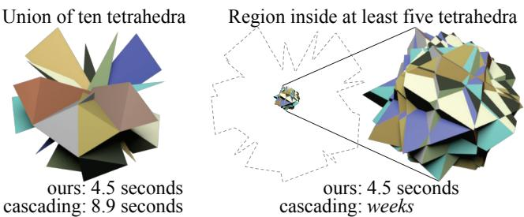
Figure 3: Simple and complex variadic operations cost the same using our mesh arrangements. Converting variadic operations to a cascade of binary operations is worst-case exponential in time.

Our method guarantees as output a solid mesh. Informally, a solid mesh is the non-degenerate boundary of a solid subregion of $\mathbb{R}^{3}$. Our method also guarantees that the output is exact, i.e., interpreting the input positions as exact rationals, all intersections result from exact construction. The output coordinates may optionally be converted to floating point in a post-process.

We validate our method on the 10,000 triangle meshes from the online 3D printing repository Thingiverse, as well as benchmarks of previous work. We present extensive comparisons with state-ofthe art methods, all of which fail with significant frequency, either rejecting the input, failing to produce any output, or producing an output that is not a solid mesh. We also evaluate the conversion of our exact results to floating-point positions; in this case, we outperform existing floating point methods along the same criteria.

# 2 Related work

Most previous work separate into two broad groups: boolean operations on different classes of objects and "mesh repair", in particular, elimination of self-intersections, computing outer hulls and similar operations. While both require intersecting meshes or surfaces, in most cases the problems have been treated disjointly.

Boolean operations Previous boolean methods define a restrictive class of input 3D pointsets that are closed with respect to set operations. The methods output a restrictive class of boundary representation or spatial partition. In almost all cases, it is assumed that creating a valid boundary representation from a broader class of inputs is a separate task, delegated to the user or preprocessing. Inputs not meeting the strict requirements are not handled directly.

Previous works differ by generality of input/output representations and tradeoffs between performance and robustness. We compare directly to the state of the art in Sections 5 and 7. For now, we categorize approaches, highlighting salient similarities and distinctions.

The current standard in robustness is CGAL's exact-arithmetic implementation [Granados et al. 2003] of Nef polyhedra [Bieri & Nef 1988]. CGAL's implementation requires a valid Nef polyhedron data structure (Sphere Maps and Selective Nef Complexes) as input. Current tools in CGAL and OPENSCAD (a modeling tool bootstrapping CGAL) only construct this form via embedded polyhedra, excluding inputs with self-intersections, non-manifold features, and inner cavities, although the latter two could be represented by the Nef representation. More fundamentally, the generality of the representation requires a complex heavy-weight data structure and has a significant impact on performance.

On the other extreme, Douze et al. [2015] restrict inputs to embedded polyhedra with vertices in general position, but is extremely efficient and is capable of handling very large meshes. Douze et al. introduce the concept of variadic boolean operations: immediately evaluating boolean operations involving many inputs rather than decomposing into a tree of binary operations (see Figure 3).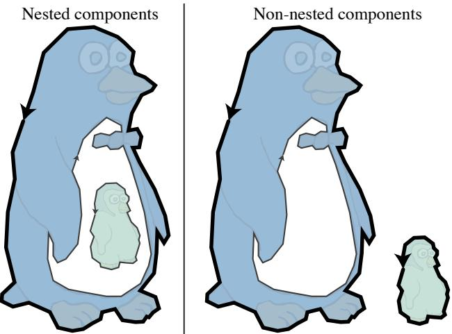
Figure 4: Combinatorially, the multi-component shapes on the left and right are the same, though their outer hulls (thick) differ.

Recently, Barki et al. [2015] use a more general yet lightweight representation and exact rational arithmetic to handle a variety of near degeneracies. Their efficient algorithm maintains robustness on a 26-model benchmark.

All methods so far are similar to ours in that they add intersections of boundary representations, and proceed to classify elements of the boundary to construct the result. However, these algorithms assume that input surfaces are free of self-intersections. Self-intersections are not only a ubiquitous meshing artifact, but also a common way to model interesting topologies Figure 2.

Many early methods based on intersection and classification suffer from robustness problems, before exact-arithmetic based methods became practical. This leads to development of more robust approaches, initially based on conversion to volumetric representations, starting from [Museth et al. 2002]. However, the approximation of the original meshes depends on the chosen resolution level for the volume grid, and high accuracy requires high tessellation. Different approaches accelerate this approach, reduce complexity of the output (e.g., using adaptivity [Varadhan et al. 2004]), and attempt to preserve the original mesh as much as possible [Pavic et al. 2010; Wang 2011; Zhao et al. 2011]. The fundamental issue with such techniques is the approximate and grid-dependent nature of volumetric calculations: while increasing robustness, these may lead to unwieldy topology changes and geometric deviations.

The space-partition view of boolean operations has appeared most clearly in binary space partitioning (BSP) methods, starting with [Thibault & Naylor 1987; Naylor et al. 1990]. Bernstein & Fussell [2009] combined this with robust predicates to develop an efficient and robust way to compute booleans on surfaces in BSP representation. As in most other works on booleans, conversion to this representation is viewed as a preprocess, with the range of inputs this preprocess can handle not precisely defined. While compared to volumetric-grid approaches, BSP methods increase mesh complexity more moderately and input geometry is better preserved, yet significant refinement is still needed. Campen & Kobbelt [2010a] localized their BSP-based method using an octree and perform refinement only locally near intersections. Importantly, this work points out that BSP trees provide a general representation of space partition that flexibly performs both boolean operations, outer hull computations, and other operations. We expand this idea, but use a higher-level and more compact space partition.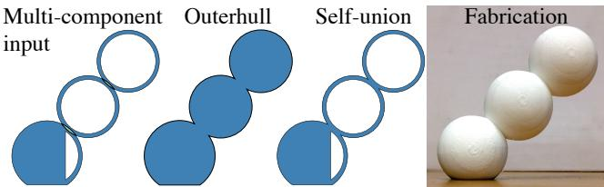
Figure 5: The outer-hull (e.g., [Attene 2014; Campen & Kobbelt 2010a] is simpler to extract, but not always appropriate. Hollow cavities should be maintained for $3 D$ printing not only to reduce material costs, but to maintain functional properties like balancing.

Mesh repair Mesh repair techniques historically deviate from boolean operations by focusing on converting a maximally broad range of input meshes to a normalized representation (e.g., closed manifold meshes without self-intersections). These methods often rely on volumetric approximation and for certain problems (e.g., hole-filling) this may be unavoidable. If possible, preserving original geometry is desirable. A common example of mesh repair of this type is computation of the outer hull, though both state-of-theart methods [Campen & Kobbelt 2010a; Attene 2014] do not appear to disambiguate nested and non-nested components (see Figure 4). For example, when preparing models for 3D printing, the outer hull may be inappropriate as it removes inner cavities (see Figure 5).

Approaches to robustness, and sources of non-robustness Many implementations (e.g., [Bernstein 2013; Mei & Tipper 2013; Douze et al. 2015]) explicitly assume general position of inputs (no four points on a circle, no co-planar intersections, etc.) and do not attempt to handle numerical non-robustness. The development of new boolean and mesh repair techniques was driven, to a large extent, by robustness considerations. We consider more explicitly how robustness was addressed in different contexts, and the unresolved problems we are addressing in our approach.

The most comprehensive approach is to represent all objects using exact arithmetic. With advances in filtered predicates for efficiency, this approach is increasingly preferred. We (like others [Granados et al. 2003; Barki et al. 2015]) largely follow it. Earlier BSP-based work used the observation [Sugihara & Iri 1992] that representing points as the intersection of original planes eliminates the need for exact computations (only exact predicates). This, in principle makes it possible to do most computations robustly in floating point, but some constructions or rounding still inevitably appear in all methods, and lead to non-robustness, often subtly.

For example, Banerjee & Rossignac [1996] and later Xu & Keyser [2013] build exact topologies but fixed-precision floating point vertex positions, leading to self-intersections, inversions (see Figure 6) and degeneracies in the output. Campen & Kobbelt [2010a] round all input vertices aggressively to ensure exact plane intersections for a BSP-representation. We discuss several other problems in existing techniques in greater detail as we describe our method. For our approach (and all exact methods), conversion of the output to a floating point (if such a conversion is desired) is a potential source of problems, although we have observed it in a very small proportion of cases and attack it with an additional heuristic utilizing our core method in Section 6.1.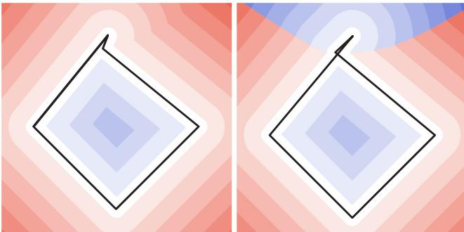
Figure 6: By outputting an exact solid mesh, our method ensures there are no inversions (illustrated as correct signed distance on left). Previous methods may create inversions, and even small inversions catastrophically affect signed distance to the output (right).

# 3 Concepts

The crux of our method is construction of the mesh arrangement data structure, consisting of cells annotated with winding numbers, patches and their adjacency graph, that allows us to extract results of a variety of operations from the arrangement.

This structure is a relatively lightweight representation of a space partition (cf. BSP trees). Based on compound surface objects (patches), it allows for complex cells (does not require them to be convex or even topological balls). Yet, it allows us to perform all operations robustly and efficiently.

The inputs to our arrangement creation algorithm are n piecewiseconstant winding number triangle meshes $\mathcal{A}_{1}, \ldots,\mathcal{A}_{n}$. For extraction of the results of specific operations from the arrangement, we use a variadic extraction function f to determine the solid mesh boundary of which region(s) of space carved out by $\mathcal{A}_{1}, \ldots,\mathcal{A}_{n}$ to output.

# 3.1 Piecewise-constant winding number meshes

A triangle mesh is a set of 3D vertices (some of which may be geometrically coinciding) and a set of triangles connecting these vertices, each triangle represented by a triplet of vertices, with orientation implied by the vertex order for non-degenerate triangles. We may view triangles combinatorially as triplets of vertices as well as geometrically as pointsets in 3D. Effectively, any valid triangular mesh in Wavefront OBJ-like format, is a valid input, subject to one general condition: we require that triangle meshes $\mathbf {\mathcal{A}}_{i}$ induce a piecewise-constant integer generalized winding number (PWN) field $w_{i}$ [Jacobson et al. 2013]:
$$
w_{i} ( \mathbf { p} ) \in\mathbb{Z} \qquad \forall \mathbf { p} \in\mathbb{R} \setminus |\mathcal{A}_{i} |,
$$
where $| \mathcal { A } _ { i } |$ denotes the union of all triangles of $\mathbf { \mathcal { A } } _ { i }$ viewed as point sets. For a triangle mesh, this is simply the sum of the signed solid angles $\Omega _ { t } ( \mathbf { p } )$ of each oriented triangle t:
$$
w_{i} ( \mathbf { p} ) = \frac { 1} { 4 \pi} \sum_{t \in\mathcal{A}_{i}} \Omega_{t} ( \mathbf { p} ).
$$
We call meshes with this property piecewise-constant winding number meshes or PWN meshes.

A PWN mesh $\mathbf { \mathcal { A } } _ { i }$ can be interpreted as dividing all of $\mathbb { R } ^ { 3 }$ into regions that are outside $\mathbf { \Phi } _ { w _ { i } } = \mathbf { \Phi } _ { 0 }$ ) or inside $( w _ { i } \neq 0 )$ ) of the "solid implied by $\mathbf { \mathcal { A } } _ { i }$." This allows multiplicity $( | w _ { i } | > 0 )$ for parts of space considered to be twice, thrice, etc. inside and also allows for negative insideness $( w _ { i } < 0 )$ ) for parts of space inside an inverted part of $\mathbf { \mathcal { A } } _ { i }$ (see inset).

<table><tr><td>Method</td><td>CAVITIES</td><td>NON-ManifOLD MUltI-COMP.</td><td></td><td>Exact</td><td>SEaMS</td><td>DEGENERACIES SELF-INTER.</td><td></td><td>|wω| &gt; 1</td></tr><tr><td>CGAL</td><td>X</td><td>X</td><td></td><td>•</td><td>X</td><td>X</td><td>X</td><td>X</td></tr><tr><td>[Campen... 2010a]</td><td>X</td><td>X</td><td>X</td><td>X</td><td>X</td><td>X</td><td>•</td><td>X</td></tr><tr><td>QUICKCSG</td><td></td><td>X</td><td>X</td><td>X</td><td>X</td><td>X</td><td>X</td><td>X</td></tr><tr><td>CARVE</td><td></td><td></td><td></td><td>X</td><td>X</td><td>X</td><td>X</td><td>X</td></tr><tr><td>CORK</td><td>−</td><td></td><td></td><td>X</td><td>X</td><td>X</td><td>X</td><td>X</td></tr><tr><td>[Bernstein... 2009]</td><td>•</td><td></td><td>X</td><td></td><td>C</td><td>X</td><td>X</td><td>X</td></tr><tr><td>[Barki et al. 2015]</td><td></td><td></td><td></td><td></td><td></td><td></td><td>X</td><td>X</td></tr><tr><td>Our method</td><td></td><td></td><td></td><td></td><td></td><td>−</td><td></td><td>•</td></tr></table>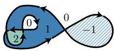

PWN meshes may exhibit commonly witnessed "artifacts" making them unsuitable for previous algorithms (see Table 1 and Figure 7).

NON-MANIFOLD: PWN mesh connectivity may be non-manifold at vertices or edges.

COPLANAR, DUPLICATE: Co-planar and duplicate facets (i.e., geometrically identical, but logically distinct: either belonging to different meshes, or using vertices with the same positions) do not necessarily invalidate a PWN mesh. For example, the conjoining of two cubes abutting along a triangle is a PWN mesh. The conjoining of two entirely identical cubes is also a PWN mesh. However, a cube with a single duplicated triangle is not a PWN mesh.

CAVITIES, MULTI-COMP., $| w | > 1$: The winding number elegantly handles correctly oriented boundaries of multiple connected components or nested shells, such as a hollowed-out sphere with an outer boundary and inversely oriented boundary of the inner cavity. If the inner boundary were not inversely oriented then the core has $w = 2 > 1$ and is considered twice inside.

SEAMS: A mesh with a combinatorially open boundary does not necessarily imply that it is not PWN. Open boundaries are permissible so long as they meet up geometrically along seams.

EXACT: As discussed in Section 5, the vertices of PWN mesh may be defined with rational coordinates, not just floating-point.

SELF-INTER.: A PWN mesh may have structured selfintersections. For example, two overlapping spheres constitute a valid PWN mesh. Similarly, a vertex-displacement of a PWN mesh without seams is also a PWN mesh regardless of any incurred selfintersections [Sacht et al. 2013]. We will say that a mesh is free of self-intersections if any two geometric triangles of the mesh intersect only over a (combinatorially) shared edge or vertex, or are combinatorially identical. We allow combinatorially duplicate triangles and exploit these to cope with degenerate configurations.

DEGENERACIES: Geometrically degenerate triangles (zero area) do not affect the winding number. This implies that onedimensional "needles" will be ignored entirely. One can formalize ignoring degenerate triangles as reconstructing a discretization of the discontinuity sheets of the winding number field. For boolean set operations, we operate on open-set interiors without boundary.

Verification We may verify whether a mesh $\mathbf { \mathcal { A } } _ { i }$ is PWN by resolving self-intersections (see Section 5.1) and then checking that the total signed incidence of every edge in the result is zero. For any edge $e = \{ i, j \}$ an oriented triangle $f = \{ i, j, k \}$ contributes $+ 1$ to the total signed incidence of e. An oppositely oriented triangle $g = \{ j, i, \ell \}$ contributes $^ { - 1 }$.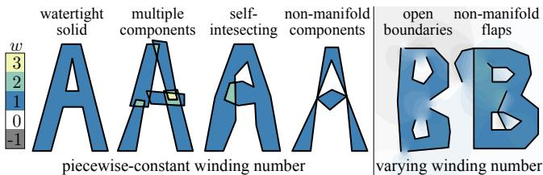
Table 1: Mesh boolean algorithm input preconditions feature chart: Previous techniques have severe input restrictions.
Figure 7: Our assumptions allow a wide class of inputs with selfintersections, multiple components and non-manifold connections, but does not include open boundaries or non-manifold flaps.

# 3.2 Variadic extraction function

In general, the extraction function f takes as input a winding number vector $\mathbf { w } = [ w _ { 1 }, \dots, w _ { n } ]$ corresponding to the winding number of each input mesh at the points of a given cell of the space partition defined by the mesh arrangement. The function f returns "true" if a region with this winding number vector is to be included in the output solid, and "false" otherwise.

For example, to implement n -way union, one would provide:
$$
f_{\mathrm { u n i o n}} \left( \mathbf { w} \right) = \left\{ \begin{array} { l l} { \mathrm { t r u e}} & { \mathrm { i f} \overbrace { \exists i \mid w_{i} \neq 0}^{\mathrm { i n s i d e a n y}},} \\ { \mathrm { f a l s e}} & { \mathrm { o t h e r w i s e}.} \end{array} \right.
$$
When $n = 1$, this function will identify a mesh's self-union. Similarly for n -way intersection:
$$
f_{\mathrm { i n t e r s e c t}} \left( \mathbf { w} \right) = \left\{ { \mathrm { t r u e ~}} \begin{array} { r} { \mathrm { i f} \overbrace { w_{i} \neq 0 \forall i}^{\mathrm { i n s i d e ~ a l l}},} \\ { \mathrm { f a l s e ~ o t h e r w i s e.}} \end{array} \right.
$$
Some extractions are asymmetric, e.g., subtraction $( { \cal A } _ { 1 } \backslash { \cal A } _ { 2 } )$:
$$
f_{\mathrm { m i n u s}} \left( \mathbf { w} \right) = \underbrace { w_{1} \neq 0}_{\mathrm { i n s i d e o f} \ A_{1}} \mathrm { a n d} \underbrace { w_{2} = 0}_{\mathrm { o u t s i d e o f} \ A_{2}}
$$
One can also design more esoteric functions, such as extracting all parts of space inside at least two of the inputs:
$$
f_{\mathrm { m i n - 2}} \left( \mathbf { w} \right) = \left\{ \begin{array} { l l} { \mathrm { t r u e}} & { \mathrm { i f} \exists i \mathrm { a n d} j \neq i | w_{i}, w_{j} \neq 0,} \\ { \mathrm { f a l s e}} & { \mathrm { o t h e r w i s e}.} \end{array} \right.
$$
Changing the two-sided inequalities above (e.g., $w _ { i } \neq 0$ ) to singlesided inequalities (e.g., $w _ { i } > 0$ ) results in orientation-sensitive op-

erations [Campen & Kobbelt 2010a; Jacobson et al. 2013]. Orientation sensitivity is useful in some cases, where inversion more intuitively denotes the exterior or void space of an input shape.

# 3.3 Solid meshes

Our algorithm's output meshes belong to a special subclass of PWN meshes that we call solid meshes. Solid meshes are free of selfintersections, degenerate triangles or duplicate triangles, and their generalized winding number field is either zero or one.

Note that even if the input meshes $\mathcal { A } _ { 1 }$ and $\boldsymbol { A } _ { 2 }$ are manifold polyhedra, the output of $\mathcal { C } \ = \ A _ { 1 } \cup \bar { \mathcal { A } } _ { 2 }$ may be a nonmanifold solid mesh (e.g., if $\mathcal { A } _ { 1 }$ bounds the unit cube and $\mathbf { \mathcal { A } } _ { 2 }$ bounds the unit cube offset by $( 1, 1, 0 )$ then $\mathcal { C }$ will contain a non-manifold edge where $\mathcal { A } _ { 1 }$ and $\mathbf { \mathcal { A } } _ { 2 }$ "kiss", see inset).

# 4 Overview

Before worrying about details of the method, we review the key aspects of each stage. For now, we consider the usual binary boolean operations on two meshes $\boldsymbol { A }$ and $\boldsymbol { B }$. The insets in this section illustrate the stages of the computation of the asymmetric difference $\boldsymbol { \bar { A } } \backslash \boldsymbol { B }$.

Arrangement construction In the first stage, we resolve all intersections between input meshes using exact arithmetic. We add new triangles by subdividing the inputs so that all intersections occur exactly at edges and vertices. All refined triangles retain references to the original triangles of A and B. In the second stage, we determine adjacency information between cells defining a space partition. We organize the mesh resulting from resolving intersections in the first stage into patches of triangles connected by manifold edges. By definition, patches are incident to each other along non-manifold mesh edges. Two cells are adjacent via a shared oriented boundary patch. Two patches incident on the same non-manifold edge may bound the same cell. We determine the patch-cell relations by sorting facets from all incident patches around this edge. In this way, we determine the cell adjacency for each connected component of the adjacency graph of patches. To ensure correct cell adjacency of nested components, we identify a boundary facet of the ambient cell surrounding each component and determine if it is contained in an interior (non-ambient) cell of another component, via point location (see Section 5.5.1). After merging the cell adjacency graphs across connected components, there remains a single ambient cell outside of all components.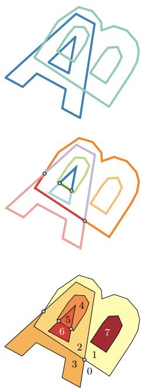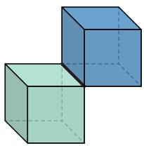

In the third stage, we assign winding numbers with respect to $\mathcal { A }$ and $\boldsymbol { B }$ to each cell, $\mathbf { w } = [ \bar { w _ { A } }, w _ { B } ]$. Having constructed the cell-patch adjacency information in the previous stage, this step is purely combinatorial. The ambient $\ " { 0 } ^ { \ast }$ - cell is defined to $[ 0, 0 ]$.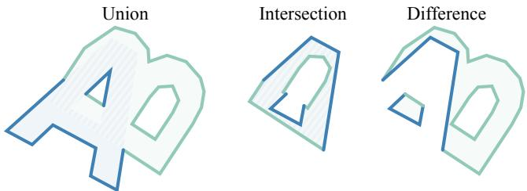
Figure 8: Alternative extractions $\mathcal { A } \cup \mathcal { B }, \mathcal { A } \cap \mathcal { B }, \mathcal { B } \setminus \mathcal { A } )$ share the same input mesh arrangement.

Remaining cells are labeled via a traversal of the cells: we add $+ 1$ or $^ { - 1 }$ to the winding number of the originating mesh of the patch crossed between cells depending on the patch orientation. For example, consider an unlabeled cell adjacent to a cell labeled $[ a, b ]$ via a patch originating from input $\boldsymbol { A }$. That unlabeled cell will receive $[ a + 1, b ]$ if crossing into the oriented patch or $[ a - 1, b ]$ if crossing out.

Extracting the result We identify desired output cells purely by their assigned winding numbers. For the difference $A \setminus B$, we collect the cells labeled $[ 1, 0 ]$. We return the facets of the patches separating these desired cells from undesired cells, reversing orientations if necessary. Different extractions reuse the same intersection resolution, cell adjacency, and winding-number labeling of the first stage (see Figure 8).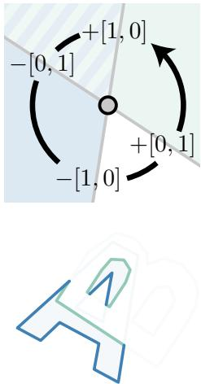

# 5 Algorithms

In this section, we consider in detail the algorithms for each of the steps overviewed in Section 4. We will break each stage into core subroutines. For each subroutine, we will provide preconditions on its input and postconditions on its output. We start with specifying preconditions and postconditions of our method as a whole.

Preconditions The method accepts as input a sequence of PWN meshes, and an extraction function whose arguments correspond to the mesh sequence. The mesh vertex coordinates are assumed to be rational coordinates, a property we call (EXACT). We review exactness in the Appendix. In accepting as input the broader class of exact coordinates rather than floating point values, we accommodate upstream operations, whose output is exact.

Postconditions The output of our algorithm is guaranteed to be an exact solid mesh. As such it is a valid input to a downstream application of our own algorithm or another module in CGAL. Observe that while our input preconditions permit self-intersections, and co-planar/degenerate/duplicate facets--by design, these will never occur in our output.

# 5.1 Intersection resolution

The first stage of arrangement construction resolves all triangletriangle intersections, enriching the mesh combinatorics so that all intersections are exactly represented by shared vertices and edges. We consider all input meshes as a single mesh, i.e., we make no distinction between intersections and self-intersections.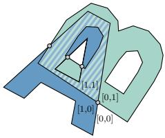

Preconditions The input is an exact PWN mesh $\mathcal { A }$

Postconditions The output is an exact PWN mesh free of selfintersections, co-incident vertices, and degenerate triangles, inducing exactly the same winding number field as the input mesh.

Algorithm Self-intersection resolution consists of four steps: discard exactly zero area input triangles as they do not affect the winding number, compute the intersection between every pair of triangles, conduct a constrained Delaunay triangulation for every coplanar cluster of intersections, and extract and replicate subtriangles from each triangle's cluster's triangulation.

For now we set aside conservative culling for performance acceleration. We consider all pairs of triangles a and b in $\boldsymbol { A }$. The intersection intersect $( a, b )$ between these triangles can be one of the following four cases: empty, a single point, a line segment, or a convex polygon (see Figure 9). This intersection must be computed exactly, therefore intersec $( a, b )$ commutes.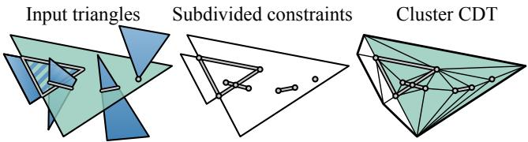
Figure 9: Blue triangles intersect the green at a point, segments and a polygon (left, 3D). Subdivided constraints reduce to coplanar points and segments (middle, 2D). The original green triangle is replaced with replications of the green triangles of a constrained Delaunay triangulation (CDT) of the coplanar cluster (right, 2D).

Next we replace each input triangle with a triangulation containing those elements resulting from the intersections.

Previous methods construct this triangulation independently for each triangle [Jacobson et al. 2013; Attene 2014; Barki et al. 2015], but this approach may introduce inconsistencies between overlapping triangles due to non-general position configurations (see Figure 10). Inconsistent triangulations of coplanar intersections result in violating the precondition of the following stage that the mesh is free of intersections as defined in Section 3.1.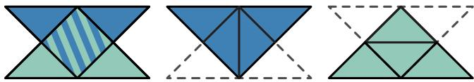
Figure 10: Two overlapping, co-planar right triangles (left) admit multiple constrained Delaunay triangulations (CDTs). Independent triangulation could lead to inconsistency (middle and right).

Instead, we gather clusters of triangles connected via non-trivial co-planar intersections (i.e., intersections resulting in convex polygons). By construction all triangles in a cluster share the same supporting plane. We compute a 2D constrained Delaunay triangulation (CDT) of the convex hull of each cluster. The original constraints collected from triangles in the cluster are the points, segments and polygons resulting from intersections with all other triangles in the input mesh $\mathcal { A }$, as well as the vertex points and edges of the cluster triangles themselves. We further subdivide segment constraints so that all intersections are resolved as constraint Steiner points. Finally, we compute the CDT of the convex hull of these points and segments; no additional Steiner vertices are required.

With CDTs constructed for each cluster, we iterate over each original triangle t to collect its respective subdivisions. We select among the CDT cluster those sub-triangles $\{ t _ { 1 }, t _ { 2 }, \ldots \}$ whose three vertices, according to exact 2D predicates, are not strictly outside t. We clone each sub-triangle $t _ { i }$ and orient it to match t, again using exact 2D predicates. In order to label winding number vectors (Section 5.3), the cloned oriented subtriangle stores a reference to t. This reference is also useful for applications requiring interpolation of texture coordinates, colors, or other attributes onto the boolean output mesh (see Figure 11).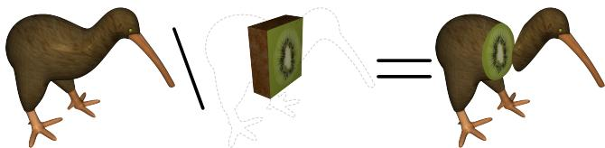
Figure 11: We retain the relationship between the output triangles and the inputs. Because of our exactness, attributes like texture coordinates are losslessly maintained.

We clean up by purging geometrically duplicate vertices. As we are using exact vertex representation, this can be done efficiently using lexicographical sorting and unique entry extraction from the list of vertices. The result is a possibly non-manifold mesh with possible duplicate triangles, but no self-intersections.

Duplicate triangles need to be retained at this stage, as their removal requires knowledge of the extraction function.

The output mesh has exactly the same winding number field as the input. This immediately follows from the fact that in the result all non-zero area triangles of the original meshes are retained, possibly in the subdivided form as a result of intersection resolution. One aspect of ensuring this is cloning sub-triangles at co-planar intersections. In the inset figure, the orange and blue shapes share a side. If only one set of faces is kept in the output the result is not a PWN mesh.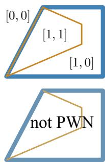

# 5.2 Partitioning space into cells

The second stage explicitly constructs a set of cells. We define a cell as a region bound by the union of oriented patches forming a closed manifold mesh with no self-intersections. The set of cells forms a space partition.

Each patch is a subset of triangles of the input mesh and inherits their orientation; the patch is a maximal connected set of faces with all edges shared by two faces from the set being manifold. The condition implies that a boundary edge of a patch (if it exists) is a non-manifold junction with neighboring patches.

Boundary patches of a cell may be geometrically coplanar, producing zero-volume cells; by the absence of self-intersections, such patches must consist of single triangles sharing the same vertices.

Preconditions The input mesh is PWN without degenerate triangles, selfintersections, and co-incident vertices.

Postconditions The output is a bipartite directed graph encoding of cellpatch incidences. Each patch node has one incoming and one outgoing edge to cell nodes, representing the volumetric regions on the positive and negative sides of the (oriented) patch, respectively, which we call above and below cells. In the following, we refer to "patch" (the combinatorial and geometric data structure) and "patch node" (the bipartite graph node) interchangeably, and likewise for cells.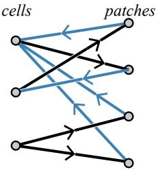

The output also includes mutual references between patches and input mesh triangles, i.e., each patch node contains a list of triangles, and each triangle has a pointer to the patch it is contained in.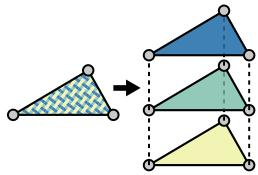

Geometrically, the cells cover all $\mathbb { R } ^ { 3 }$. Some cells will have zero geometric volume. These cells are always bound by exactly two clones of the same geometric triangle: i.e., two patches, each with one triangle. There may be many such degenerate cells stacked on the same multiply cloned triangle.

When the input to this stage is the resolved intersection (see Section 5.1) of n piecewise-constant winding number inducing meshes, then the output is denoted a valid cell-patch data structure.

Algorithm Our cell partitioning algorithm first separates the input mesh into connected components of triangles. Two triangles are considered connected if and only if they share an edge.

For each such connected component, we construct a cell-patch graph independently of the other components. First, we cluster triangles into patches. Starting with any unassigned triangle we grow a new patch traversing across manifold edges until the boundary of the patch is either empty or consists only of non-manifold edges.

During clustering, we record, for each non-manifold edge, its incident patches.

The adjacency between patches is encoded as a matrix A, setting $\mathbf { A } ( p, q ) = e$. which means that patch p is incident to patch q sharing with it a representative non-manifold edge e. Incident patches p and q may share multiple non-manifold edges, and the choice of representative $\mathbf { A } ( p, q )$ is arbitrary.

We now construct the bipartite graph of cells and patches encoding the volumetric partition: while the patches have already been established above, it remains to construct the cells and to add, for each patch p, one outgoing edge to $C ^ { \uparrow } ( p )$ and one incoming edge from $C ^ { \downarrow } ( p )$, the cells above and below p, respectively.

We will traverse all patch-patch incidences in arbitrary order.

When visiting an incident pair $( p, q )$, we retrieve the representative edge $e =$ $\mathbf { A } ( p, q )$. As detailed in Section 5.5.3, we sort the e -incident patches cyclically around e, with respect to p 's orientation.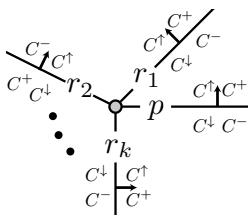

Suppose the sort results in the ordering $[ p, r _ { 1 }, r _ { 2 }, \ldots, r _ { k } ]$, so that $r _ { 1 }$ and $r _ { k }$ are immediately "above" and "below" p, respectively (see inset).

If we think of this sorting order as "upward," then each patch's own orientation is either consistent or inconsistent with the sorting order (e.g. in inset, $r _ { 2 }$ is inconsistent). Let $C ^ { + } ( r _ { i } ) \equiv C ^ { \uparrow } ( r _ { i } )$ and $C ^ { - } ( r _ { i } ) \equiv C ^ { \downarrow } ( r _ { i } )$ if patch $r _ { i }$ is oriented consistently with the sort, otherwise let $C ^ { + } ( r _ { i } ) \equiv C ^ { \downarrow } ( r _ { i } )$ and $C ^ { - } ( r _ { i } ) \equiv C ^ { \uparrow } ( r _ { i } )$.

We now propagate cell assignments by iterating over each consecutive pair of e -incident patches in order, beginning with $( p, r _ { 1 } )$ and ending with $( r _ { k }, p )$. Visiting the pair $( r _ { i }, r _ { i + 1 } )$, our task is to identify the cell references $C ^ { + } ( r _ { i } ) \stackrel { - } { \equiv } C ^ { - } ( r _ { i + 1 } )$. If both ${ \cal C } _ { } ^ { + } ( r _ { i } )$ and

$C ^ { - } ( r _ { i + 1 } )$ are unassigned, we assign them both to a newly created cell node. If only one is unassigned, we set it to the other cell node. If both are assigned to distinct cell nodes, we merge the two nodes in the bipartite graph. After visiting all patch-patch incidences, the graph for one connected component is complete.

After completing each connected component, it remains to merge the bipartite graphs. In particular, the ambient cell of a nested component must be equated to the corresponding internal cell of the enclosing component (see inset). As a special case, the ambient cells of all nonnested components must be equated.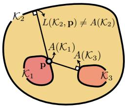

As detailed in Section 5.5.2, for each component $\kappa _ { i }$, we identify its ambient cell $A ( \mathbb { K } _ { i } )$.

We now iterate over each component, determine whether it is nested, and find the cell to which its ambient cell should be equal. Visiting component $\kappa _ { i }$, we select an arbitrary point $\mathbf { p } \in \mathcal { K } _ { i }$. We build a set of candidates $E = \{ \mathcal { K } _ { j } | j \neq i, \mathbf { p } \notin A ( \mathcal { K } _ { j } ) \}$ consisting of every component $\kappa _ { j } \neq \kappa _ { i }$ whose ambient cell does not contain $\mathbf { p }$. To determine whether a cell contains $\mathbf { p }$, we use point location (Section 5.5.1): given a point $\mathbf { p }$ and component $\kappa _ { j }$ find the containing cell $L ( { \cal K } _ { j }, { \bf p } )$ and distance from $\mathbf { p }$ to $\kappa _ { j }$.

If the set E is not empty, then $\kappa _ { i }$ is a nested component. Among the candidates E, we select the one (and only) component $\kappa _ { j }$ closest to $\mathbf { p }$. We merge the bipartite graph nodes $A ( \ K _ { i } )$ and $L ( { \cal K } _ { j }, { \bf p } )$, equating the ambient cell of the nested component to the interior cell of its enclosing component, respectively.

If the set E is empty, then $\kappa _ { i }$ is not a nested component. In this case, we equate its ambient cell $A ( \mathbb { K } _ { i } )$ with the universal ambient cell $C _ { 0 }$, defined as the cell containing "all points at infinity", by merging these two nodes in the bipartite graph.

After we have processed all components, the ambient cell of each nested component has been equated with the interior cell of its enclosing component, and the ambient cell of all non-nested components is $C _ { 0 }$. The bipartite graph is now connected; each patch is incident to two cells in a consistent manner.

# 5.3 Winding number labeling

In the third stage, we compute the winding number of each cell with respect to each input mesh.

Preconditions The input is a valid cell-patch graph. The universal ambient cell is seeded with a known winding number vector; by default $\mathbf { w } = [ 0, \ldots, 0 ]$, signifying that infinity lies outside all shapes. Only the combinatorial (not geometric) aspects of the input are considered by this algorithm: instead of computing winding numbers geometrically, we use property that the winding number changes by 1 or $^ { - 1 }$, whenever a surface is crossed, and thus can be computed by propagation along the cell-patch bipartite graph.

Postconditions The output is a valid cell-patch data structure with consistently labeled winding number vector for each cell. Neighboring cells will differ in winding number vector by exactly $+ 1$ or $^ { - 1 }$ in a single entry corresponding to the originating mesh of the patch between them, signed according to its orientation.

This process assigns winding numbers to zero-volume cells, formed by duplicate triangles; although no points have this winding number, this records what interior points would have if the cell boundaries were separated consistently with patch ordering.

Algorithm Given cell C with a known winding number vector ${ \bf w } _ { c }$, we assign the winding number vector of neighboring cells via breadth first traversal. For each oriented patch p separating cell C from neighbor cell N, if the winding number vector ${ \bf w } _ { n }$ is still unknown we set it to ${ \bf w } _ { c }$ adjusted to account for crossing patch p, originating from mesh $\mathbf { \mathcal { A } } _ { i }$:
$$
\mathbf { w}_{n} \gets \mathbf { w}_{c} + s_{p} [ \delta_{i 1} \dots \delta_{i n} ],
$$
where $s _ { p }$ is $+ 1$ if cell C lies above p and N below and $^ { - 1 }$ if vice versa, and $\delta _ { i j }$ is Kronecker's delta. We then add cell N to the queue of cells to process later. When the queue is empty, all cells have been labeled, and the algorithm has completed.

Complements By default, all input meshes $\mathbf { \mathcal { A } } _ { i }$ are assumed to represent bounded solids. Under this convention, the winding number at infinity is zero, $w _ { j } ( \infty ) = 0$. Winding numbers elegantly handle complements by subtraction from 1. If $A _ { j }$ is the complement of $\mathbf { \mathcal { A } } _ { i } = \mathbf { \mathcal { A } } _ { i } ^ { c }$, then
$$
w_{j} = 1 - | w_{i} | \quad \mathrm { o r} \quad w_{j} = 1 - w_{i},
$$
depending on whether the complement operator is orientationinsensitive or -sensitive, respectively (see inset).1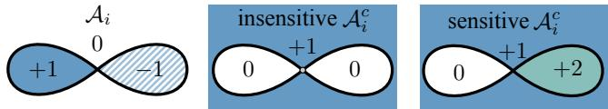

As a consequence, if $A _ { j }$ represents the unbounded complement of some bounded solid, then the seeded winding number vector at infinity should be $w _ { j } ( \infty ) = 1$.

In this way the winding number elegantly captures set identities. In particular, we produce exactly the same result for $A \backslash B$ and $\mathcal { A } \cap B ^ { c }$.

# 5.4 Operation result extraction

With the arrangement data structure constructed, we may perform arbitrary extraction operations. We extract the triangulated boundary of all cells for which an extraction function f is true.

Preconditions Inputs are a valid cell-patch data structure with consistently labeled winding number vectors and a function $f ( \mathbf { w } )$ returning true or false for a given winding number vector w. As in the previous stage, this stage makes use only of combinatorial (not geometric) aspects of the input.

Postconditions The output is a solid mesh.

Algorithm We flag all cells that pass f, collecting all patches separating a flagged cell from an unflagged cell, and then collecting all triangles of those patches, flipping the orientation of triangles from patches with a flagged cell above and unflagged cell below. We then purge possible boundaries arising from zero-volume symbolic cells. Since these always occur as perfect combinatorial duplicates of single triangles, we need only remove all triangles with zero total signed occurrence: sum of $+ 1$ if oriented $i, j, k$ and $^ { - 1 }$ if $k, j, i$.

# 5.5 Core low-level subroutines

The robustness of our method rests on the correctness of several core low-level subroutines.

# 5.5.1 Point location

We are asked to locate in which cell a given point lies. This is a special case of the fundamental point location problem in computational geometry. We take special care to solve this problem robustly and in the presence of zero-volume cells (e.g., due to resolved coplanar intersections).

Preconditions Inputs are a query point $\mathbf { q } \in \mathbb { R } ^ { 3 }$ and a valid cellpatch data structure. The query must not lie exactly on any patch.

Postcondition The output is the unique cell containing the query.

Algorithm Searching over all triangles, we find a triangle t containing the point c on the input mesh closest to the query point $\mathbf { q }$. Point c lies either exactly at a vertex v of t, or else along an edge e, or else within the interior of t (but not on its boundary). None of these cases is trivial. The vertex v or edge e could be a nonmanifold junction of many cells, and the triangle t could lie deep in a "stack" of zero-volume cells due to duplicated faces.

In fact, only at edges can we robustly determine the symbolic and geometric cell arrangement. The cyclic ordering of cells incident on an edge e is consistent, and since q does not lie on the input mesh it must lie in one of the incident cells. We insert a dummy facet connecting e and q into the sorted list of facets incident on $\mathbf { e }$. The next facet after the dummy (or previous facet before) must be part of a patch bounding the cell containing q.

The ambiguity in the case where c lies within the triangle t arises in the presence of duplicates of the triangle t. Since all duplicates share the same three edges, we choose one arbitrarily as the sorting edge e, and insert a dummy as in the edge case above.

If the closest point c lies at a vertex v, we identify a good sorting edge e (i.e., on the convex hull of v and its vertex neighbors) and again insert a dummy as above. Identifying the containing cell of a query whose point of closest approach is a vertex will also arise when identifying the ambient cell of a component. In this case, we project edges incident on v onto the plane formed by ${ \bf q } - { \bf c }$ and any orthogonal vector (rather than the $x y$ plane) and then follow the rest of the ambient cell identification algorithm in Section 5.5.2.

# 5.5.2 Ambient cell identification

In this subroutine, we identify the ambient cell (containing all points at infinity) of a given mesh.

Preconditions Inputs are a (non-manifold) self-intersection-free triangle mesh and corresponding cell-patch data structure.

Postconditions The output is a facet guaranteed to contain an outer vertex (a vertex on the convex hull of the vertices) and participate in a patch forming part of the boundary of the ambient cell of this mesh containing all points at infinity.

Algorithm We could solve this problem by identifying the cell containing some arbitrary far away point using the point location algorithm of Section 5.5.1. However, we enjoy the performance benefits of avoiding closest point computation by choosing a query point with a vertex as its known closest point.

We locate a vertex v with the maximum x -coordinate magnitude, breaking ties arbitrarily. It follows immediately that $\textbf { q } = \textbf { v } +$ $( 1, 0, 0 )$ lies in the desired ambient cell and that $\mathbf { v }$ is the point of closest approach of $\mathbf { q }$ to the input mesh.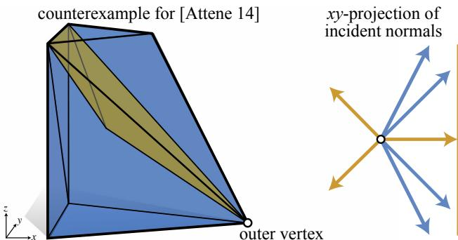
Figure 12: Consider a tetrahedron (orange) inside a wedge (blue), connected at a non-manifold vertex. One face normal of the interior tetrahedron (orange) has a larger x -component than the normals of exterior triangles (blue) incident on this non-manifold outer vertex.

We will identify the ambient cell by finding a facet incident on v that is part of a patch on the ambient cell's boundary. To find an incident outer facet, we first select an edge incident on this vertex that also lies on the convex hull. Then we sort facets cyclically around this edge and select one of the two facets that are part of ambient-cell boundary patches.

Sorting facets around an edge is discussed in Section 5.5.3, so it remains to identify an edge of the convex hull edge on the vertex with maximal $x -$ -coordinate. We rely on our exact representation of the input mesh and the ability to determine predicates exactly (e.g., is a point below, on, or above a plane?). We sort incident edges with respect to their projection on the $x y$ -plane. We select the edge whose projected edge-vector $\mathbf { e } = ( e _ { x }, e _ { y } )$ is most orthogonal to the $_ x$ -axis. Our particular exact representation kernel allows construction of quotients (but not square roots), so we identify the edge with maximum slope as a line function of $_ x$: that is, according to $\lvert e _ { y } / e _ { x } \rvert$. We may break ties arbitrarily because all edges with maximum slope must lie on the convex hull.

Remark Attene [2014] proceeds in a similar way by finding a maximal x -coordinate vertex and then chooses the incident triangle whose normal has the largest magnitude $_ x$ -component. This criterion cannot be applied if the vertex is non-manifold: an inner "flap" might have a more outward-pointing normal than the true outer facets. For a concrete counterexample, consider extruding the triangle $\{ ( 0, 0 ), ( 1, 1 ), ( 0, 2 ) \}$ two units in the z -direction, then move the lower-right corner to $( 2, 1, 0 )$ and add a inner tetrahedron connecting that vertex to the top-left corners and any interior vertex floating below (see Figure 12).

# 5.5.3 Cyclical sort triangles about a common edge

The cell partitioning, point location, and ambient cell identification subroutines depend on the ability to sort triangles about a common edge robustly. We sort only at one representative edge between incident patches, rather than at every edge of the triangulation (cf. [Attene 2014; Barki et al. 2015]).

Sorting triangles around a common edge is misleadingly innocuous. This subroutine must (and will) ensure consistent ordering of exactly duplicate triangles (e.g., resulting from resolved co-planar input triangles) and geometrically correct ordering of numerically nearly co-planar triangles.

Preconditions The input is a set of m non-degenerate triangles $t _ { 1 }, \ldots, t _ { m }$ incident on a mutual (non-degenerate) edge $\{ i, j \}$. Each triangle $t _ { k }$ is endowed with a globally assigned index $\varepsilon _ { k }$ (e.g., its index in the non-manifold output mesh after resolving all intersections). It is assumed that if two triangles are coplanar, then either they intersect only along the edge $\{ i, j \}$ (their dihedral angle is $1 8 0 ^ { \circ }$ ) or they are geometrically identical (same third vertex position and their dihedral angle is $0 ^ { \circ }$ ).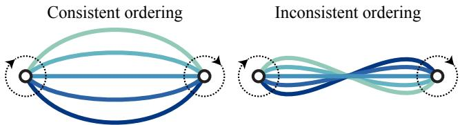
Figure 13: Consider five co-planar facets (lines) incident on two oriented edges (dots). Using the edge orientation to sign these indices during sorting ensures that orderings from either edge are consistent (left). Otherwise the sort is the same regardless of the edge orientation leading to inconsistent ordering.

Postconditions This subroutine outputs a sorted (clockwise) ordering of the triangles, looking down the edge $\{ i, j \}$. Geometrically distinct triangles are sorted cyclically according to their dihedral angle with the first triangle $t _ { 1 }$. Duplicate triangles--without loss of generality all are $\{ i, j, k \}$ --are sorted consistently in the sense that their relative ordering is maintained when sorting around $\{ i, j \}, \{ j, k \}$, or $\{ k, i \}$ and their ordering is reversed when sorting around $\{ j, i \}, \{ k, j \}$, or $\{ i, k \}$.

Algorithm Let each triangle t be positively incident on $\{ i, j \}$ if $t = \{ i, j, k \}$ and otherwise negatively (i.e., if $t = \{ k, j, i \} )$.

Let $\mathbf { p } _ { k }$ refer to the vertex position of triangle $t _ { k }$ 's third "flap" vertex not lying on the shared edge $\{ i, j \}$. Our recursive divide-andconquer algorithm begins by selecting a starting triangle $t ~ = ~ t _ { 0 }$ and sorting each other triangle $t _ { k }$ into one of four groups, based on whether $\mathbf { p } _ { k }$ lies (1) co-planar with $t _ { 0 }$ and on the same side of $\{ i, j \}$ as $\mathbf { p } _ { 0 }$, (2) co-planar with $t _ { 0 }$, and on the opposite side of $\{ i, j \}$ as p0, (3) below the plane of $t _ { 0 }$, (4) above the plane of $t _ { 0 }$.

We sort within groups (1) and (2) by simulating simplicity à la [Edelsbrunner $\&$ Mücke 1990]. Duplicate triangles are sorted according to their uniquely assigned index $\varepsilon _ { k }$. To ensure that this ordering is consistent and not erroneously reversed when viewed from a different edge incident on the same replicated triangles, we sign these indices based on the signed incidence of each triangle with respect to $\{ i, j \}$ (see Figure 13). This symbolic perturbation will differ depending on input indices, but is always consistent. Only the ordering of zero-volume cells are effected, so different orderings will always produce the same geometric result.

Triangles in groups (3) and (4) are sorted by recursive calls. The complete output is then simply the merger of the four sorted groups.

# 6 Implementation

We implemented the algorithm in $\mathrm { C } { + + }$ utilizing the exact arithmetic kernel of the popular CGAL library. We specifically use its subroutines for: exact testing and construction triangle-triangle intersections; 2D constrained Delaunay tessellation (CDT); pointtriangle closest point queries and point-plane predicates. We found CGAL's CDT implementation to be robust on all examples if constraints are subdivided at intersections as a preprocess.

We also use CGAL's built-in bounding-box-based spatial acceleration for collecting a list of candidate triangle-triangle intersections. We further accelerate the exact triangle-triangle intersection detection and construction by processing candidates in parallel. Due to the reference counting employed by CGAL's deferred evaluation exact number type (CGAL::Lazy_exact_nt), seemingly readonly simultaneous access of triangle data is unsafe. Fortunately intersection detection and construction is compute-bound, so despite placing mutex locks around every mesh vertex leads to parallelism performance gains.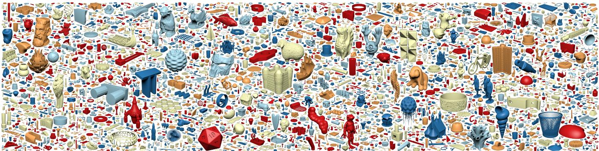
Figure 14: We conduct extensive evaluation of the robustness of our method on a dataset of 10,000 popular real-world models.

We also use CGAL's axis-aligned bounding-box hierarchy for point to triangle-soup closest point querying. We further accelerate the point location in Section 5.5.1 by culling points entirely outside of the bounding box of a component (the query point must then lie in that component's ambient cell).

# 6.1 Converting to floating-point

While input meshes with floating-point vertex position coordinates losslessly convert to our exact representation, the reverse is not true about our output exact meshes. Naively rounding a solid exact mesh to floating point may result in a non-solid mesh due to newly introduced self-intersections. This occurs in $2. 1 9 \%$ of our output meshes in the Thingi10K dataset.

This problem is known as vertex rounding. Without allowing subdivision of facets and insertion of new vertices, this problem is NPhard [Milenkovic & Nackman 1990]. Allowing for re-triangulation, a robust--albeit slow and complicated--solution to this problem exists in theory [Fortune 1997].

To fit into floating-point pipelines and fairly compare to previous methods producing floating-point output meshes (e.g., [Bernstein 2013; Attene 2014; Douze et al. 2015]), we propose a heuristic for rounding our exact output meshes to floating-point. Our heuristic is related to the method proposed in [Sacks & Milenkovic 2014].

Preconditions We assume the input to be a solid triangle-mesh with exact coordinates.

Postconditions Though we can make no guarantees of convergence, our exact method equipped with this rounding heuristic successfully finds self-intersection free floating-point meshes for $9 9. 9 5 \%$ of the dataset. Otherwise, we can only claim the output to remain a PWN mesh.

Heuristic Given a solid mesh with exact vertices, we iteratively apply the following steps: (1) round all vertices to double precision floating-point coordinates, (2) find all triangles participating in self-intersections (if none, then return), (3) round all vertices of these triangles to single precision floating-point coordinates, and (4) compute the self-union of the resulting mesh.

# Cleanliness of the 10,000 Thingiverse meshes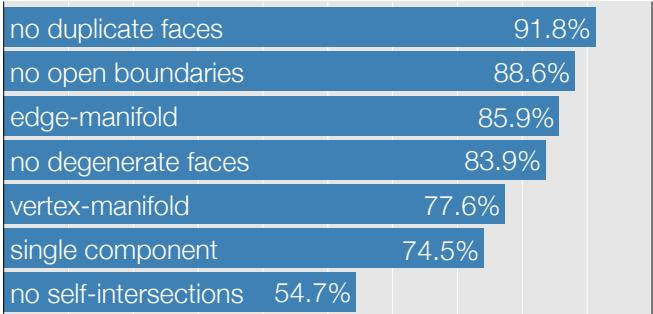
Figure 15: Real-world meshes with real-world problems.

# 7 Experiments and results

Constructed or procedurally generated examples may help investigate corner cases, but do not necessarily report how robustly an algorithm will perform in practice. To this end, we gather a dataset of 10,000 meshes from "the wild," and test our method and previous works against it. Considering these meshes as a representative sampling of a general population of meshes encountered in practice, we evaluate the restrictiveness of preconditions and the robustness of claimed postconditions across methods.

# 7.1 Thingi10K dataset

Contents and methodology The Thingi10K dataset contains the first 10,000 meshes of "Featured" models on thingiverse.com, a popular shape repository. These models are heavily biased toward models designed by amateurs or semi-professionals for 3D printing (though there is no official restrictive policy). We therefore interpret these models as a representative sampling of the population of meshes intended to model a solid 3D object.

Each "thing" featured on thingiverse.com may contain several distinct mesh files. We collected the first 2011 things, totalling 10,000 meshes (see Figure 14). All things have free licenses (GPL, LGPL, CC, BSD, or public domain). The original meshes came in a biased variety of file formats: 9956.stl, 42.obj, one.off, and one.ply. The vast majority of meshes have single-precision vertex-coordinates. Since.stl files store triangle streams rather than meshes, we immediately merge exactly duplicate corners. The number of faces in each mesh follows a log-normal distribution with geometric mean and standard deviation $5 0 7 7. 6 \pm 8. 5$ (see inset).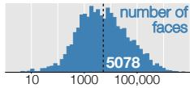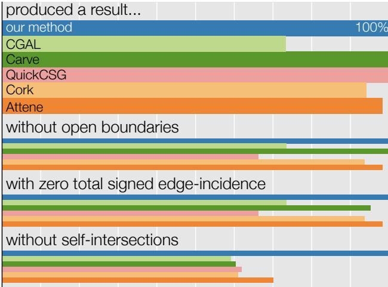
Postconditions, self-union of 8616 meshes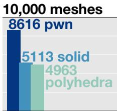
Figure 16: Previous methods frequently failed to produce an output without self-intersections, without open boundaries, and with piecewise-constant winding number.

Comparing preconditions Of the 10,000 meshes, 8616 meet our PWN precondition. Of these, 5113 are solid; of those 4963 are manifold polyhedra.

The 10,000 meshes exhibit a variety of typical problematic cases: open boundaries, self-intersections, non-manifold elements, multiple components, etc. (see Figure 15). Among the 4524 meshes containing self-intersections, 3082 contain coplanar self-intersections. This quantifies an approximation of the fraction of models deviating from the general positioning assumption.

Many "problematic" meshes seem to result from modeling with self-intersections (see Figure 2) and overlapping, independently modeled components or from previous failed boolean operations.

# 7.2 Testing self-union

Assuming each mesh in the Thingi10K dataset to represent an intended solid, we compare extracting a valid boundary of this solid with available implementations of five previous works: "CGAL" [CGAL 2015], "Carve" [CARVE 2014], "Cork" [Bernstein 2013], "QuickCSG" [Douze et al. 2015], and "Attene" [Attene 2014].

We emphasize that this experimental comparison reflects both algorithmic limitations and implementation deficiencies, so a different implementation of any given method could potentially and perform better. The no-longer-maintained implementation of [Bernstein & Fussell 2009] failed on most examples. Similarly, the web-service implementation of [Campen & Kobbelt 2010a] failed to produce a result roughly $40 \%$ of the time. We are unable to obtain implementations or outputs for other methods (e.g., [Barki et al. 2015]).

We limit our comparison to the 8616 PWN meshes. Of these, only 3413 contain self-intersections. Nonetheless, we consider all 8616 PWN meshes as implementations relying on internal rounding (e.g. [Attene 2014; Bernstein 2013]) often also stumble on nearly selfintersecting meshes.

Attene's mesh repair method computes the outer hull, rather than the self-union [2014]. The other implementations do not provide an explicit API for conducting self-union, so we intersect the input model with its conservative bounding box.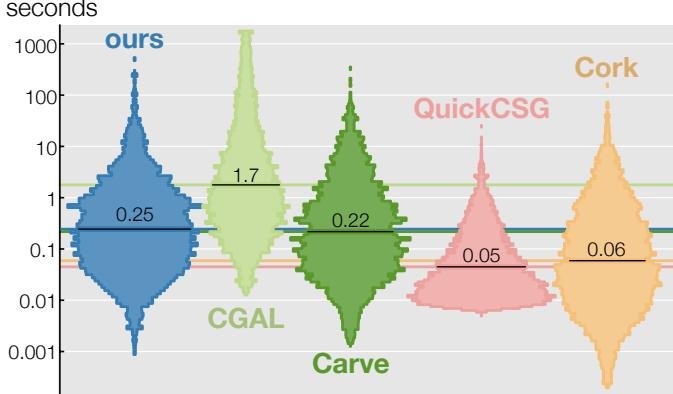
Running time distributions, self-union of 8616 meshes
Figure 17: The performance of our method is competitive with existing floating-point methods and faster than the state-of-the-art exact method [CGAL 2015]. Geometric means given for each method. Unequal histogram areas correspond to success rate.

Performance profile of four-stage algorithm $\%$ of total running time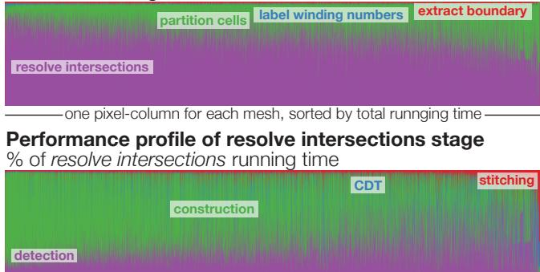
Performance profile of partition cells stageFigure 18: The main bottleneck of our algorithm is triangletriangle intersection resolution. Within this major stage, the intersection detection and exact construction dominate.

Comparing postconditions Self-union should output a solid mesh. We report whether a method successfully produced any output and if it met certain necessary postconditions. Strictly testing solidity requires a correct implementation of cyclic facet ordering around a non-manifold edge to determine that all incident cells are alternating zero/one winding number. Absent trusted third-party code, we test necessary (but not sufficient) conditions: lack of selfintersections, open boundaries, and non-zero total signed incidence edges. Such meshes form a strict subclass of PWN meshes, but a superclass of solids. Our exact method succeeds with $100 \%$ success across all criteria (see Figure 16). Previous methods fall short in at least one criteria. This unique success places our exact method robustly into the exact geometry pipeline.

In a floating-point context, our method also out-performs all others. Our heuristic for converting our exact outputs to floating-point meshes in Section 6.1 succeeds in removing new self-intersections all but five cases out of the 8616. These meshes fail to converge after 20 iterations. Rates of closedness and total signed edgeincidence are--by construction--maintained at $100 \%$.

The specific causes of failure of the previous methods are difficult to determine. We can identify robustness flaws associated with characteristics of the input meshes. Methods assuming general positioning or resorting to numerical perturbation [Bernstein 2013; Douze et al. 2015] will struggle in the presence of coplanar intersections.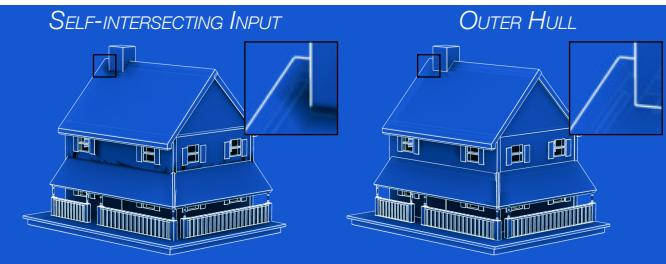
Figure 19: Self-intersections confuse per-vertex ambient occlusion and sharp-line detection. Rendering the outerhull ameliorates this.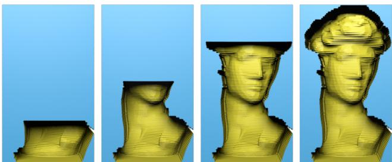
Figure 20: David emerges from a block by repeatedly subtracting the Minkowski sum of a drill bit along piecewise-linear paths.

Attene assumes accurate floating-point normals during self-intersection culling and outer hull extraction [2014], but inputs may contain degenerate or nearly degenerate triangles with untrustworthy normals. The inset highlights self-intersections (orange) and an open boundary (red) on a problematic output of Attene's.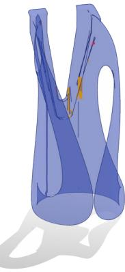

Performance We collected timing information across the 8616 self-unions for our method and four others (CGAL, Carve, QuickCSG, Cork) locally on a machine with an 8-core Intel Xeon 3GHz processor with 16GB of memory.2 The violin histograms of running timings in Figure 17 show that while ours is not the fastest, it is competitive.

The Thingi10K dataset also provides means to further examine the performance of our individual subroutines. The profile in Figure 18 reveals that resolving intersections is the dominating bottleneck.

# 7.3 General discussion

Outer hull The outer hull of an input triangle mesh is defined as those triangles reachable from infinity by some (possibly nonstraight) path that does not intersect the mesh [Campen & Kobbelt 2010b; Attene 2014]. In general, the outer hull cannot be categorized in terms of the winding number: boundaries with inner hollow cavities with zero winding number are not part of the outer hull. For some applications, retaining these inner cavities is crucial (see Figure 5). For other applications, such as rendering, the outer hull may be appropriate and desired (see Figure 19). We can easily adapt our algorithm to compute outer hulls. We construct cell partition according to Section 5.2, find the ambient cell according to Section 5.5.2, and simply extract its boundary as per Section 5.4.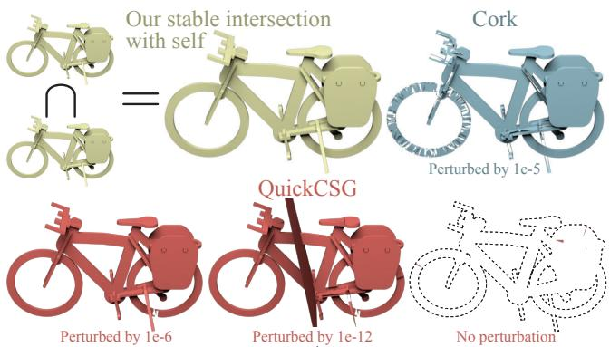
Figure 21: Numerical perturbation can produce spurious artifacts.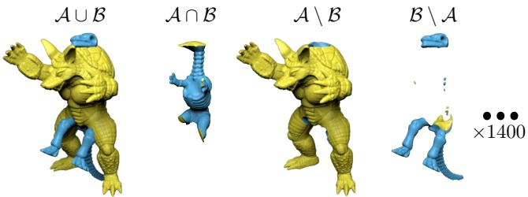
Figure 22: We reproduce and exhaustively expand the pairwise testing in [Barki et al. 2015] (see supplemental material).

Minkowski sums The Minkowski sum of a solid mesh $\boldsymbol { A }$ along a segment $\{ \mathbf { s }, \mathbf { d } \}$ can be computed as the union of $\mathcal { A }$ at s, $\boldsymbol { A }$ at $\mathbf { d }$, and the union of all prisms formed by triangles of $\mathcal { A }$ along $\{ \mathbf { s }, \mathbf { d } \}$:
$$\mathcal{A} + \{ \mathbf { s}, \mathbf { d} \} = \bigcup \left(\mathcal{A} + \mathbf { s},\mathcal{A} + \mathbf { d}, \bigcup_{t \in\mathcal{A}} t + \{ \mathbf { s}, \mathbf { d} \} \right).
$$
Explicitly computing the union of all triangular prisms via our mesh boolean algorithm would produce the correct result but after too much unnecessary computation: most neighboring prisms are exact duplicates. We cull the union of prisms with a pre-process, removing all facets with zero total signed occurrence, replacing all instances of facets with $\pm 2 k$ total signed occurrences with $\pm k$ positive/negative clones. This proof-of-concept inherits the robustness of our method, but is likely suboptimal in terms of performance compared to specialized methods [Campen & Kobbelt 2010b]. In Figure 20, we simulate a CNC-milling tool.

Traditional binary boolean tests A traditional test for a boolean algorithm is to select two meshes, randomly rotate them, then conduct a binary operation (union, intersection, difference, etc.) and investigate the result for artifacts or errors. This type of testing encourages the general positioning assumption and may give a false sense of robustness in cases with coplanar intersections and exact co-incidences. An extreme case is taking the intersection of an object with a clone of itself (see Figure 21). Methods based on numerical perturbation, such as [Bernstein 2013], panic in the presence of so many co-planar intersections.

For completeness, we reproduce and expand the testing in [Barki et al. 2015]. Barki et al. compute the union and intersection for 22 pairs of meshes from a collection of 26 standard computer graphics meshes (Armadillo, Dino, etc.). We exhaustively compute union, intersection, and both asymmetric differences for all pairs (see Figure 22). All $4 ( 2 6 ( 2 6 + 1 ) ) / 2 = 1 4 0 4$ tests result in valid solid meshes. For two of these meshes, Barki et al. also compute the union and intersection of the mesh and a clone rotated by random

Union of each mesh of [Barki et al. 2015] with itself rotated by π10, 2π10,... π rotation. For all 26 meshes, we compute the union of the mesh and 10 clones rotated by $\pi / 1 0, 2 \pi / 1 0, \stackrel { - } { \dots }, \pi$ about the same axis (see Figure 23). All our results are valid solid meshes.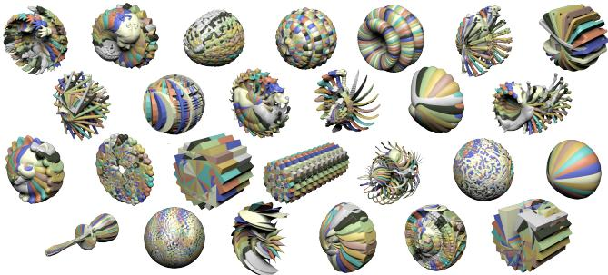
Figure 23: We reproduce and expand upon the A-union-rotated-A style test in [Barki et al. 2015].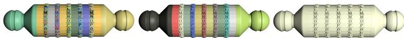
Figure 24: The letters are separated overlapping components on the cryptex. Exact union reveals disjoint rings, shown in different colors, but small tolerances between parts cause inexact methods to merge over zealously.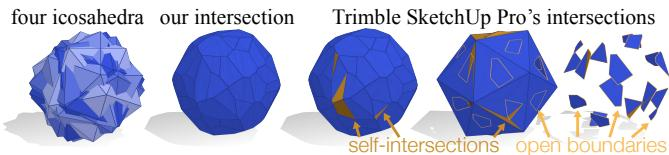
Figure 25: A popular commercial app produces three different results (presumably due to randomization), yet all are incorrect.

The robustness of several previous works rely on the assumption that input vertices lie on a regular grid [Campen & Kobbelt 2010a] or at general positions [Bernstein 2013; Douze et al. 2015]. However, input rounding or perturbation--no matter how subtle--may introduce unnecessary intersections that merge disjoint components (see Figure 24) or cause numerical problems (see Figure 21). In contrast, the exact nature of our approach allows us to only resolve intersections already present in the inputs.

Others (e.g., [Barki et al. 2015]) have demonstrated robustness issues with boolean implementations in commercial software such as MAYA. We add to this by comparing to Trimble's SKETCHUP PRO. SKETCHUP PRO consistently fails to intersect four randomly rotated icosahedra (see Figure 25). We also attempted to union each of the 26 models of [Barki et al. 2015] with a clone rotated by $\pi / 1 0$ (a simplified version of Figure 23). After a day of computation, only 12 produced an output, and none were without flaws (all were combinatorially open, only two were without self-intersections).

Although very common, inputs with multiple, possibly nested, components are overlooked in previous works. The implementation of [Campen & Kobbelt 2010a] assumes single component input, and [CGAL 2015] does not detect nested voids automatically. Our algorithm correctly handles both cases (see Figure 26).

Stress tests In addition to standard tests on common computer graphics models, we also stress test our algorithm on challenging examples. Our algorithm is robust for carrying out consecutive boolean operations because the output solid mesh is trivially a valid PWN input for the following operations (see Figure 27).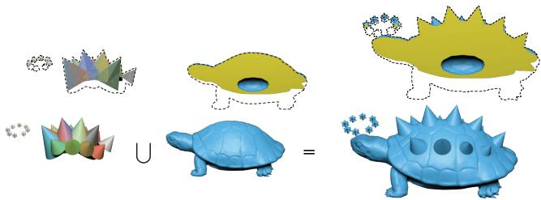
Figure 26: Disconnected stars and overlapping spike components correctly unites with a nested turtle (slice view above).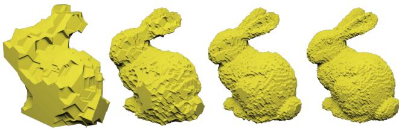
Figure 27: We reproduce the carving example of [Bernstein & Fussell 2009] by subtracting 10,000 dodecahedra from a box.

An interesting and challenging application of booleans is to "undo" boolean subtractions given only the argument and the result, produced by an unknown boolean implementation (see Figure 28).

Generality Besides conventional boolean operations, the space partition defined by mesh arrangement is useful for many important geometry processing applications. In Figure 29, the outer hull computation is a necessary preprocessing step for generating a volumetric discretization for structural analysis [Zhou et al. 2013]. The outer hull is also useful for culling extra internal complexity (see Figure 30).

Our variadic formulation also allows us to compute regions inside at least k of the input meshes without the combinatorial explosion associated with binary boolean operations (see Figure 31). Figure 3 considers ten intersecting tetrahedra. Our variadic union of all ten tets is roughly twice as fast as decomposing the union into a cascading tree of binary union operations (and $6. 5 \times$ faster than a linear chain of binary unions). Intuitively, this is because our intersection resolution is the most economical for this arrangement. In contrast, repeated unions will require resolving intersections with previous results, aggregating unnecessary complexity: though geometrically identical, our result has 384 triangles, compared to the cascading tree's 1000. We also construct extraction of the region inside at least five input tetrahedra. Decomposing this task into a binary tree of cascading operations leads to an exponential number of operations in the number of tets $( 5 \binom { 1 0 } { 5 } - 1 = \dot { 1 } 2 5 9$ binary operations for ten tets). The aggregation of complexity is catastrophic, leading to performance measured in weeks. Instead, extracting this result from our arrangement requires the same cost as extracting the union: just a few seconds.

Lastly, the cell data structure used by our algorithm can be easily extended for customized applications. For example, it is easy to eliminate small cells immersed inside a shape (see Figure 32).

# 8 Limitations and future work

A limitation of this method is the requirement that the input mesh have no open boundaries or non-manifold "flaps". Of the 10,000 meshes in our Thingi10K dataset, $18 \%$ did not meet our preconditions. While repairing invalid input meshes is beyond the scope of this method, many previous works are available [Attene 2010; Campen et al. 2012; Jacobson et al. 2013]. On the other hand, the high-level structure of our approach would clearly extend to meshes with boundaries and unstructured non-manifoldness via the generalized winding number [Jacobson et al. 2013]. However, our lowlevel combinatorial and sorting based subroutines would need to be replaced with robust or exact evaluations of the generalized winding number. While Barki et al. [2015] provide a partial solution for simple cases (e.g., clipping a closed model with a plane), a robust solution for arbitrary geometrically open models is elusive.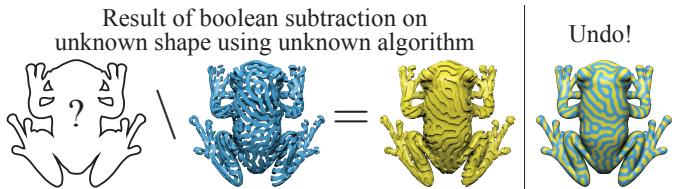
Figure 28: The groved, yellow frog is the result of subtracting the stripy, blue flog from an unknown (presumably solid) frog using some boolean implementation (not ours). Our robust union recovers the original frog (blue and yellow).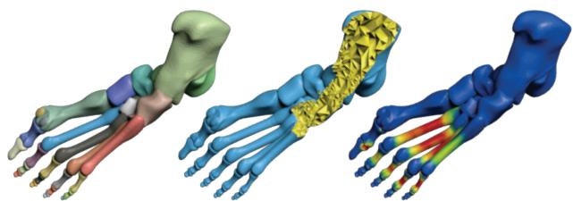
Figure 29: Tetrahedralization of the input foot mesh fails due to overlapping input components, but succeeds after self-union. The volume mesh helps analyze the shapes structure.

Our method is variadic, but does not optimize operations based on the requested extraction and inputs. For example, consider conducting the 1000-way union of 999 overlapping spheres enclosed and their conservative bounding box. Clearly resolving the intersections between the 999 spheres is overkill. It would be interesting to explore conservative optimization.

In the hopes of fostering continued work and more exhaustive testing in geometry processing at large, we release our code (now in LIBIGL [Jacobson et al. 2016]) and our Thingi10K dataset.

# Acknowledgments

We thank G. Bernstein for sharing code and M. Attene for testing on the Thingi10K dataset. We thank M. Campen, A. Fleming H. Maia, J. Panetta, R. Sawhney, O. Stein, P. Thamjaroenporn, O. Winn, and E. Yao for early feedback and proofreading. Funded in part by NSF grants CMMI-11-29917, IIS-14-09286, and IIS-17257.

# References

ATTENE, M. 2010. A lightweight approach to repairing digitized polygon meshes. The Visual Computer.
ATTENE, M. 2014. Direct repair of self-intersecting meshes. Graphical Models.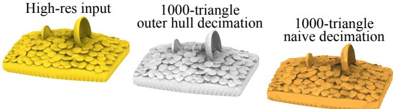
Figure 30: The coin mesh has been modeled with many overlapping components (gold). Constructing the outer hull adds many new vertices, but removes hidden interior geometry. After decimation, the few triangles are well spent on the visible surface (silver). Naive decimation wastes precious triangles on the hidden interior (bronze).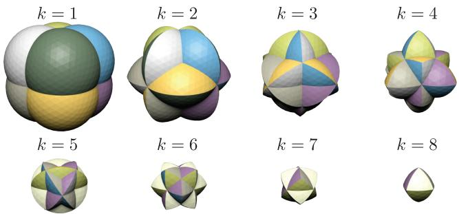
Figure 31: Our method supports n-ary operations. For example, extracting all regions inside at least k of the input spheres centered at each corner of the unit cube.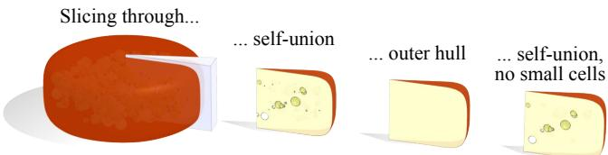
Figure 32: The self-union of a wheel of cheese retains its internal bubbles after slicing (intersecting) with a knife (blue wedge). Slicing the outer hull reveals no bubbles. Eliminating small volumes cells in the self-union before extraction, produces a few bubbles.
BANERJEE, R. P., AND ROSSIGNAC, J. R. 1996. Topologically exact evaluation of polyhedra defined in CSG with loose primitives. Comput. Graph. Forum.
BARKI, H., GUENNEBAUD, G., AND FOUFOU, S. 2015. Exact, robust, and efficient regularized booleans on general 3d meshes. Computers and Mathematics with Applications.
BERNSTEIN, G., AND FUSSELL, D. 2009. Fast, exact, linear booleans. In Proc. SGP.
BERNSTEIN, G., 2013. Cork boolean library https://github.com/gilbo/cork.
BIERI, H., AND NEF, W. 1988. Elementary set operations with d-dimensional polyhedra. In Proc. IWCGA.
CAMPEN, M., AND KOBBELT, L. 2010. Exact and robust (self-)intersections for polygonal meshes. Comput. Graph. Forum.
CAMPEN, M., AND KOBBELT, L. 2010. Polygonal Boundary Evaluation of Minkowski Sums and Swept Volumes. Comput. Graph. Forum.
CAMPEN, M., ATTENE, M., AND KOBBELT, L., 2012. A practical guide to polygon mesh repairing. Eurographics Tutorial.
CARVE, 2014. CARVE: An efficient and robust library for boolean operations on polyhedra. http://carve-csg.com/.
CGAL, 2015. CGAL, Computational Geometry Algorithms Library. http://www.cgal.org.
DOUZE, M., FRANCO, J.-S., AND RAFFIN, B. 2015. QuickCSG: Arbitrary and faster boolean combinations of n solids. Tech. Rep. 01121419, Inria Research Centre Grenoble, Rhone-Alpes.
EDELSBRUNNER, H., AND MÜCKE, E. P. 1990. Simulation of simplicity: A technique to cope with degenerate cases in geometric algorithms. ACM Trans. Graph..
FORTUNE, S. 1997. Vertex-rounding a three-dimensional polyhedral subdivision. Discrete Comput. Geom.
GRANADOS, M., HACHENBERGER, P., HERT, S., KETTNER, L., MEHLHORN, K., AND SEEL, M. 2003. Boolean operations on 3d selective nef complexes: Data structure, algorithms, and implementation. In Proc. ESA.
JACOBSON, A., KAVAN, L., AND SORKINE-HORNUNG, O. 2013. Robust inside-outside segmentation using generalized winding numbers. ACM Trans. Graph..
JACOBSON, A., PANOZZO, D., ET AL., 2016. libigl: A simple $\mathrm { C } { + + }$ geometry processing library. http://libigl.github.io/libigl/.
MEI, G., AND TIPPER, J. C. 2013. Simple and robust boolean operations for triangulated surfaces. arXiv preprint arXiv:1308.4434.
MILENKOVIC, V. J., AND NACKMAN, L. R. 1990. Finding compact coordinate representations for polygons and polyhedra.
MUSETH, K., BREEN, D. E., WHITAKER, R. T., AND BARR, A. H. 2002. Level set surface editing operators. ACM Trans. Graph..
NAYLOR, B., AMANATIDES, J., AND THIBAULT, W. 1990. Merging bsp trees yields polyhedral set operations. In Proc. SIG-GRAPH.
PAVIC, D., CAMPEN, M., AND KOBBELT, L. 2010. Hybrid Booleans. Comput. Graph. Forum.
SACHT, L., JACOBSON, A., PANOZZO, D., SCHÜLLER, C., AND SORKINE-HORNUNG, O. 2013. Consistent volumetric discretizations inside self-intersecting surfaces. Proc. SGP.
SACKS, E., AND MILENKOVIC, V. 2014. Robust cascading of operations on polyhedra. Computer-Aided Design (Tech. Note).
SUGIHARA, K., AND IRI, M. 1992. Construction of the Voronoi diagram for one million generators in single-precision arithmetic. Proc. of the IEEE.
THIBAULT, W. C., AND NAYLOR, B. F. 1987. Set operations on polyhedra using binary space partitioning trees. In Proc. SIG-GRAPH.
VARADHAN, G., KRISHNAN, S., SRIRAM, T., AND MANOCHA, D. 2004. Topology preserving surface extraction using adaptive subdivision. In Proc. SGP.
WANG, C. C. L. 2011. Approximate boolean operations on large polyhedral solids with partial mesh reconstruction. IEEE TVCG.
XU, S., AND KEYSER, J. 2013. Fast and robust booleans on polyhedra. Computer-Aided Design.
ZHAO, H., WANG, C. C., CHEN, Y., AND JIN, X. 2011. Parallel and efficient boolean on polygonal solids. The Visual Computer. ZHOU, Q., PANETTA, J., AND ZORIN, D. 2013. Worst-case structural analysis. ACM Trans. Graph..

# Appendix: Exact representation

Since a computer cannot represent all points in $\mathbb { R } ^ { 3 }$, we assume all vertices of our input and output meshes are given in the "exact" rational coordinate space $\mathbb { Q } ^ { 3 }$. Exactness means that points, line segments and convex polygons with endpoints in $\mathbb { Q } ^ { 3 }$ form a group closed under spatial intersection.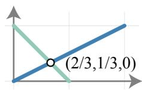

The space of the double precision floating-point coordinate space $\mathbb { F } ^ { 3 }$ does not satisfy these criteria: e.g., the point of intersection between line segments $[ ( 0, 0, 0 ), ( 2, 1, 0 ) ]$ and $[ ( 1, 0, 0 ), ( 0, 1, 0 ) ]$ is the non-floating-point position $( 2 / 3, 1 / 3, 0 )$, see inset. The exact rational space $\mathbf { \hat { \mathbb { Q } } } ^ { 3 }$ contains the floating-point space as a subset: $\mathbb { F } ^ { 3 } \subset \mathbb { Q } ^ { 3 }$. So, if given a mesh $\mathbf { \mathcal { A } } _ { i }$ with floating-point vertex positions, we can losslessly cast them to our exact space.